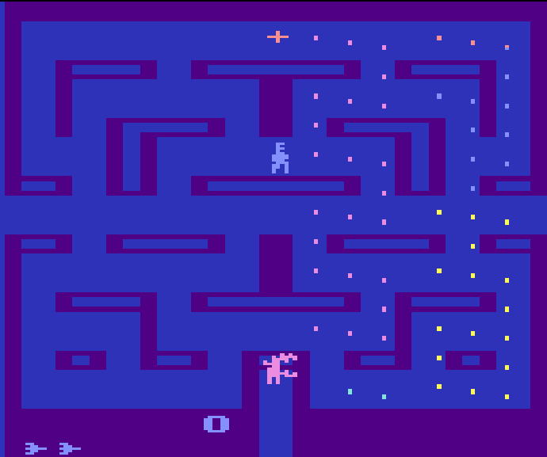

# RL
Reinforcement learning

- 记录强化学习自学的相关东西
  - github pag [https://scchy.github.io/RL](https://scchy.github.io/RL)
- 强化学习实践的项目
- 强化学习的框架 在 [src 目录](./src/)下


# 框架简介
目录
```text
src
├── LLMRL
│   ├── DataWhale-R1.yaml
│   ├── train_DataWhale-R1.py
│   └── train_DataWhale-R1.sh
├── RAGRL
│   ├── api_chat_test.py
│   ├── data
│   ├── rag.md
│   ├── rag_utils.py
│   └── simple_rl_rag.py
├── requestment.txt
├── RLAlgo
│   ├── A2C.py
│   ├── _base_net.py
│   ├──batchRL
│   │   └──  cql.py
│   ├── DDPG.py
│   ├── DQN.py
│   ├── grad_ana.py
│   ├── ICM.py
│   ├── PPO2_old.py
│   ├── PPO2.py
│   ├── PPO.py
│   ├── SAC.py
│   ├── SoftQNew.py
│   ├── SoftQ.py
│   └── TD3.py
├── RLUtils
│   ├── batchRL
│   │   ├── trainer.py
│   │   └── utils.py
│   ├── config.py
│   ├── env_wrapper.py
│   ├── __init__.py
│   ├── memory.py
│   ├── state_util.py
│   └── trainer.py
├── setup.py
├── test
│   ├── border_detector.py
│   ├── README.md
│   ├── test_ac.py
│   ├── test_cql.py
│   ├── test_ddpg.py
│   ├── test_dqn.py
│   ├── test_env_explore.ipynb
│   ├── test_models
│   ├── test_ppo_atari.py
│   ├── test_ppo_new.py
│   ├── test_ppo.py
│   ├── test_sac.py
│   ├── test_softQ.py
│   ├── test_TD3.py
│   └── wandb
└── TODO.md
```

## 环境要求

核心包

| package | version |
|--|--|
|python版本 | `Python 3.10`|
|torch | 2.1.1|
|torchvision | 0.16.1|
|gymnasium | 0.29.1|
|cloudpickle | 2.2.1|


## 运行示例
```python
import gymnasium as gym
import torch
from RLAlgo.PPO2 import PPO2
from RLUtils import train_on_policy, random_play, play, Config, gym_env_desc

env_name = 'Hopper-v4'
gym_env_desc(env_name)
path_ = os.path.dirname(__file__) 
env = gym.make(
    env_name, 
    exclude_current_positions_from_observation=True,
    # healthy_reward=0
)
cfg = Config(
    env, 
    # 环境参数
    save_path=os.path.join(path_, "test_models" ,'PPO_Hopper-v4_test2'), 
    seed=42,
    # 网络参数
    actor_hidden_layers_dim=[256, 256, 256],
    critic_hidden_layers_dim=[256, 256, 256],
    # agent参数
    actor_lr=1.5e-4,
    critic_lr=5.5e-4,
    gamma=0.99,
    # 训练参数
    num_episode=12500,
    off_buffer_size=512,
    off_minimal_size=510,
    max_episode_steps=500,
    PPO_kwargs={
        'lmbda': 0.9,
        'eps': 0.25,
        'k_epochs': 4, 
        'sgd_batch_size': 128,
        'minibatch_size': 12, 
        'actor_bound': 1,
        'dist_type': 'beta'
    }
)
agent = PPO2(
    state_dim=cfg.state_dim,
    actor_hidden_layers_dim=cfg.actor_hidden_layers_dim,
    critic_hidden_layers_dim=cfg.critic_hidden_layers_dim,
    action_dim=cfg.action_dim,
    actor_lr=cfg.actor_lr,
    critic_lr=cfg.critic_lr,
    gamma=cfg.gamma,
    PPO_kwargs=cfg.PPO_kwargs,
    device=cfg.device,
    reward_func=None
)

agent.train()
train_on_policy(env, agent, cfg, wandb_flag=False, train_without_seed=True, test_ep_freq=1000, 
                online_collect_nums=cfg.off_buffer_size,
                test_episode_count=5)
agent.load_model(cfg.save_path)
agent.eval()
env_ = gym.make(env_name, 
                exclude_current_positions_from_observation=True,
                # render_mode='human'
                )
play(env_, agent, cfg, episode_count=3, play_without_seed=True, render=False)
```

## 训练结果展示

|环境与描述 | 参数函数链接| 效果|
|-|-|-|
|[ Hopper-v4 ](state: (11,),action: (3,)(连续 <-1.0 -> 1.0>))| [Hopper_v4_ppo2_test](./src/test/test_ppo.py) | |
|[ Humanoid-v4 ](state: (376,),action: (17,)(连续 <-0.4 -> 0.4>))| [Humanoid_v4_ppo2_test](./src/test/test_ppo.py) | |
|[ ALE/DemonAttack-v5 ](state: (210, 160, 3),action: 6(离散 ))| [DemonAttack_v5_ppo2_test](./src/test/test_ppo_atari.py) | |
|[ ALE/AirRaid-v5 ](state: (250, 160, 3),action: 6(离散 ))| [AirRaid_v5_ppo2_test](./src/test/test_ppo_atari.py) | |
|[ ALE/Alien-v5 ](state: (210, 160, 3),action: 18(离散 ))| [Alien_v5_ppo2_test](./src/test/test_ppo_atari.py) | |
|[ Walker2d-v4 ](state: (17,),action: (6,)(连续 <-1.0 -> 1.0>))| [Walker2d_v4_ppo2_test](./src/test/test_ppo.py)   | |
|[ HumanoidStandup-v4 ](state: (376,),action: (17,)(连续 <-0.4 -> 0.4>))| [HumanoidStandup_v4_ppo2_test](./src/test/test_ppo.py) | |
|[ CartPole-v1 ](state: (4,),action: 2(离散))| [duelingDQN: dqn_test](./src/test/test_dqn.py) |   |
|[ MountainCar-v0 ](state: (2,),action: 3(离散 ))| [duelingDQN: dqn_test](./src/test/test_dqn.py) |   |
|[ Acrobot-v1 ](state: (6,),action: 3(离散 ))| [duelingDQN: Acrobot_dqn_test](./src/test/test_dqn.py) |   |
|[ LunarLander-v2 ](state: (8,),action: 4(离散 ))| [duelingDQN: LunarLander_dqn_test](./src/test/test_dqn.py) |   |
|[ ALE/DemonAttack-v5 ](state: (210, 160, 3),action: 6(离散 ))| [doubleDQN: DemonAttack_v5_dqn_new_test](./src/test/test_dqn.py) |   |
|[ BipedalWalker-v3 ](state: (24,),action: (4,)(连续 <-1.0 -> 1.0>))| [BipedalWalker_ddpg_test](./src/test/test_ddpg.py) |  |
|[ BipedalWalkerHardcore-v3 ](state: (24,),action: (4,)(连续 <-1.0 -> 1.0>))| [BipedalWalkerHardcore_TD3_test](./src/test/test_TD3.py) |  |
|[ Reacher-v4 ](state: (11,),action: (2,)(连续 <-1.0 -> 1.0>))| [sac_Reacher_v4_test](./src/test/test_SAC.py) |  |
|[ Pusher-v4 ](state: (23,),action: (7,)(连续 <-2.0 -> 2.0>))|  [sac_Pusher_v4_test](./src/test/test_SAC.py) |  |
|[ CarRacing-v2 ](state: (96, 96, 3),action: (3,)(连续 <-1.0 -> 1.0>))| [CarRacing_TD3_test](./src/test/test_TD3.py) |  |
|[ InvertedPendulum-v4 ](state: (4,),action: (1,)(连续 <-3.0 -> 3.0>))| [InvertedPendulum_TD3_test](./src/test/test_TD3.py) |  |
|[ HalfCheetah-v4 ](state: (17,),action: (6,)(连续 <-1.0 -> 1.0>))| [HalfCheetah_v4_ppo_test](./src/test/test_ppo.py)  |  |
|[ ALE/Breakout-v5 ](state: (210, 160, 3),action: 4(离散 ))| [Breakout_v5_ppo2_test](./src/test/test_ppo_atari.py)  | |
|[ ALE/DoubleDunk-v5 ](state: (210, 160, 3),action: 18(离散 ))| [DoubleDunk_v5_ppo2_test](./src/test/test_ppo_atari.py) | |
|[ ALE/Galaxian-v5 ](state: (210, 160, 3),action: 6(离散 ))| [Galaxian_v5_ppo2_test](./src/test/test_ppo_atari.py)  | |
|[ Walker2d-v4 ](state: (17,),action: (6,)(连续 <-1.0 -> 1.0>))| [cql_Walker2d_v4_simple_test](./src/test/test_cql.py)   | |


