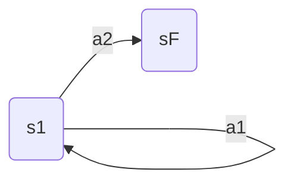

# Assignment 1: Imitation Learning

- [berkeley-PDF-HW02](https://rail.eecs.berkeley.edu/deeprlcourse/deeprlcourse/static/homeworks/hw2.pdf)
- [Github-hw2](https://github.com/berkeleydeeprlcourse/homework_fall2023/blob/main/hw2/README.md)

目标->试验策略梯度及其变体, 包括方差减少技巧(baseline)
- implementing reward-to-go 
- neural network baselines.

# Review

## 1. Policy gradient

policy gradient
$$\nabla_\theta J(\theta) = \nabla_\theta \int \pi_\theta(\tau)r(\tau)d\tau\\=\int \pi_\theta(\tau) \nabla_\theta log \pi_\theta (\tau) r(\tau)d\tau\\=E_{\tau \sim \pi_\theta (\tau)}[\nabla_\theta log \pi_\theta (\tau)r(\tau)]$$

approximated from a batch of N sampled trajectories
$$\nabla_\theta J(\theta) \approx \frac{1}{N} \sum_{i=1}^N \nabla_\theta log \pi_\theta (\tau)r(\tau)\\=\frac{1}{N} \sum_{i=1}^N (\sum_{t=0}^{T-1}\nabla_\theta log \pi_\theta (a_{it}|s_{it}))(\sum_{t=0}^{T-1}r(a_{it}, s_{it}))$$

## 2. VarianceReduction
### 2.1 Reward-to-go
$$\nabla_\theta J(\theta) \approx \frac{1}{N} \sum_{i=1}^N (\sum_{t=0}^{T-1}\nabla_\theta log \pi_\theta (a_{it}|s_{it}))(\sum_{t^\prime=t}^{T-1}r(a_{it^\prime}, s_{it^\prime}))$$


### 2.2 Discounting 
- full 
$$\nabla_\theta J(\theta) \approx \frac{1}{N} \sum_{i=1}^N (\sum_{t=0}^{T-1}\nabla_\theta log \pi_\theta (a_{it}|s_{it}))(\sum_{t=0}^{T-1}\gamma^{t - 1} r(a_{it}, s_{it}))$$

- Reward-to-go
$$\nabla_\theta J(\theta) \approx \frac{1}{N} \sum_{i=1}^N (\sum_{t=0}^{T-1}\nabla_\theta log \pi_\theta (a_{it}|s_{it}))(\sum_{t^\prime=t}^{T-1}\gamma^{t^\prime - t} r(a_{it^\prime}, s_{it^\prime}))$$

### 2.3 Baseline

$$\nabla_\theta J(\theta) = \nabla_\theta E_{\tau \sim \pi_\theta (\tau)}[ log \pi_\theta (\tau)(r(\tau) -b )]$$

$E_{\tau \sim \pi_\theta (\tau)}[ \nabla_\theta log \pi_\theta (\tau)b]=\int \pi_\theta(\tau)  \nabla_\theta log \pi_\theta (\tau)b  d\tau=\nabla_\theta \int  \pi_\theta (\tau)b d\tau = \nabla_\theta 1 b$

- if b is not depend of $\pi_\theta$ $\nabla_\theta 1 b=0$

reward-to-go + baseline
$$\nabla_\theta J(\theta) \approx \frac{1}{N} \sum_{i=1}^N (\sum_{t=0}^{T-1}\nabla_\theta log \pi_\theta (a_{it}|s_{it}))(\sum_{t^\prime=t}^{T-1}\gamma^{t^\prime - t} r(a_{it^\prime}, s_{it^\prime}) - V^\pi_\phi(s_{it}))$$


### 2.4 GAE: Generalized Advantage Estimation

### advantage function

$A^\pi (s_t, a_t)=\sum_{t^\prime=t}^{T-1}\gamma^{t^\prime - t} r(a_{it^\prime}, s_{it^\prime}) - V^\pi_\phi(s_{t})=Q^\pi(s_t, a_t) - V^\pi_\phi(s_{t})$

$A^\pi (s_t, a_t)\approx \delta_t=r(s_t, a_t) + \gamma V^\pi_\phi(s_{t+1}) - V^\pi_\phi(s_{t})$

### GAE

$A_n^\pi (s_t, a_t) = \sum_{t^\prime = t}^{t+n} \gamma^{t^\prime - t}r(s_{t^\prime}, a_{t^\prime}) + \gamma^n V^\pi_\phi(s_{t+n+1}) - V^\pi_\phi(s_{t})$


$A_1^\pi (s_t, a_t) = r(s_t, a_t) + \gamma V^\pi_\phi(s_{t+1}) - V^\pi_\phi(s_{t})=\delta_t$  
$A_2^\pi (s_t, a_t) = r(s_t, a_t) + \gamma (r(s_{t+1}, a_{t+1})+ \gamma V^\pi_\phi(s_{t+2})) - V^\pi_\phi(s_{t})\\=r_t+\gamma r_{t+1} + \gamma^2 V_{t+2} - V_t\\=\delta_t - \gamma V_{t+1} + \gamma r_{t+1} + \gamma^2 V_{t+2}\\=\delta_t + \gamma \delta_{t+1}$

$A_n = \sum_{i=1}^{n} \gamma ^{(i-1)} \delta_i$


$A_{GAE}(t)=\sum_{i}^T \lambda^i A_t^i = \sum_{i}^T \lambda^i \sum_j^{i}\gamma^{j-1} \delta_j$

展开如下

$A_{GAE}(t)= \delta _t + \lambda (\delta _t + \gamma \delta_{t+1})+ \lambda^2 (\delta _t + \gamma \delta_{t+1} + \gamma^2 \delta_{t+2}) + ...=\delta_t (1 + \lambda + \lambda ^ 2 + ...) + \gamma \delta_{t+1}(\lambda + \lambda ^ 2 + ...)+ \gamma^2 \delta_{t+2}(\lambda ^ 2 + ...)\\=\delta_t \frac{1*(1-\lambda^n)}{1-\lambda} + \gamma \delta_{t+1} \frac{\lambda*(1-\lambda^{n-1})}{1-\lambda} + \gamma^2 \delta_{t+2} \frac{\lambda^2*(1-\lambda^{n-2})}{1-\lambda}$

$\lim_{n \rightarrow \infin} (1-\lambda) A_{GAE}(t)\\=\delta _t + \lambda \gamma \delta _{t+1} + (\lambda \gamma)^2 \delta _{t+2}... \\= \sum_i^n (\lambda \gamma)^{i-1}\delta_i$

reward-to-go  and define $A_{GAE}(t) \propto (1-\lambda) A_{GAE}(t)$  

$A_{GAE}(t) = \sum_{t^\prime=t}^T (\lambda \gamma)^{t^\prime-t}\delta_{t^\prime}$

$A_{GAE}(t) = \delta_t + \lambda \gamma A_{GAE}(t+1)$

```python
def compute_GAE(gamma, lmbda, td_delta):
    td_delta = td_delta.detach().numpy()
    advantage_list = []
    advantage = 0.0
    for delta in td_delta[::-1]:
        advantage = gamma * lmbda * advantage + delta
        advantage_list.append(advantage)
    advantage_list.reverse()
    return torch.tensor(advantage_list, dtype=torch.float)
```

# 8- Analysis



1. reward: $R(s_1, a_1)=1; R(s_1, a_2)=0$
2. terminal: $Done: s_1 + a_2$
3. policy: $\pi_\theta (a_1|s_1) = \theta; pi_\theta (a_2|s_1) = 1 - \theta;$

## 8.1 Applying policy gradients 

$J(\theta) = E_{\pi_\theta} [R(\tau)]; \gamma=1$

1. trajectory length = 1, 2, k
   1. 1: $P_{l=1}(\tau) = \theta (1-\theta)$,  reward: $R_{l=2}(\tau) = 1$
   2. 2: $P_{l=2}(\tau) = \theta ^2 (1-\theta)$,  reward: $R_{l=3}(\tau) = 2$
   3. k: $P_{l=k}(\tau) = \theta ^k (1-\theta) $,  reward: $R_{l=k}(\tau) = k$

$J(\theta) = E_{\pi_\theta} [R(\tau)] = (1-\theta)\sum_{k=0}^\infin k \theta^k$

化简：
1. $\sum_{k=0}^\infin k \theta^k = \theta \frac{d}{d \theta} \sum_{k=0}^\infin\theta^k$
2. 等差数列和$\sum_{k=0}^\infin\theta^k=\frac{ 1 *(1-\theta^\infin)}{1-\theta}=\frac{1}{1-\theta}$
3. $\frac{d}{d \theta} \sum_{k=0}^\infin\theta^k = \frac{d}{d \theta} \frac{1}{1-\theta}=\frac{1}{(1-\theta)^2}$
4. $\sum_{k=0}^\infin k \theta^k = \theta \frac{1}{(1-\theta)^2}$

所以
$J(\theta) = E_{\pi_\theta} [R(\tau)] = (1-\theta) \frac{\theta}{(1-\theta)^2} = \frac{\theta}{1-\theta}$


1. Compute the expected return of the polkcy $E_{\tau \sim \pi_\theta}R(\tau)$ directly, Compute the gradient of thks expression with respect to $\theta$

$\nabla J(\theta) =\frac{1}{(1-\theta)}+\frac{\theta}{(1-\theta)^2} = \frac{1}{(1-\theta)^2}$


$\nabla J(\theta) =\nabla_\theta E_{\tau \sim \pi_\theta} [log \pi(\tau) R(\tau)]= E_{\tau \sim \pi_\theta} [R(\tau) \nabla_\theta log \pi(\tau) ]$
- $\nabla_\theta log \pi(\tau) = \nabla_\theta [k log \theta + log(1-\theta)] = \frac{k}{\theta} - \frac{1}{1-\theta}$
- $R(\tau)=(1-\theta)\sum_{k=0}^\infin k \theta^k$

$\rightarrow \nabla J(\theta) =(1-\theta)\sum_{k=0}^\infin k \theta^k \times (\frac{k}{\theta} - \frac{1}{1-\theta})$

$=(1-\theta)[\frac{1}{\theta} \sum_{k=0}^\infin k^2 \theta^k - \frac{1}{1-\theta} \sum_{k=0}^\infin k \theta^k]$

$=(1-\theta)[\frac{1}{\theta} \frac{\theta(1+\theta)}{(1-\theta)^3} - \frac{1}{1-\theta} \frac{\theta }{(1-\theta)^2} ]$

$=(1-\theta)[\frac{1 + \theta }{(1-\theta)^3} - \frac{\theta }{(1-\theta)^3}]=\frac{1}{(1-\theta)^2}$


## 8.2 Compute the variance of the policy gradient in closed form

方差
单轨迹梯度：$g(\tau) = R(\tau) \nabla_\theta log \pi(\tau) =k (\frac{k}{\theta} - \frac{1}{1-\theta})$

K服从几何分布$P(K)=\theta^{k}(1-\theta)$

$Var[g(\tau)] = E[g^2] - (E[g])^2$
- $E[g]=\frac{1}{(1-\theta)^2}$
- $E[g^2] = (1−\theta)\sum_{k=0}^\infin k^2 (\frac{k}{\theta} - \frac{1}{1-\theta})^2 \theta^k = \frac{1+\theta}{\theta(1-\theta)^2}$

所以
$Var[g(\tau)] =\frac{1+\theta}{\theta(1-\theta)^2} -  \frac{1}{(1-\theta)^4} = \frac{1}{\theta(1-\theta)^2}$


$\theta \rightarrow 1^- \ (Var \rightarrow 0)$
 
$\theta \rightarrow 0^+ \ (Var \rightarrow \infin)$

## 8.3 Apply return-to-go as an advantage estimator

(a) Write the modified policy gradient and confirm that it is unbiased

advantage:   
$A(s_t, a_t) = \sum_{k=t}^{T-1}r_k -b$

policy-gradient:  
$\nabla_\theta J(\theta) = E_{\tau \sim \pi_\theta} [ \sum_{k=t}^{T-1}  \nabla_\theta log \pi_\theta (a_t|s_t)A(s_t, a_t) ]$

b is $\theta$-independent:

$E_{\tau \sim \pi_\theta} [ \sum_{k=t}^{T-1}  \nabla_\theta log \pi_\theta (a_t|s_t)b]=0$


(b) Compute the variance of the return-to-go policy gradient and plot it on [0, 1] alongside the variance
of the original estimator.

assume:
1. single-step reward variance $\sigma_r^2$


Original (full-trajectory) estimator variance:
- independent rewards, the return variance is $Var[R] = K \sigma_r^2$
- policy gradient $g = E_{\tau \sim \pi_\theta} [ \sum_{k=t}^{K-1}  \nabla_\theta log \pi_\theta (a_t|s_t)(R - b)]$
- $Var[g]=(\sum_{k=t}^{K-1}  \nabla_\theta log \pi_\theta (a_t|s_t))^2 Var[R] \propto  K^2(K \sigma_r^2)$

Return-to-go estimator variance:
- $Var[R_t] = (K-t) \sigma_r^2$
- policy gradient $g = E_{\tau \sim \pi_\theta} [ \sum_{k=t}^{K-1}  \nabla_\theta log \pi_\theta (a_t|s_t)(R_{t} - b)]$
- $Var[g]  \propto  \sigma_r^2 \sum_{k=t}^{K-1} (K-t)=\sigma_r^2 \frac{K(K+1)}{2}$


## 8.4 Consider a finite-horizon H-step MDP with sparse reward:


sparse reward：

$R(\tau) = \left\{ \begin{matrix} 1 \ \ \tau \rightarrow s_H \\ 0   \ \ \tau \rightarrow s_F  \end{matrix} \right. $


a) Write the policy gradient with importance sampling.

$\nabla_\theta J(\theta) = \nabla_\theta E_{\tau \sim \pi_{old}}[\frac{\pi_{new}}{\pi_{old}}log(\pi_{new} (a|s))R(\tau)] $
- $\rho = \frac{\pi_{new}}{\pi_{old}} = \frac{\theta^k}{ {\theta^\prime}^k} $
- $\nabla_\theta log(\pi_{new} (a|s))=\nabla_\theta [log(\theta^k)] = \frac{k}{\theta}$

策略梯度（一条轨迹）:
$g = \left\{ \begin{matrix} 1*\frac{k\theta^{k-1}}{ {\theta^\prime}^k }\ \ \tau \rightarrow s_H \\ 0   \ \ \tau \rightarrow s_F  \end{matrix} \right. $


b) Compute its variance. How does it change when H becomes large?
>  重要性采样策略梯度的期望 = 无 IS 时的梯度，与行为策略 θ′ 无关（无偏）


$E(g) = g(\tau) * P_{\pi_{old}(\tau)} = \rho \frac{H}{\theta} * P_{\pi_{old}(\tau)} = \frac{H\theta^{H-1}}{{\theta^\prime}^H} * {\theta^\prime}^H = H \theta^{H-1}$


$Var[g] = E[g^2] - (E[g])^2$
- $E[g^2] = \rho (\frac{H}{\theta})^2 {\theta^\prime}^H=  \theta^H \frac{H^2}{\theta^2} = H^2 \theta^{H-2}$
- $(E[g])^2=H^2 \theta^{2H-2}$

$Var[g] =  H^2 \theta^{H-2} - H^2 \theta^{2H-2} = H^2 \theta^{H-2}(1-\theta^H)$

$lim_{H \rightarrow +\infin} Var[g]$ 指数级放大 

