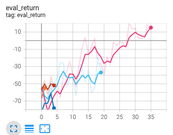
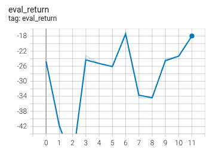
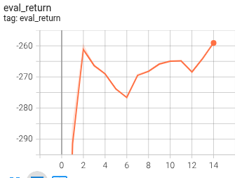
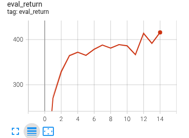
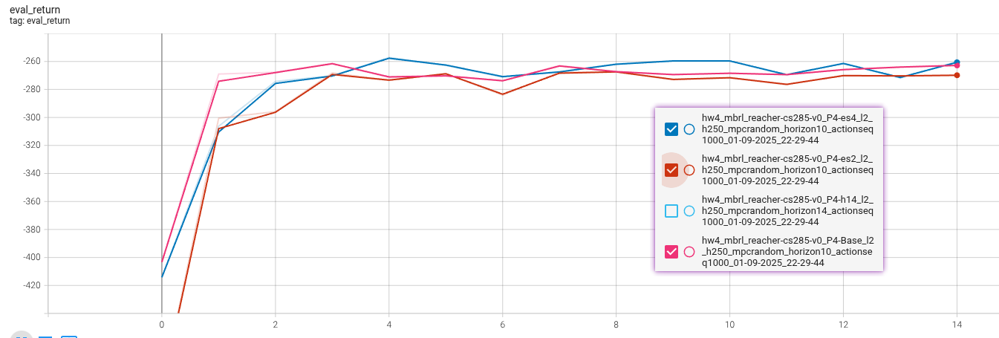
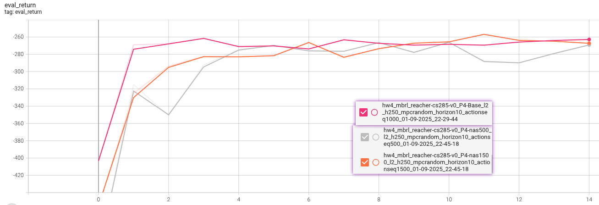
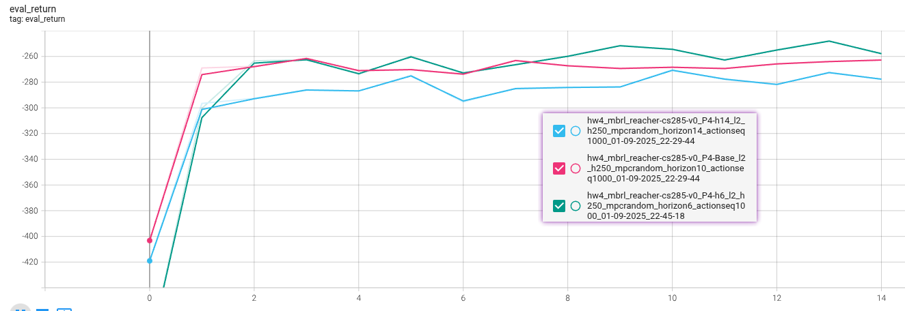
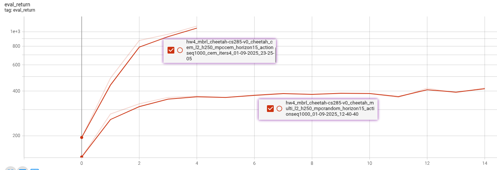

# Assignment 4:  Model-Based RL

- [berkeley-PDF-HW04](https://rail.eecs.berkeley.edu/deeprlcourse/deeprlcourse/static/homeworks/hw4.pdf)
- [Github-hw4](https://github.com/berkeleydeeprlcourse/homework_fall2023/tree/main/hw4)

1. 对环境建模：learning a dynamics function to model observed state transitions
2. then using predictions from that model in some way to decide what to do 
   1. use model predictions to learn a policy, 
   2. or use model predictions directly in an optimization setup to maximize predicted rewards

## Analysis 

Setting: $M = (\mathcal{S}, \mathcal{A}, P, r, \gamma)$
- $\mathcal{S}, \mathcal{A}$ 是一个无限集合
- $P = P(\cdot | s, a)$是状态转移概率
- $r$是奖励函数
- $\gamma$是折扣系数

Learning a dynamics model. 
我们考虑最朴素的基于模型的算法。假设我们可以访问环境的模拟器，对于每个状态-动作对 (s, a)，我们调用模拟器 N 次，获得样本 $s^\prime \sim P(\cdot | s, a)$。然后，我们简单地构建一个环境动力学模型

$\hat{P}(s^\prime | s, a) = \frac{count(s, a, s^\prime)}{N}$
- $count(s, a, s^\prime)$: 表示$s, a \rightarrow s^\prime$的次数

Additional notation. $\hat{M}$ 等价于 M
- $\hat{V}^\pi, \hat{V}^\star$ 为value function
- $\hat{Q}^\pi, \hat{Q}^\star$ 为state-action value function

在$\hat{M}$中优化上述函数

### Problem 2.1.
$Q^\pi - \hat{Q}^\pi = \gamma (I-\gamma \hat{P}^\pi) ^{-1} (P - \hat{P})V^\pi = \gamma (I-\gamma P^\pi) ^{-1} (P - \hat{P})\hat{V}^\pi $

对于任意策略$\pi$: 
- 真实的转移概率：$P^\pi(s′|s) = \sum_a \pi(a|s) P(s′|s, a)$
- 建模的转移概率：$\hat P^\pi(s′|s) = \sum_a \pi(a|s) \hat P(s′|s, a)$

Bellman算子:
- 真实世界里走一步后的预期回报: $T^\pi Q = r + \gamma P^\pi Q$
- 建模世界里走一步后的预期回报: $\hat T^\pi Q = r + \gamma \hat P^\pi Q$

prove: 
1. $Q^\pi = r + \gamma P^\pi Q^\pi ; \hat{Q}^\pi = r + \gamma \hat{P}^\pi \hat Q^\pi$
2. 两式相减： $Q^\pi - \hat{Q}^\pi = \gamma P^\pi (Q^\pi − \hat Q^\pi) + \gamma (P^\pi − \hat P^\pi) \hat Q^\pi$
3. 整理:$\Rightarrow (I − \gamma P^\pi)(Q^\pi − \hat Q^\pi) = \gamma (P^\pi − \hat P^\pi) \hat Q^\pi \\ \Rightarrow Q^π − \hat Q^\pi = \gamma (I − \gamma  P^\pi)^{-1} (P^\pi − \hat P^\pi) \hat Q^\pi$
5. 基于V和Q的关系 $\hat V^\pi(s) = \sum_a \pi(a|s) \hat Q^\pi(s,a)$
   1. 加权矩阵 $ \Pi = \sum_a \pi(a|s) \rightarrow \hat{V}^\pi = \Pi \hat Q^\pi$
6. 带入V : $Q^\pi − \hat Q^\pi = \gamma (I-\gamma P^\pi) ^{-1} (P - \hat{P})\Pi^{-1} \hat{V}^\pi$
7. 直接省略$\Pi^{-1}$，误差式自然化： $Q^\pi − \hat Q^\pi = \gamma (I-\gamma P^\pi) ^{-1} (P - \hat{P})\hat{V}^\pi$

### Problem 2.2. 

下列哪个描述是正确的 

1. X 对于任意策略$\pi, \delta \gt 0$, 下式以至少 $1-\delta$的概率成立。 Error Reason: $4|\mathcal{S}|$ 因子来源不明

$|| (P - \hat{P}) \hat{V}^\pi ||_\infin \le \max_{s, a} || P(\cdot | s, a) - \hat{P}(\cdot | s, a) ||_1 ||\hat{V}^\pi||_\infin \\ \le \frac{1}{1-\gamma} \sqrt{\frac{4|\mathcal{S}|log(|\mathcal{S}| |\mathcal{A}|/\delta) }{N}}$

2. √ 对于任意策略$\pi$ 和 $\delta \gt 0$, 下式以至少 $1-\delta$的概率成立：

$|| (P - \hat{P}) \hat{V}^\pi ||_\infin \le \frac{1}{1-\gamma} \sqrt{2\frac{log(2|\mathcal{S}| |\mathcal{A}|/\delta) }{N}}$

用 Hint 2 的方法：
对每个 (s,a)，令 $X_i = I_{s^\prime} \cdot \hat V^\pi(s^\prime)$。
- 取值范围 $0 ≤ Xi ≤ ||\hat V^π||_\infin$
- 独立同分布: 由 Hoeffding + union bound 给出的逐点误差
  - $|(P−\hat P)\hat V^π|_{(s,a)} \le \sqrt{2||\hat V^π||_{\infin}^2 log(2|S||A|/δ)/N}$
  - 取 max 得到 $\infin$范数后即为 
    - $||(P−\hat P)\hat V^π||_{\infin}$
    - $= max_{s,a} |(P−\hat P)\hat V^π|_{(s,a)}$
    - $\le max_{s,a} \sqrt{2||\hat V^π||_{\infin}^2 log(2|S||A|/δ)/N}$
    - $= \sqrt{2||\hat V^π||_{\infin}^2 log(2|S||A|/δ)/N}$
  - $||\hat V^π||_\infin \le \sum_{t=0}^\infin \gamma^t \cdot 1 = 1/(1−\gamma)$
    - 在折扣因子 $\gamma \lt 1$ 且即时奖励 $r\in [0,1]$ 的 MDP 里，无限步折扣回报的上界就是几何级数 $1+\gamma+\gamma ^2 +⋯ = 1/(1−\gamma)$
  - 带入后最终得到 $|| (P - \hat{P}) \hat{V}^\pi ||_\infin \le \frac{1}{1-\gamma} \sqrt{2\frac{log(2|\mathcal{S}| |\mathcal{A}|/\delta) }{N}}$

3. X  下式以至少 $1-\delta$的概率成立：$||(P - \hat{P}) V^\star ||_\infin \le \frac{1}{1-\gamma} \sqrt{2\frac{log(2|\mathcal{S}| |\mathcal{A}|/\delta) }{N}}$

不等式里用了 $V^\star$（最优价值），而 $V^\star$ 依赖于转移分布，不满足 Hint 2 中“V 与观测无关”的前提，无法直接套用 Hoeffding。

4. √ 对于任意策略$\pi$ 和 $\delta \gt 0$, 下式以至少 $1-\delta$的概率成立：

$|| (P - \hat{P}) \hat{V}^\star ||_\infin \le \frac{1}{1-\gamma} \sqrt{2\frac{log(2|\mathcal{S}| |\mathcal{A}|/\delta) }{N}}$

与 2 同理，只是把 $\hat V^\pi$ 换成 $\hat V^\star$；$\hat V^\star$ 是在 模型 MDP 中定义的纯函数，不依赖于真实样本，因此仍满足独立性前提，Hoeffding 可用。

$\hat V^\pi ≤ \hat V^\star ≤ V^\star + \epsilon$

| 维度         | $\hat V^\pi$                  | $\hat V^\star$                                    | $V^\star$                                     |
| ---------- | ----------------------------- | ------------------------------------------------- | --------------------------------------------- |
| **所处 MDP** | 模型 MDP ($\hat P$)             | **同一模型 MDP** ($\hat P$)                           | **真实环境** ($P$)                                |
| **策略**     | **固定策略** $\pi$                | **模型最优策略** $\hat\pi^\star$                        | **真实最优策略** $\pi^\star$                        |
| **数学定义**   | $(I-\gamma\hat P^\pi)^{-1}r$  | $\displaystyle\max_\pi(I-\gamma\hat P^\pi)^{-1}r$ | $\displaystyle\max_\pi(I-\gamma P^\pi)^{-1}r$ |
| **关系**     | $\hat V^\pi \le \hat V^\star$ | $\hat V^\star \le V^\star +  \epsilon$   | —                                             |
| **与真实误差**  | 衡量给定策略在**模拟器**中的表现            | 衡量**模拟器**本身的最优潜力                                  | 衡量**现实**中的理论最高分                               |
| **意义** | 模拟器里$\pi$的表现 | 模拟器里理论最高分 | 现实里理论最高分 |

## 3. Model-Based RL (MBRL)

[Lecture 11: Model-Based Reinforcement Learning](https://rail.eecs.berkeley.edu/deeprlcourse/static/slides/lec-11.pdf)

主要2部分组成：
1) 学习一个动力学模型；
2) 利用所学动力学模型进行规划与执行动作，以最小化某个代价函数（或最大化某个奖励函数）

### 3.1 Dynamic Model 

$\hat{\triangle}_{t+1}=f_\theta (s_t, a_t)$

生成下一个状态

$\hat{s}_{t+1} = s_t + \hat{\triangle}_{t+1}$

目标函数：

$\mathcal{L}(\theta)=\sum_{(s_t, a_t, s_{t+a}) \in \mathcal{D}} || (s_{t+1} - s_t) - f_\theta (s_t, a_t) ||^2_2 = \sum_{(s_t, a_t, s_{t+a}) \in \mathcal{D}} || \triangle_{t+1}- \hat{\triangle}_{t+1}= ||^2_2 ... (4)$

在实践中，对神经网络的目标进行归一化是有帮助的。因此，在代码里，我们将训练网络去预测状态变化量的归一化版本，如下所示：

$\mathcal{L}(\theta)=\sum_{(s_t, a_t, s_{t+a}) \in \mathcal{D}} || Normalize(s_{t+1} - s_t) - f_\theta (s_t, a_t) ||^2_2 $

进行预估下一状态的时候
$\hat{s}_{t+1} = s_t + Unnormalize(f_\theta (s_t, a_t))$

### 3.2 Action Selection 

$a^\star = \argmin_{a_{t:\infin}} \sum_{t^\prime=t}^\infin c(\hat{s}_{t^\prime}, a_{t^\prime}); \hat{s}_{t^\prime+1} = \hat{s}_{t^\prime} + Unnormalize(f_\theta (s_{t^\prime}, a_{t^\prime})) ..... (7)$

2个关键问题：
1) 对无限长的动作序列进行规划是不可行的
2) dynamics model不是完美的，若这种开环方式去规划，误差会随时间不断累积，导致远期的规划极其不准

$A^\star = \argmin_{\{ A^0, ..., A^{K-1} \}} \sum_{t^\prime=t}^{t+H-1} c(\hat{s}_{t^\prime}, a_{t^\prime}); \hat{s}_{t^\prime+1} = \hat{s}_{t^\prime} + Unnormalize(f_\theta (s_{t^\prime}, a_{t^\prime})) ..... (8)$
- $A^k = (a^k_t, ..., a^k_{t+H-1})$ 是长度为H的随机动作的序列
- K个长度为H的随机动作序列，利用dynamics model $f_\theta$预测每条序列所能产生的未来状态，并计算各个候选序列对应的代价/回报，最终选出最优动作序列。

相比这种“随机射击”（random-shooting）优化，更优的替代方案是交叉熵方法（CEM）。CEM 与随机射击类似，但会迭代地改进采样分布。具体步骤如下：
1. 与随机射击一样，先随机初始化 K 条动作序列 $A^(0), …, A^(K−1)$。
2. 从中挑选预测折扣回报最高的 J 条序列作为“精英”动作序列。
3. 用这些精英序列的均值与方差拟合一个对角高斯分布，并在下一轮迭代中以此分布采样新的动作序列。
4. 重复上述过程 M 次后，取最终高斯分布的均值作为优化后的动作序列。

更多细节可参见本文第 3.3 节。[paper: Deep Dynamics Models for Learning Dexterous Manipulation](https://arxiv.org/pdf/1909.11652)

此外，由于模型并不完美，实际执行总会偏离计划，我们采用模型预测控制（MPC）策略：在每个时间步，先用随机射击或 CEM 选出最优的 H 步动作序列，但仅执行其中第一个动作；随后利用更新后的状态信息重新规划。通过这种方式，可以显著降低因近似动力学模型长期预测所带来的误差累积。

### 3.3 On-Policy Data Collection 

尽管理论上 MBRL 属于 off-policy 方法——意味着它可以从任何数据中学习——但在实际应用中，如果缺乏 on-policy 数据，其表现往往会很差。
换句话说，若模型仅用随机收集的数据训练，则在大多数情况下，它无法准确描述我们真正关注的那部分状态空间。
因此，我们可以通过迭代式地收集 on-policy 数据来提升整体任务性能，具体流程如下：

----
Algo1: Model-Based RL with On-Policy Data

使用基础策略函数$\pi_o(a_t, s_t)$(比如随机策略) ，来收集数据 $\mathcal{D} = \{ (s_t, a_t, s_{t+1}) \}$

while not done:
  1. 用 $\mathcal{D} = \{ (s_t, a_t, s_{t+1}) \}$ 训练 $f_\theta$ (使用公式4)
  2. $s_t \rightarrow s_{cur}$
  3. for m=0 to M:
     1. for t=0 to T:
        1. $A^\star = \pi_{MPC}(a_t, s_t)$; $\pi_{MPC}$来自random-shooting 或者 CEM
        2. $a_t \leftarrow 1^{st} action in A^\star$
        3. $s_{t+1}, r, te, tu, _ = env.step(a_t)$
        4. $\mathcal{D}$ 中加入 $(s_t, a_t, s_{t+1})$

----

$\pi_{MPC-CEM}$: (数据驱动 + 随机搜索 + 分布更新)
1. 进行N次迭代
   1. i==0 → 用初始 mean/ std
   2. 基于$\mathcal{N}(\mu, \sigma)$ 采样action
   3. 评估采样的action
   4. 基于评估选取TopK & 更新 $(\mu, \sigma)$
2. 最终返回 $\mu$ 作为action

### 3.4 Ensembles 

提升预测精度的一个简单且有效的方法是使用模型集成。其思路很直接：
不再只训练一个网络 $f_\theta$，而是训练 N 个独立初始化的网络 $\{f_{\theta _n}\}_{n=1}^N$。在测试阶段，对于每条候选动作序列，我们独立地生成 N 条 rollout，并将这些 rollout 的回报取平均，再从中选出最优的动作序列。

## Code

### P1: halfcheetah_0_iter.yaml
Collect a large dataset by executing random actions. Train a neural network dynamics model on this fixed
dataset. 

参数调整：
- num_iters: $5 \rightarrow 36$
- initial_batch_size: $20000 \rightarrow 12000$
- num_eval_trajectories: $0 \rightarrow 5$

### P3

You should expect 
- rewards of around-25 to-20 for the obstacles env: -17.7498
  - 
- rewards of around-300 to-250 for the reacher env: -258.87
  - 
- rewards of around 250-350 for the cheetah env: 419.827
  - 

### P4
修改YAML 配置文件，分别去掉每一个超参数（即做消融实验）。
对每个超参数，至少跑两次：一次将其调大，一次将其调小（相对默认值），因此总共需要 7 次实验。
研究某一个超参数时，请保持其余超参数不变。
提交内容：
将这 7 次实验的完整日志作为 run logs 一并提交。
绘制并提交以下三组图，每张图需配有标题、图例和说明文字，描述你观察到的趋势：
- **集成规模（ensemble size）** 的影响
  - 
- **候选动作序列数量（candidate action sequences）** 的影响
  - 
- **规划时域（planning horizon）** 的影响
  - 

### P5 halfcheetah_cem.yaml

### P6  MBPO.

