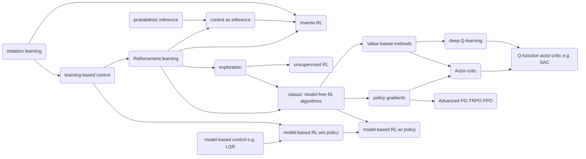
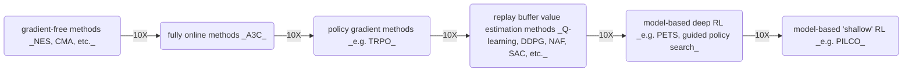

# RL Route



## learning timesteps 




# DataWhale习题回答

## 1.1 强化学习的基本结构是什么？

智能体 + 环境：

- 智能体在环境中获取状态(`state`)
- 智能体利用这个状态输出一个决策（一个动作`action`：可以离散的，也可以是连续的）
- 环境返回下一个状态(`next_state`)，以及一个奖励 (`reward`)
- 重复以上过程以在环境中获取最大的收益

整个探索的过程如下

```python
# 重置环境
state, _ = env.reset()
done = False
episode_cnt = 0
max_step = 260
explore_memory = []
while not done:
    episode_cnt += 1
    # 智能体利用这个状态输出一个决策
    action = agent.policy(state)
    # 环境返回下一个状态
    next_state, reward, done, _, _ = env.step(a)
    # 保存探索的过程
    explore_memory.append([state, reward, next_state, done])
    state = next_state
    if episode_cnt >= max_step:
        break

# 基于探索状态更新智能体
agent.update(explore_memory)
```

## 1.2 强化学习相对于监督学习为什么训练会更加困难？

- 监督学习可以基于标签，损失函数来在学习的过程中通过反向传播不断修正自己的预测。  
- 强化学习目标是不同决策下的状态序列所获得的奖励，它不能很好的得到反馈快速修正学习，需要不断的试错探索最终获得延迟奖励。

## 1.3 强化学习的基本特征有哪些？

1. 在沿用当前学习到的策略的同时会有一定的机率进行探索，以获取对环境不一样的理解，以完善对环境的认识（学习更加的全面与健壮）
2. 获取延迟奖励
   - 不能很快的获取最终反馈
   - 会用折扣率(`gamma`)来权衡近期奖励和未来奖励  
3. 时间因素非常重要，数据非独立同分布（是一串相关联的序列数据）。
4. 智能体的行为会对后续影响，模型是非稳定的
   - 强化学习里一个非常重要的问题是如何让智能体的行为一直稳定地提升

## 1.4 近几年强化学习发展迅速的原因？

1. 强化学习得到的模型可以超人类的表现（AlphaGo在围棋上的突出表现）
2. 近几年深度学习的快速发展，使得数据科学家将<font color=darkred>强化学习和深度学习</font>进行结合。可以用深度强化学习实现一个端到端训练的过程。直接输入状态，无需设计策略，就可以输出动作。
3. 近几年的硬件的快速发展，算力不断提升，有了更多的GPU

## 1.5 状态和观测有什么关系？

状态是对世界的完整描述，观测是智能体对状态的部分描述。

- 完全观测：智能体能够观察到环境的所有状态
- 部分观测：智能体智能观测到部分状态

## 1.6 对于一个强化学习智能体，它由什么组成？

1. 策略函数：选取下一个动作
   1. 会有很多种探索策略: epsilon-greedy, softmax, 汤普森采样, ucb等，可以看笔者PR的[Q-learning探索策略研究.ipynb](https://github.com/johnjim0816/rl-tutorials/blob/master/notebooks/Q-learning/Q-learning%E6%8E%A2%E7%B4%A2%E7%AD%96%E7%95%A5%E7%A0%94%E7%A9%B6.ipynb)
2. 价值函数：对当前状态进行估价（`V(s)`）
   1. 对于DQN, PPO等深度强化学习模型就无需设计价值函数
   2. 当时需要注意的是，一个基于场景与业务设计的价值函数较为合理的时候有时候表现也是不错的
3. 模型：智能体对这个环境的状态进行了理解

## 1.7 根据强化学习智能体的不同，我们可以将其分为哪几类？

- 基于价值的智能体
  - 显式的学习价值函数，隐式的学习它的策略
- 基于策略的智能体
  - 直接学习策略：给与一个状态，返回一个行动概率
- 演员-评论员智能体（经典框架，很多深度强化学习都是基于该框架-如PPO）
  - 结合策略和价值
  - 基于策略寻找动作，基于价值对动作评估。在原有的策略梯度算法的基础上加速学习。

## 1.8 基于策略迭代和基于价值迭代的强化学习方法有什么区别？

1.7已经回答

## 1.9 有模型学习和免模型学习有什么区别？

通过智能体到底有没有学习这个环境模型来分类

- 有模型：它通过学习这个状态的转移来采取动作
  - 据环境中的经验，构建一个虚拟世界，同时在真实环境和虚拟世界中学习
- 免模型：没有去直接估计这个状态的转移，也没有环境的具体转移变量。它通过学习价值函数和策略函数进行决策。（即没有一个环境转移的模型）
  - 直接与真实环境进行交互来学习到最优策略

免模型强化学习的泛化能力更强，但是所需的数据量更加的大（需要大量的采样来估计状态、动作及奖励函数，从而优化动作策略）。

## 1.10 强化学习的通俗理解

在没有及时反馈的情况下，通过不断的自我学习(经验结合试错)来获取最终环境的延迟奖励。

