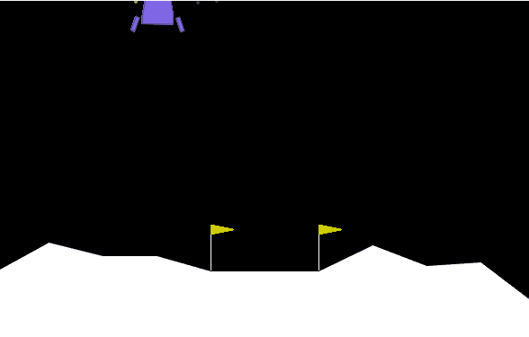

# 基于价值的DRL方法总结

|方法| action描述 | state描述 | QNet | TagetQNet | action选取 | QTarget | loss | 备注 |
|-|-|-|-|-|-|-|-|-|
| DQN | 仅离散动作 | 支持连续状态 | QNet(state) -> q | deepcopy(QNet) | $a=max(TagetQNet(s_{t+1}))$| $q_{t+1}=TagetQNet(s_{t+1})[a];\\  QTarget=r + \gamma * q_{t+1}$ | MSE(QNet(state), QTarget)| 对传统Qtable状态空间有限的拓展 |
| doubleDQN | 仅离散动作 | 支持连续状态 | QNet(state) -> q | deepcopy(QNet) | <font color=darkred>$a=max(QNet(s_{t+1}))$</font>| $q_{t+1}=TagetQNet(s_{t+1})[a];\\  QTarget=r + \gamma * q_{t+1}$ | MSE(QNet(state), QTarget)| 对DQN Qtarget高估的修正|
| DuelingDQN | 仅离散动作 | 支持连续状态 | VNet(state) -> <font color=darkred>V + A - mean(A) </font>-> q | deepcopy(VNet) | $a=max(TagetQNet(s_{t+1}))$| $q_{t+1}=TagetQNet(s_{t+1})[a];\\ QTarget=r + \gamma * q_{t+1}$ | MSE(QNet(state), QTarget)| 拆分成价值函数和优势函数计算q,另一种修正QTagret高估方法 |


## 8.1 环境实验与调参经验

|环境与描述 | 使用方法 | 网络结构 | 环境参数配置 | agent参数配置 | 训练参数配置 | 经验 |
|-|-|-|-|-|-|-|
|[ CartPole-v1 ](state: (4,),action: 2(离散))| DuelingDQN | [10, 10] | `dict(action_contiguous_=False, seed=42)` | `dict(epsilon=0.01, target_update_freq=3, gamma=0.95, learning_rate=2e-3)` | `dict(num_episode=500, off_buffer_size=2048, off_minimal_size=1024, sample_size=256, max_episode_steps=240)`| 相对简单环境buffer可以相对小一些，训练效果不佳时`num_episode`可以调大  |
|[ MountainCar-v0 ](state: (2,),action: 3(离散 ))| DuelingDQN | [32, 32] | `dict(action_contiguous_=False, seed=42)` | `dict(epsilon=0.05, target_update_freq=3, gamma=0.95, learning_rate=2e-3)` | `dict(num_episode=200, off_buffer_size=3076, off_minimal_size=1024, sample_size=256, max_episode_steps=500)`| 相对复杂环境: 1.增加网络宽度与深度 2.需要增加探索率`epsilon`; 3.将回合步数调大`max_episode_steps`;需要多次训练尝试，同时也可以适量的增大`off_buffer_size`  |
|[ Acrobot-v1 ](state: (6,),action: 3(离散 ))| DuelingDQN | [128, 64] | `dict(action_contiguous_=False, seed=42)` | `dict(epsilon=0.05, target_update_freq=3, gamma=0.95, learning_rate=2e-3)` | `dict(num_episode=300, off_buffer_size=20480, off_minimal_size=1024, sample_size=256, max_episode_steps=400)`| 相对复杂环境: 1.增加网络宽度与深度 2.需要增加探索率`epsilon`; 3.将回合步数调大`max_episode_steps`;4. 适量的增大`off_buffer_size`;5. 增加迭代次数  |
|[ LunarLander-v2 ](state: (8,),action: 4(离散 ))| DuelingDQN | [128, 64] | `dict(action_contiguous_=False, seed=42)` | `dict(epsilon=0.05, target_update_freq=3, gamma=0.99, learning_rate=2e-3)` | `dict(num_episode=800, off_buffer_size=20480, off_minimal_size=2048, sample_size=128, max_episode_steps=200)`| 由于环境需要正确降落, 所以在调参的时候需要调整`max_episode_steps`不能过大也不过小，过大可能会导致智能体悬空，同时需要增加迭代次数`num_episode` ,适当减小每次的`sample_size` |


## 8.2 实验效果

|环境与描述 | 使用方法 | 配置| 效果|
|-|-|-|-|
|[ CartPole-v1 ](state: (4,),action: 2(离散))| DuelingDQN | 上述对应配置|  |
|[ MountainCar-v0 ](state: (2,),action: 3(离散 ))| DuelingDQN | 上述对应配置|  |
|[ Acrobot-v1 ](state: (6,),action: 3(离散 ))| DuelingDQN | 上述对应配置|  |
|[ LunarLander-v2 ](state: (8,),action: 4(离散 ))| DuelingDQN | 上述对应配置|  |


## 8.3 环境实验脚本简述

详细看[github test_dqn脚本](https://github.com/scchy/RL/blob/main/src/test/test_dqn.py)

**CartPole-v1**

```python
import gym
import torch
from RLAlgo.DQN import DQN
from RLUtils import train_off_policy, play, Config, gym_env_desc

env_name = 'CartPole-v1' 
gym_env_desc(env_name)
env = gym.make(env_name)
action_contiguous_ = False

cfg = Config(
    env, 
    # 环境参数
    split_action_flag=True,
    save_path=r'D:\TMP\dqn_target_q.ckpt',
    # 网络参数
    hidden_layers_dim=[10, 10],
    # agent参数
    learning_rate=2e-3,
    target_update_freq=3,
    gamma=0.95,
    epsilon=0.01,
    # 训练参数
    num_episode=500,
    off_buffer_size=2048,
    off_minimal_size=1024,
    sample_size=256,
    max_episode_steps=240,
    # agent 其他参数
    dqn_type = 'duelingDQN'
)
dqn = DQN(
    state_dim=cfg.state_dim,
    hidden_layers_dim=cfg.hidden_layers_dim,
    action_dim=cfg.action_dim,
    learning_rate=cfg.learning_rate,
    gamma=cfg.gamma,
    epsilon=cfg.epsilon,
    target_update_freq=cfg.target_update_freq,
    device=cfg.device,
    dqn_type=cfg.dqn_type
)
train_off_policy(env, dqn, cfg, action_contiguous=action_contiguous_)

```

**MountainCar-v0**

```python
env_name = 'MountainCar-v0' 
gym_env_desc(env_name)
env = gym.make(env_name)
action_contiguous_ = False # 是否将连续动作离散化

cfg = Config(
    env, 
    # 环境参数
    split_action_flag=True,
    save_path=r'D:\TMP\dqn_target_q.ckpt',
    seed=42,
    # 网络参数
    hidden_layers_dim=[32, 32],
    # agent参数
    learning_rate=2e-3,
    target_update_freq=3,
    gamma=0.95,
    epsilon=0.05,
    # 训练参数
    num_episode=200,
    off_buffer_size=2048+1024,
    off_minimal_size=1024,
    sample_size=256,
    max_episode_steps=500,
    # agent 其他参数
    dqn_type = 'duelingDQN'
)

```


**Acrobot-v1**

```python
env_name = 'Acrobot-v1' 
gym_env_desc(env_name)
env = gym.make(env_name)
action_contiguous_ = False # 是否将连续动作离散化

cfg = Config(
    env, 
    # 环境参数
    split_action_flag=True,
    save_path=r'D:\TMP\Acrobot_dqn_target_q.ckpt',
    seed=42,
    # 网络参数
    hidden_layers_dim=[128, 64],
    # agent参数
    learning_rate=2e-3,
    target_update_freq=3,
    gamma=0.95,
    epsilon=0.05,
    # 训练参数
    num_episode=300,
    off_buffer_size=20480,
    off_minimal_size=1024,
    sample_size=256,
    max_episode_steps=400,
    # agent 其他参数
    dqn_type = 'duelingDQN'
)
```


**LunarLander-v2**

```python
env_name = 'LunarLander-v2' 
gym_env_desc(env_name)
env = gym.make(env_name)
action_contiguous_ = False # 是否将连续动作离散化

cfg = Config(
    env, 
    # 环境参数
    split_action_flag=True,
    save_path=r'D:\TMP\LunarLander_dqn_target_q.ckpt',
    seed=42,
    # 网络参数
    hidden_layers_dim=[128, 64],
    # agent参数
    learning_rate=2e-3,
    target_update_freq=3,
    gamma=0.99,
    epsilon=0.05,
    # 训练参数
    num_episode=800,
    off_buffer_size=20480,
    off_minimal_size=2048,
    sample_size=128,
    max_episode_steps=200,
    # agent 其他参数
    dqn_type = 'duelingDQN'
)
```
