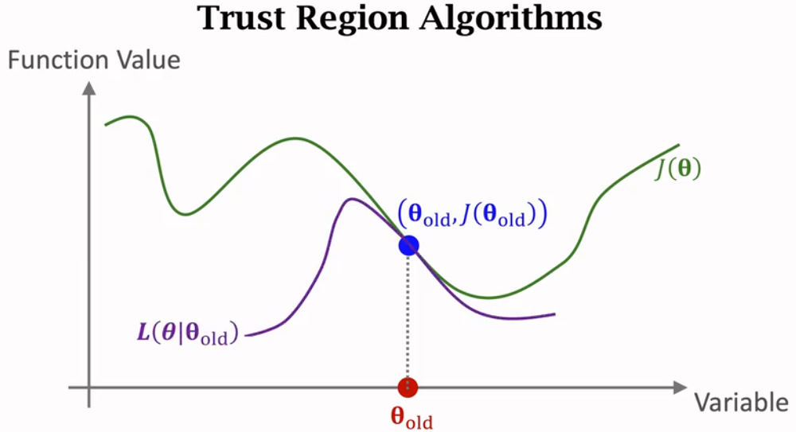
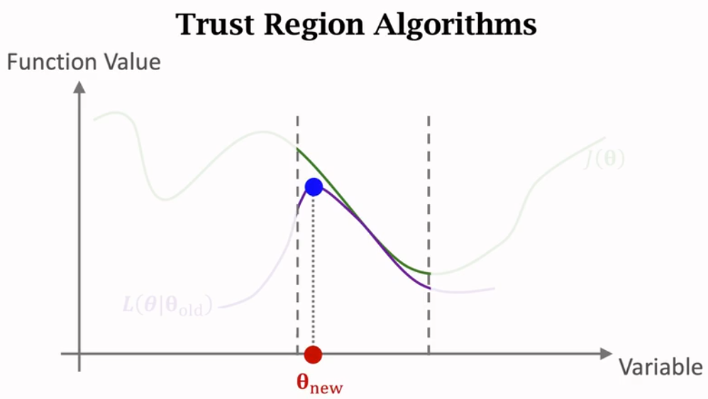
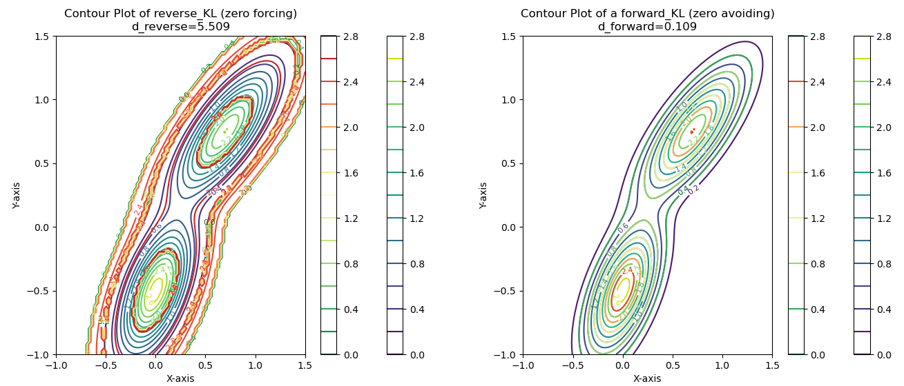

# 置信域算法到PPO

## pre9.1 置信域算法到TRPO 

置信域算法核心：
找到更新参数$\theta$和$\theta_{old}$相关的近似目标函数，邻域 $N(\theta_{old})$内寻找最大值
1. 近似(approximation)：$L(\theta | \theta_{old})$ 
   1. 
2. 最大化(Maximation):  $\argmax_{\theta \in N(\theta_{old})} L(\theta | \theta_{old})$
   1. 


强化学习优化目标：1991 Dyna paper中就提出的agent的任务可以建模成奖励最大化问题（reward maximization）
$E_\pi[\tau(r) ] = E_\pi[V^\pi(S)] = \sum_{i=1}^A\pi(a_i|S;\theta)Q(S, a_i)$
1. 寻找$L(\theta | \theta_{old})$ 
   1. 等价替换$\sum_{i=1}^A\pi(a_i|S;\theta)Q(S, a_i)=\sum_{i=1}^A \pi(a_i|S;\theta_{old}) \frac{\pi(a_i|S;\theta)}{\pi(a_i|S;\theta_{old})}Q(S, a_i)=E_{a\sim \pi(.|\theta_{old})}[\frac{\pi(a|S;\theta)}{\pi(a|S;\theta_{old})}Q(S, a)]$
   2. $L(\theta | \theta_{old})=E_{a\sim \pi(.|\theta_{old})}[\frac{\pi(a|S;\theta)}{\pi(a|S;\theta_{old})}Q(S, a)] \simeq E_{a\sim \pi(.|\theta_{old})}[\frac{\pi(a|S;\theta)}{\pi(a|S;\theta_{old})}U_t]$ 
   3. 蒙特卡洛近似 &  $u_i$回报用优势$A_i$确保策略更新的方向是朝着提高预期回报的方向。
      1. $L(\theta | \theta_{old}) \simeq \frac{1}{n}\sum_{i=1}^n\frac{\pi(a_i|s_i;\theta)}{\pi(a_i|s_i;\theta_{old})}A_i \ \ ..... (TRPO-1)$
2. $\argmax_{\theta \in N(\theta_{old})} L(\theta | \theta_{old})$
   1. 约束$\frac{1}{n}\sum_{i=1}^nD_{KL}[\pi(.|s_i;\theta_{old}) | | \pi(.|s_i;\theta) ] < \Delta \ \ ..... (TRPO-2)$


## pre9.2 TRPO到PPO 

TRPO 使用泰勒展开近似、共轭梯度、线性搜索等方法直接求解。该方法计算量巨大，所以2017PPO paper发布， PPO 的优化目标与 TRPO 相同，但 PPO 用了一些相对简单的方法来求解

1. `PPO-Penalty`: 拉格朗日乘数法直接将 KL 散度的限制放进了目标函数中
   1. $L(\theta | \theta_{old}) = \frac{1}{n}\sum_{i=1}^n[\frac{\pi(a_i|s_i;\theta)}{\pi(a_i|s_i;\theta_{old})}A_i + \beta D_{KL}[\pi(.|s_i;\theta_{old}) | | \pi(.|s_i;\theta) ]]$
2. `PPO-Clip` : 在目标函数中进行限制，以保证新的参数和旧的参数的差距不会太大
   1. $L(\theta | \theta_{old}) = \frac{1}{n}\sum_{i=1}^n[min(\frac{\pi(a_i|s_i;\theta)}{\pi(a_i|s_i;\theta_{old})}A_i, clip(\frac{\pi(a_i|s_i;\theta)}{\pi(a_i|s_i;\theta_{old})}, 1-\epsilon, 1+\epsilon )A_i)]$


## pre9.3 正向$D_{KL}$和反向$D_{KL}$

> 参考： [机器学习中的各种熵](https://lumingdong.cn/various-entropies-in-machine-learning.html)

我们可以看到上面的近似都是用的正向$D_{KL}(P||Q)$, `P`为真实分布，`Q`为预估分布。 
- $D_{KL}[\pi(.|s_i;\theta_{old}) | | \pi(.|s_i;\theta) ]$, 真实值$P=\pi(.|s_i;\theta_{old})$，预估值 $Q=\pi(.|s_i;\theta)$
- 期望预估尽量覆盖真实值

### 什么是$D_{KL}$

我们先来看下
$$D_{KL}(P||Q) = Plog(\frac{P}{Q})$$ 
表示的是什么。


1. 相对熵物理意义：求 p 与 q 之间的对数差$log(p/q)$在 p 上的期望值。
2. 是一种相对熵：是`P,Q`的交叉熵$H(P, Q)=-\sum plog(q)$与`P`自身的信息熵$H(P) = -\sum plog(p)$的差异
   1.  $H(P, Q) - H(P) = -\sum plog(q) + \sum plog(p) = \sum p(log(p)-log(q)) = \sum plog(\frac{p}{q}) $
   2.  用分布p的最佳信息传递方式来传达分布p，比用分布p自己的最佳信息表达分布p，平均多耗费的信息长度
       1.  要传达的信息来自于分布 p
       2.  信息传递的方式由分布 q 决定的。

### 正向$D_{KL}$和反向$D_{KL}$


显然 $D_{KL}(P||Q) \neq D_{KL}(Q||P)$
```python
import numpy as np

p = np.array([0.5, 0.3, 0.2]) # 本周访问调查喜欢
q = np.array([0.2, 0.2, 0.6]) # 预估一周后喜欢


d_forward_kl = (p * np.log(p/q)).sum()
d_reverse_kl = (q * np.log(q/p)).sum()
print(d_forward_kl, d_reverse_kl)
# (0.3600624406359049, 0.39481620520440186)
```

#### 正向 KL 散度（Forward KL）

即使$D_{KL}(P||Q)$ 最小，用公式表示为：
$$q^\star = \argmin_{q}D_{KL}(p||q) = \argmin_q \sum_x p(x)log\frac{p(x)}{q(x)}$$

正向KL散度, 是对数差在真实分布p上的期望。
- $p(x)=0$时，不论对数差是多少KL散度都是0
- $p(x)>0$时，对数差会对KL散度大小产生影响, 此时$q(x)$作为分母，要尽量大一些，才能保证 KL 散度小
- 即在 $p(x)$ 大的地方,想让KL小， $q(x)$ 也尽量大; 在 $p(x)$ 小的地方, $q(x)$ 对整体影响不大(因为 log 项本身分子很小，又乘了一个非常小的 $p(x)$)

综合上述，想要使得正向 KL 散度（Forward KL）最小，<font color=darkred>则要求在p不为0的地方，q也尽量不为0，所以正向 KL 散度被称为是 `zero avoiding`</font>。此时得到的分布 q 是一个比较 `宽` 的分布。
<font color=darkred>更在意真实分布 p 中的常见事件</font>

#### 反向 KL 散度（Reverse KL）

即使$D_{KL}(Q||P)$ 最小，用公式表示为：
$$q^\star = \argmin_{q}D_{KL}(q||p) = \argmin_q \sum_x q(x)log\frac{q(x)}{p(x)}$$


反向 KL散度, 是对数差在真实分布q上的期望。
- $q(x)=0$时，不论对数差是多少KL散度都是0, 即我们完全可以忽略 $p(x)$
- $p(x)>0$时，必须得保证 $q(x)$ 在 $p(x)$ 小的地方也尽量小，才能使整体 KL 散度变小。

综合上述，想要使得反向 KL 散度（Reverse KL）最小，$p(x)$小的地方, 就需要$q(x)$的值也尽量小；在 $p(x)$大的地方，可以适当的忽略。
换一种说法，<font color=darkred>则要求在 p 为 0 的地方，q 也尽量为 0，所以反向 KL 散度被称为是 `zero forcing`</font>。此时得到的分布 q 是一个比较 `窄` 的分布。
<font color=darkred>更在意真实分布 p 中的罕见事件</font>


## 拟合test 

[test KL Python](./D_KL.py)

- 反向 KL 散度（Reverse KL）: $D_{KL}(Q||P)$更在意真实分布 p 中的常见事件
- 正向 KL 散度（Forward KL）: $D_{KL}(Q||P)$更在意真实分布 p 中的罕见事件

