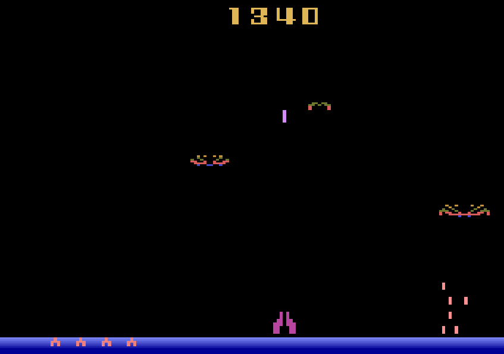
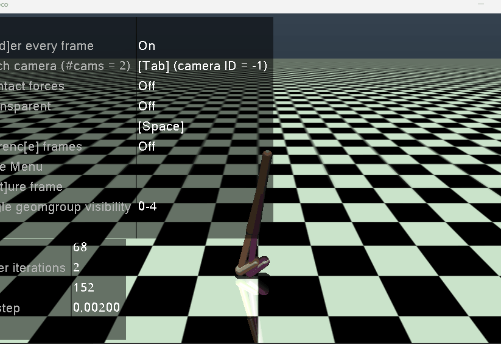
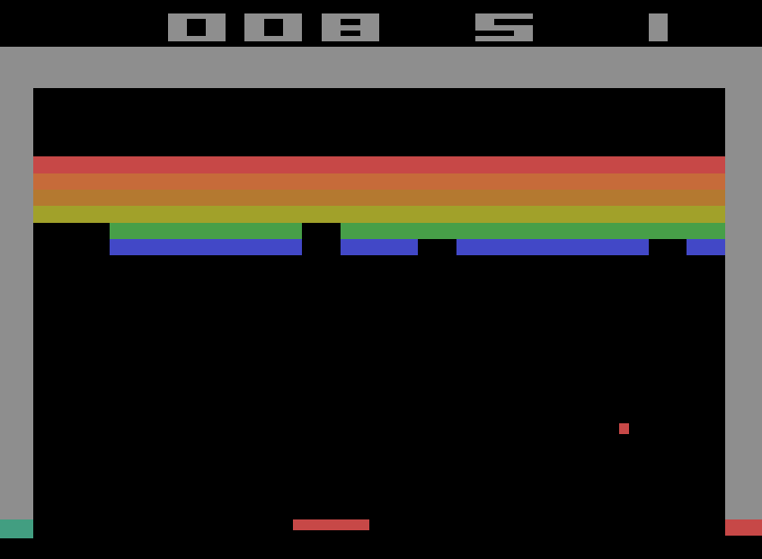

# 基于策略的PPO2

## 10.1 PPO2的优化点

|-|PPO|PPO2|ref|
|-|-|-|-|
|data collect| one episode| several episode(one batch)|
|activation| ReLU | Tanh |
|adv-compute| - | compute adv as one serires | 
|adv-normalize| mini-batch normalize | servel envs-batch normalize | [影响PPO算法性能的10个关键技巧](https://zhuanlan.zhihu.com/p/512327050) |
|Value Function Loss Clipping| - | $L^{V}=max[(V_{\theta_t} - V_{tar})^2, (clip(V_{\theta_t}, V_{\theta_{t-1}}-\epsilon, V_{\theta_{t-1}}+\epsilon))^2]$ |[The 37 Implementation Details of Proximal Policy Optimization](https://iclr-blog-track.github.io/2022/03/25/ppo-implementation-details/)|
|optimizer| actor-opt & critic-opt | use common opt |
|loss| actor-loss-backward & critic-loss-backward | loss weight sum |
|paramate-init| - | 1- **hidden layer** orthogonal initialization of weights **$\sqrt{2}$**;   2- **The policy output** layer weights are initialized with the scale of **0.01**;   3- **The value output** layer weights are initialized with the scale of **1.0** |[The 37 Implementation Details of Proximal Policy Optimization](https://iclr-blog-track.github.io/2022/03/25/ppo-implementation-details/)|
|training envs| single gym env | SyncVectorEnv |


## 10.2 环境实验与调参经验 & 实验效果


|环境与描述 | 参数函数链接| 训练方法function| 经验 | 效果|
|-|-|-|-|-|
|[ Hopper-v4 ](state: (11,),action: (3,)(连续 <-1.0 -> 1.0>))| [Hopper_v4_ppo2_test](../../src/test/test_ppo.py) | [train_on_policy](../../src/RLUtils/trainer.py) | PPO_old.PPO2主要是收集多轮的结果序列进行训练，增加训练轮数，适当降低学习率，稍微增Actor和Critic的网络深度 | |
|[ Humanoid-v4 ](state: (376,),action: (17,)(连续 <-0.4 -> 0.4>))| [Humanoid_v4_ppo2_test](../../src/test/test_ppo.py)  | [ppo2_train](../../src/RLUtils/trainer.py) | 需要同时对多个环境进行游戏采样`num_envs=128`，同时环境的步数需要进行尝试，同时还对eps进行了调小，希望更新的策略范围更小一些| |
|[ ALE/DemonAttack-v5 ](state: (210, 160, 3),action: 6(离散 ))| [DemonAttack_v5_ppo2_test](../../src/test/test_ppo_atari.py)  | [ppo2_train](../../src/RLUtils/trainer.py) | 主要是CNN网络,学习率小一些 | |
|[ ALE/AirRaid-v5 ](state: (250, 160, 3),action: 6(离散 ))| [AirRaid_v5_ppo2_test](../../src/test/test_ppo_atari.py)  | [ppo2_train](../../src/RLUtils/trainer.py) | 主要是CNN网络,学习率小一些 | |
|[ ALE/Alien-v5 ](state: (210, 160, 3),action: 18(离散 ))| [Alien_v5_ppo2_test](../../src/test/test_ppo_atari.py)  | [ppo2_train](../../src/RLUtils/trainer.py)| 环境的星星较小所以需要关闭`max_pooling`, eps稍微调大些 | |
|[ Walker2d-v4 ](state: (17,),action: (6,)(连续 <-1.0 -> 1.0>))| [Walker2d_v4_ppo2_test](../../src/test/test_ppo.py)  | [ppo2_train](../../src/RLUtils/trainer.py)| 对eps进行了调小，希望更新的策略范围更小一些 | |
|[ HumanoidStandup-v4 ](state: (376,),action: (17,)(连续 <-0.4 -> 0.4>))| [HumanoidStandup_v4_ppo2_test](../../src/test/test_ppo.py)  | [ppo2_train](../../src/RLUtils/trainer.py)| 对eps进行了调大一些，希望智能体做出更多意料之外的action, 网络略微宽深一些， reward/1000, minibatchsize 要大一些 | |
|[ ALE/Breakout-v5 ](state: (210, 160, 3),action: 4(离散 ))| [Breakout_v5_ppo2_test](../../src/test/test_ppo_atari.py)  | [ppo2_train](../../src/RLUtils/trainer.py)| 对eps进行了调小，希望更新的策略范围更小一些；entroy_coef稍微大一点，增加agent的探索； Atria的Wrapper&SyncVectorEnv reset修复| |
|[ ALE/DoubleDunk-v5 ](state: (210, 160, 3),action: 4(离散 ))| [DoubleDunk_v5_ppo2_test](../../src/test/test_ppo_atari.py)  | [ppo2_train](../../src/RLUtils/trainer.py)| 1.环境调整（图像大小 & reward辅助）帮助学习出3分线；2.优化CNN网络；3.加深critic头的深度，以达到同样的学习率下，critic收敛更快的目的; 4.eps进行了调小，希望更新的策略范围更小一些；5.entroy_coef稍微大一点，增加agent的探索；6.`stack_num=10` 增加，捕捉agent的连续信息；7. `max_episode_steps=360`收集更多同策略下的样本| |


## 10.3 重要经验总结

### ALE/DoubleDunk-v5 训练经验总结

#### 1- 环境调整
1. 图像大小与截取
   1. 不需要进行起始跳帧 
   2. 图像过小可能对球的识别较难 

2. 奖励调整——学习出3分线
   1. 绿色 <b><font color=darkgreen>CLEAR THE BALL !</font> </b> 简单识别：我方抢到板但是需要到3分线外清场——清场奖励 
   2. 绿色 <b><font color=darkgreen>TURNOVER</font> </b> 简单识别：我方抢到板直接投篮,重新发球——惩罚 

```python
    def obs_reward(self, s, a):
        fire_a = a in [1] + list(range(10, 18))
        # CLEAR THE BALL 中 T 的位置
        T_sum = (s[180:190, 75:80, 0] == 45).sum() 
        clear_ball_obs = (T_sum >= 7) and (T_sum <= 9)
        # TRUN OVER THE BALL
        trun_over_obs = (s[180:190, 55:105, 0] == 45).sum() >= 165
        r_fix = 0
        if trun_over_obs:
            r_fix -= 0.1
        if clear_ball_obs:
            r_fix += ( -0.1 if fire_a else self.clear_ball_reward)
        return r_fix
```

#### 2- 模型参数调整

1. 为了帮助网络进行更好的学习，<font color=darkred>需要加深critic头的深度，以达到同样的学习率下，critic收敛更快的目的</font>。
由于使用的时share-CNN bottom, 并且学习率使用统一的。
一般PPO因为事务差异和梯度幅度的差异，会将critic的学习率大于actor的学习率
- 事务差异： 
  - Actor-主要职责是直接输出动作；
    - 1）更新较为敏感，参数发生较小变化，就可能动作分布产生显著的改变 
    - 2）Actor的学习率过高，很容易导致策略快速陷入局部最优，甚至出现策略退化的情况
  - Critic-主要职责是预估状态价值，为Actor提供梯度方向指导；
    - 1）价值函数更新相对稳定，需要设置较大学习率加快收敛速度
    - 2）Critic学习率过低，可能无法即时提供准确的梯度信号，近而拖慢Actor的训练
- 梯度幅度差异
  - Actor的梯度其幅度受到回报（或优势函数）方差较大影响，往往较小且不够稳定
  - Critic的梯度则是来源于价值函数的均方误差（MSE），其幅度通常较大且相对稳定


1. `PPOSharedCNN`网络优化: 基于`stack_num`对`out_channels`进行调整
```python
cnn_feature = nn.Sequential(
    nn.Conv2d(self.stack_num * base_c, self.stack_num * 16, 8, stride=3),
    nn.ReLU(),
    nn.MaxPool2d(2, 2, 0),
    nn.Conv2d(self.stack_num * 16, self.stack_num * 32, 4, stride=2),
    nn.ReLU(),
    nn.Conv2d(self.stack_num * 32, self.stack_num * 64, 3, stride=2),
    nn.ReLU(),
    nn.Flatten()
)
```
2. `max_episode_steps=360`收集更多同策略下的样本
3. `entroy_coef=0.0125`稍微大一点，增加agent的探索；
4. `eps=0.175` 进行了调小，希望更新的策略范围更小一些
5. `stack_num=10` 增加，捕捉agent的连续信息
6. 训练策略
   1. 整体reward调整`reward_func=lambda x: x * 2.0`
   2. step1: `lr=4.5e-4` 运行`num_episode=1288` -> `PPO2_{env_name_str}-2`
   3. step2: 载入step1模型 `lr=1.5e-4` 运行`num_episode=888` -> `PPO2_{env_name_str}-1`

