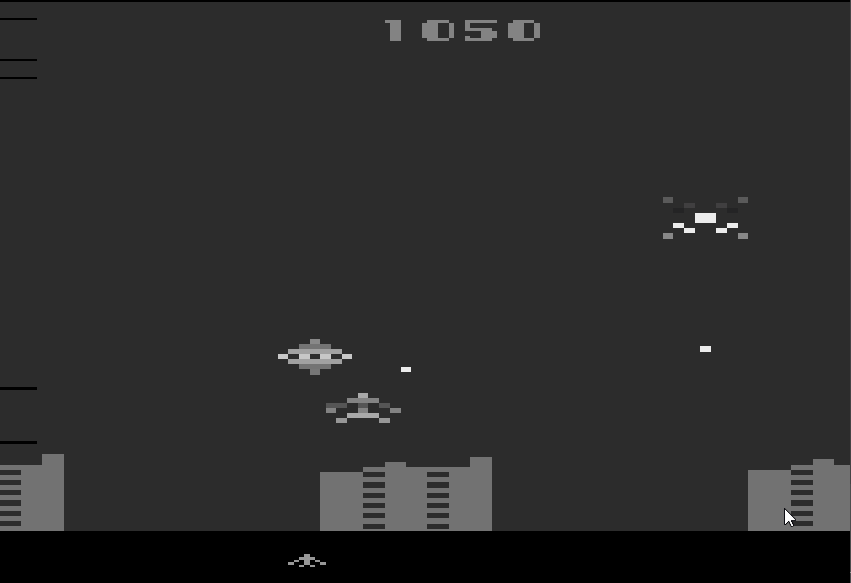

# 基于策略的PPO2

## 10.1 PPO2的优化点

|-|PPO|PPO2|ref|
|-|-|-|-|
|data collect| one episode| several episode(one batch)|
|activation| ReLU | Tanh |
|adv-compute| - | compute adv as one serires | 
|adv-normalize| mini-batch normalize | servel envs-batch normalize | [影响PPO算法性能的10个关键技巧](https://zhuanlan.zhihu.com/p/512327050) |
|Value Function Loss Clipping| - | $L^{V}=max[(V_{\theta_t} - V_{tar})^2, (clip(V_{\theta_t}, V_{\theta_{t-1}}-\epsilon, V_{\theta_{t-1}}+\epsilon))^2]$ |[The 37 Implementation Details of Proximal Policy Optimization](https://iclr-blog-track.github.io/2022/03/25/ppo-implementation-details/)|
|optimizer| actor-opt & critic-opt | use common opt |
|loss| actor-loss-backward & critic-loss-backward | loss weight sum |
|paramate-init| - | 1- **hidden layer** orthogonal initialization of weights **$\sqrt{2}$**;   2- **The policy output** layer weights are initialized with the scale of **0.01**;   3- **The value output** layer weights are initialized with the scale of **1.0** |[The 37 Implementation Details of Proximal Policy Optimization](https://iclr-blog-track.github.io/2022/03/25/ppo-implementation-details/)|
|training envs| single gym env | SyncVectorEnv |

## 10.2 环境实验与调参经验 & 实验效果

|环境与描述 | 参数函数链接| 训练方法function| 经验 | 效果|
|-|-|-|-|-|
|[ Hopper-v4 ](state: (11,),action: (3,)(连续 <-1.0 -> 1.0>))| [Hopper_v4_ppo2_test](../../src/test/test_ppo.py) | [train_on_policy](../../src/RLUtils/trainer.py) | PPO_old.PPO2主要是收集多轮的结果序列进行训练，增加训练轮数，适当降低学习率，稍微增Actor和Critic的网络深度 | |
|[ Humanoid-v4 ](state: (376,),action: (17,)(连续 <-0.4 -> 0.4>))| [Humanoid_v4_ppo2_test](../../src/test/test_ppo.py)  | [ppo2_train](../../src/RLUtils/trainer.py) | 需要同时对多个环境进行游戏采样`num_envs=128`，同时环境的步数需要进行尝试，同时还对eps进行了调小，希望更新的策略范围更小一些| |
|[ ALE/DemonAttack-v5 ](state: (210, 160, 3),action: 6(离散 ))| [DemonAttack_v5_ppo2_test](../../src/test/test_ppo_atari.py)  | [ppo2_train](../../src/RLUtils/trainer.py) | 主要是CNN网络,学习率小一些 | |
|[ ALE/AirRaid-v5 ](state: (250, 160, 3),action: 6(离散 ))| [AirRaid_v5_ppo2_test](../../src/test/test_ppo_atari.py)  | [ppo2_train](../../src/RLUtils/trainer.py) | 主要是CNN网络,学习率小一些 | |
|[ ALE/Alien-v5 ](state: (210, 160, 3),action: 18(离散 ))| [Alien_v5_ppo2_test](../../src/test/test_ppo_atari.py)  | [ppo2_train](../../src/RLUtils/trainer.py)| 环境的星星较小所以需要关闭`max_pooling`, eps稍微调大些 | |
|[ Walker2d-v4 ](state: (17,),action: (6,)(连续 <-1.0 -> 1.0>))| [Walker2d_v4_ppo2_test](../../src/test/test_ppo.py)  | [ppo2_train](../../src/RLUtils/trainer.py)| 对eps进行了调小，希望更新的策略范围更小一些 | |
