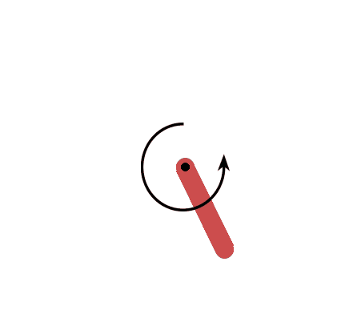

# 基于策略的离线算法DDPG
## 11.1 简介

PPO这类算法都是在线策略算法，样本效率（sample efficiency）较低。像DQN算法，是直接估计最优价值函数，可以做离线策略学习，但是它只能处理动作空间有限的环境。

吸收DQN的优点，同时弥补PPO这类算法的缺陷，DDPG（deep deterministic policy gradient）就顺应而生。它构造一个确定性策略，用梯度上升的方法来最大化值。

DDPG 也属于一种 Actor-Critic 算法。 REINFORCE、TRPO 和 PPO 学习随机性策略（`Actor`输出action的分布进行采样），而 DDPG 则学习一个确定性策略（`Actor`直接输出action）。


## 11.2 Pytorch实践
策略网络（`Actor`）直接输出确定性action
```python
class policyNet(nn.Module):
    """
    return continuity action
    """
    def __init__(self, state_dim: int, hidden_layers_dim: typ.List, action_dim: int, action_bound: float=1.0):
        super(policyNet, self).__init__()
        self.action_bound = action_bound
        self.features = nn.ModuleList()
        for idx, h in enumerate(hidden_layers_dim):
            self.features.append(nn.ModuleDict({
                'linear': nn.Linear(hidden_layers_dim[idx-1] if idx else state_dim, h),
                'linear_action': nn.ReLU(inplace=True)
            }))
        self.fc_out = nn.Linear(hidden_layers_dim[-1], action_dim)
    
    def forward(self, x):
        for layer in self.features:
            x = layer['linear_action'](layer['linear'](x))
        return torch.tanh(self.fc_out(x)) * self.action_bound
```
DQN输入state返回所有action的价值，再用max选取action  
DDPG的ValueNet直接以state和action为入参，输出价值
```python
class valueNet(nn.Module):
    def __init__(self, state_action_dim: int, hidden_layers_dim: typ.List):
        super(valueNet, self).__init__()
        self.features = nn.ModuleList()
        for idx, h in enumerate(hidden_layers_dim):
            self.features.append(nn.ModuleDict({
                'linear': nn.Linear(hidden_layers_dim[idx-1] if idx else state_action_dim, h),
                'linear_activation': nn.ReLU(inplace=True)
            }))
        
        self.head = nn.Linear(hidden_layers_dim[-1] , 1)


    def forward(self, state, action):
        x = torch.cat([state, action], dim=1).float() # 拼接状态和动作
        for layer in self.features:
            x = layer['linear_activation'](layer['linear'](x))
        return self.head(x) 
```


### 11.2.1 构建智能体
同时在action输出的时候增加一些噪声`act.detach().numpy()[0] + self.sigma * np.random.rand(self.action_dim)`
```python
class DDPG:
    def __init__(self, 
                state_dim: int, 
                hidden_layers_dim: typ.List, 
                action_dim: int,
                actor_lr: float,
                critic_lr: float,
                gamma: float,
                DDPG_kwargs: typ.Dict,
                device: torch.device
                ):
        self.actor = policyNet(state_dim, hidden_layers_dim, action_dim, action_bound = DDPG_kwargs['action_bound'])
        self.critic = valueNet(state_dim + action_dim, hidden_layers_dim)
        self.target_actor = copy.deepcopy(self.actor)
        self.target_critic = copy.deepcopy(self.critic)

        self.actor.to(device)
        self.critic.to(device)
        self.target_actor.to(device)
        self.target_critic.to(device)
        self.actor_opt = torch.optim.Adam(self.actor.parameters(), lr=actor_lr)
        self.critic_opt = torch.optim.Adam(self.critic.parameters(), lr=critic_lr)
        
        self.gamma = gamma
        self.device = device
        self.count = 0
        # soft update parameters
        self.tau = DDPG_kwargs.get('tau', 0.8)
        self.action_dim = action_dim
        # Normal sigma
        self.sigma = DDPG_kwargs.get('sigma', 0.1)
    
    def policy(self, state):
        state = torch.FloatTensor([state]).to(self.device)
        act = self.actor(state)
        return act.detach().numpy()[0] + self.sigma * np.random.rand(self.action_dim)

    def soft_update(self, net, target_net):
        for param_target, param in zip(target_net.parameters(), net.parameters()):
            param_target.data.copy_(
                param_target.data * (1 - self.tau) + param.data * self.tau
            )

    def update(self, samples):
        self.count += 1
        state, action, reward, next_state, done = zip(*samples)
        state = torch.FloatTensor(state).to(self.device)
        action = torch.tensor(action).to(self.device)
        reward = torch.tensor(reward).view(-1, 1).to(self.device)
        reward = (reward + 10.0) / 10.0  # 对奖励进行修改,方便训练
        next_state = torch.FloatTensor(next_state).to(self.device)
        done = torch.FloatTensor(done).view(-1, 1).to(self.device)
        
        target_action = self.target_actor(state)
        next_q_value = self.target_critic(next_state, target_action)
        q_targets = reward + self.gamma * next_q_value * ( 1.0 - done )
        critic_loss = torch.mean(F.mse_loss(self.critic(state, action).float(), q_targets.float()))
        self.critic_opt.zero_grad()
        critic_loss.backward()
        self.critic_opt.step()
        
        # 计算采样的策略梯度，以此更新当前 Actor 网络
        ac_action = self.actor(state)
        actor_loss = -torch.mean(self.critic(state, ac_action))
        self.actor_opt.zero_grad()
        actor_loss.backward()
        self.actor_opt.step()
        
        self.soft_update(self.actor, self.target_actor)
        self.soft_update(self.critic, self.target_critic)
```

### 11.2.2 智能体训练

注意设置`tau`要设置小一些

```python
def train_agent(env, cfg):
    ac_agent = DDPG(
        state_dim=cfg.state_dim,
        hidden_layers_dim=cfg.hidden_layers_dim,
        action_dim=cfg.action_dim,
        actor_lr=cfg.actor_lr,
        critic_lr=cfg.critic_lr,
        gamma=cfg.gamma,
        DDPG_kwargs=cfg.DDPG_kwargs,
        device=cfg.device
    )
    tq_bar = tqdm(range(cfg.num_episode))
    rewards_list = []
    now_reward = 0
    bf_reward = -np.inf
    buffer_ = replayBuffer(cfg.buffer_size)
    for i in tq_bar:
        tq_bar.set_description(f'Episode [ {i+1} / {cfg.num_episode} ]')
        s, _ = env.reset()
        done = False
        episode_rewards = 0
        steps = 0
        while not done:
            a = ac_agent.policy(s)
            n_s, r, done, _, _ = env.step(a)
            buffer_.add(s, a, r, n_s, done)
            s = n_s
            episode_rewards += r
            steps += 1
            # buffer update
            if len(buffer_) > cfg.minimal_size:
                samples = buffer_.sample(cfg.batch_size)
                ac_agent.update(samples)
            if (episode_rewards >= cfg.max_episode_rewards) or (steps >= cfg.max_episode_steps):
                break

        rewards_list.append(episode_rewards)
        now_reward = np.mean(rewards_list[-10:])
        if (bf_reward < now_reward) and (i >= 10):
            torch.save(ac_agent.actor.state_dict(), cfg.save_path)
            bf_reward = now_reward
        
        tq_bar.set_postfix({'lastMeanRewards': f'{now_reward:.2f}', 'BEST': f'{bf_reward:.2f}'})
    env.close()
    return ac_agent

class Config:
    num_episode = 200
    state_dim = None
    hidden_layers_dim = [ 128, 64 ]
    action_dim = 20
    actor_lr = 3e-5
    critic_lr = 5e-4
    DDPG_kwargs = {
        'tau': 0.05, # soft update parameters
        'sigma': 0.005, # noise
        'action_bound': 2.0
    }
    gamma = 0.9
    device = torch.device('cuda') if torch.cuda.is_available() else torch.device('cpu')
    buffer_size = 10240
    minimal_size = 1024
    batch_size = 256
    save_path = r'D:\tmp\DDPG_ac_model.ckpt'
    # 回合停止控制
    max_episode_rewards = 204800
    max_episode_steps = 240

    def __init__(self, env):
        self.state_dim = env.observation_space.shape[0]
        try:
            self.action_dim = env.action_space.n
        except Exception as e:
            self.action_dim = env.action_space.shape[0]
        print(f'device={self.device} | env={str(env)}')


if __name__ == '__main__':
    print('=='*35)
    print('Training Pendulum-v1')
    env = gym.make('Pendulum-v1')
    cfg = Config(env)
    ac_agent = train_agent(env, cfg)
```

### 11.2.3 训练出的智能体观测

最后将训练的最好的网络拿出来进行观察

```python
ac_agent.actor.load_state_dict(torch.load(cfg.save_path))
play(gym.make('Pendulum-v1', render_mode="human"), ac_agent, cfg)
```


