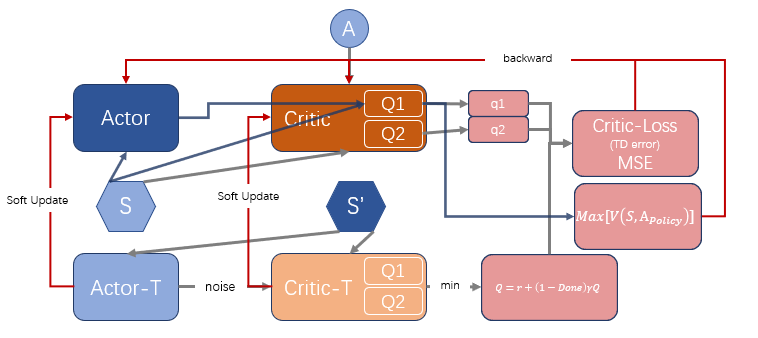

# 基于策略的离线算法TD3

## 12.1 简介

> reference: [openai-TD3](https://spinningup.openai.com/en/latest/algorithms/td3.html)

DDPG的critic会高估, 从而导致actor策略失败。TD3是增加了三个关键技巧优化DDPG。经过优化后的TD3(Twin Dalayed DDPG 双延迟深度确定性策略梯度算法)适合于具有高维连续动作空间的任务。

Tricks:

- **Clipped Double Q-learning**: critic中有两个`Q-net`, 每次产出2个Q值，使用其中小的
  - 即 $Q_{traget}=min(Q1, Q2)$; $Q_{traget} = reward + (1.0 - done) * \gamma * Q_{traget}$
  - 需要注意这时候 $criticLoss = MSE(Q1_{cur}, Q_{traget}) + MSE(Q2_{cur}, Q_{traget})$ 对 $ Q1_{cur}, Q2_{cur} $ 求偏导
- **Delayed Policy Update**: actor的更新频率要小于critic(当前的actor参数可以产出更多样本)。
  - 论文中建议`one policy for every two Q-funtion updates.`
- **Target Policy Smoothing**: 在 target-actor输出的action中增加noise  (本质上是正则化)
  - 从而可以更充分的理解游戏空间，使得网络更健壮。
  - $a'(s') = clip(U_{\theta_{t}}(s') + clip(\epsilon, -c, c), a_{L}, a_{H})$

## 12.2 Pytorch实践

策略网络（`Actor`）直接输出确定性action, 这里我们的激活函数都是用的`nn.Tanh()`

```python
class DT3PolicyNet(nn.Module):
    """
    输入state, 输出action
    """
    def __init__(self, state_dim: int, hidden_layers_dim: typ.List, action_dim: int, action_bound: float=1.0):
        super(DT3PolicyNet, self).__init__()
        self.action_bound = action_bound
        self.features = nn.ModuleList()
        for idx, h in enumerate(hidden_layers_dim):
            self.features.append(nn.ModuleDict({
                'linear': nn.Linear(hidden_layers_dim[idx-1] if idx else state_dim, h),
                'linear_action': nn.Tanh()
            }))

        self.fc_out = nn.Linear(hidden_layers_dim[-1], action_dim)
    
    def forward(self, x):
        for layer in self.features:
            x = layer['linear_action'](layer['linear'](x))

        return torch.tanh(self.fc_out(x)) * self.action_bound
```

DQN输入state返回所有action的价值，再用max选取action  
TD3的valueNet基本和DDPG一样，就<font color=darkred>多了一个QNet</font>, 均是直接以state和action为入参，输出价值

```python

class TD3ValueNet(nn.Module):
    """
    输入[state, cation], 输出value
    """
    def __init__(self, state_action_dim: int, hidden_layers_dim: typ.List):
        super(TD3ValueNet, self).__init__()
        self.features_q1 = nn.ModuleList()
        self.features_q2 = nn.ModuleList()
        for idx, h in enumerate(hidden_layers_dim):
            self.features_q1.append(nn.ModuleDict({
                'linear': nn.Linear(hidden_layers_dim[idx-1] if idx else state_action_dim, h),
                'linear_activation': nn.ReLU(inplace=True)
            }))
            self.features_q2.append(nn.ModuleDict({
                'linear': nn.Linear(hidden_layers_dim[idx-1] if idx else state_action_dim, h),
                'linear_activation': nn.ReLU(inplace=True)
            }))
            
        self.head_q1 = nn.Linear(hidden_layers_dim[-1] , 1)
        self.head_q2 = nn.Linear(hidden_layers_dim[-1] , 1)
        
    def forward(self, state, action):
        x = torch.cat([state, action], dim=1).float() # 拼接状态和动作
        x1 = x
        x2 = x
        for layer1, layer2 in zip(self.features_q1, self.features_q2):
            x1 = layer1['linear_activation'](layer1['linear'](x1))
            x2 = layer2['linear_activation'](layer2['linear'](x2))
        return self.head_q1(x1), self.head_q2(x2)

    def Q1(self, state, action):
        x = torch.cat([state, action], dim=1).float() # 拼接状态和动作
        for layer in self.features_q1:
            x = layer['linear_activation'](layer['linear'](x))
        return self.head_q1(x) 

```

### 12.2.1 构建智能体


这里我们要注意探索输出的noise和Tick3(`Target Policy Smoothing`)中的noise

- 探索输出的noise:
  - 作用: 增大探索的空间
  - `action_noise = np.random.normal(loc=0, scale=self.max_action * self.train_noise, size=self.action_dim)`
  - 输出： `act.detach().numpy()[0] + action_noise).clip(self.action_low, self.action_high`
- Target Policy Smoothing
  - `policy_noise`: `policy_noise = TD3_kwargs.get('policy_noise', 0.2) * self.max_action`
  - `noise_clip`: 限制最大noise `policy_noise_clip = TD3_kwargs.get('policy_noise_clip', 0.5) * self.max_action`

```python
    @torch.no_grad()
    def smooth_action(self, state):
        act_target = self.target_actor(state)
        noise = (torch.randn(act_target.shape).float() *
                self.policy_noise).clip(-self.noise_clip, self.noise_clip)
        smoothed_target_a = (act_target + noise).clip(-self.max_action, self.max_action)
        return smoothed_target_a
```

TD3智能体脚本



```python
from ._base_net import TD3ValueNet as valueNet
from ._base_net import DT3PolicyNet as policyNet


class TD3:
    def __init__(
        self,
        state_dim: int, 
        actor_hidden_layers_dim: typ.List, 
        critic_hidden_layers_dim: typ.List, 
        action_dim: int,
        actor_lr: float,
        critic_lr: float,
        gamma: float,
        TD3_kwargs: typ.Dict,
        device: torch.device=None
    ):
        """
        state_dim (int): 环境的sate维度  
        actor_hidden_layers_dim (typ.List): actor hidden layer 维度  
        critic_hidden_layers_dim (typ.List): critic hidden layer 维度  
        action_dim (int): action的维度  
        actor_lr (float): actor学习率  
        critic_lr (float): critic学习率  
        gamma (float): 折扣率  
        TD3_kwargs (typ.Dict): TD3算法的三个trick的输入  
            example:  
                TD3_kwargs={  
                    'action_low': env.action_space.low[0],  
                    'action_high': env.action_space.high[0],  
                - soft update parameters  
                    'tau': 0.005,   
                - trick2: Target Policy Smoothing  
                    'delay_freq': 1,  
                - trick3: Target Policy Smoothing  
                    'policy_noise': 0.2,  
                    'policy_noise_clip': 0.5,  
                - exploration noise  
                    'expl_noise': 0.25,  
                    -  探索的 noise 指数系数率减少 noise = expl_noise * expl_noise_exp_reduce_factor^t  
                    'expl_noise_exp_reduce_factor': 0.999  
                }  
        device (torch.device): 运行的device  
        """
        if device is None:
            device = torch.device('cpu')
        self.device = device
        self.action_low = TD3_kwargs.get('action_low', -1.0)
        self.action_high = TD3_kwargs.get('action_high', 1.0)
        self.max_action = max(abs(self.action_low), abs(self.action_high))
        self.actor = policyNet(
            state_dim, 
            actor_hidden_layers_dim, 
            action_dim, 
            action_bound = self.max_action
        )
        self.critic = valueNet(
            state_dim + action_dim, 
            critic_hidden_layers_dim
        )
        self.target_actor = copy.deepcopy(self.actor)
        self.target_critic = copy.deepcopy(self.critic)
        
        self.actor.to(device)
        self.critic.to(device)
        self.target_actor.to(device)
        self.target_critic.to(device)
        self.actor_opt = torch.optim.Adam(self.actor.parameters(), lr=actor_lr)
        self.critic_opt = torch.optim.Adam(self.critic.parameters(), lr=critic_lr)
        
        self.gamma = gamma
        self.action_dim = action_dim
        
        self.tau = TD3_kwargs.get('tau', 0.01)
        self.policy_noise = TD3_kwargs.get('policy_noise', 0.2) * self.max_action 
        self.policy_noise_clip = TD3_kwargs.get('policy_noise_clip', 0.5) * self.max_action 
        self.expl_noise = TD3_kwargs.get('expl_noise', 0.25)
        self.expl_noise_exp_reduce_factor = TD3_kwargs.get('expl_noise_exp_reduce_factor', 1)
        self.delay_counter = -1
        # actor延迟更新的频率: 论文建议critic更新2次， actor更新1次， 即延迟1次
        self.delay_freq = TD3_kwargs.get('delay_freq', 1)
        
        # Normal sigma
        self.train = False
        self.train_noise = self.expl_noise

    @torch.no_grad()
    def smooth_action(self, state):
        """
        trick3: Target Policy Smoothing
            在target-actor输出的action中增加noise
        """
        act_target = self.target_actor(state)
        noise = (torch.randn(act_target.shape).float() *
                self.policy_noise).clip(-self.policy_noise_clip, self.policy_noise_clip)
        smoothed_target_a = (act_target + noise).clip(self.action_low, self.action_high)
        return smoothed_target_a

    @torch.no_grad()
    def policy(self, state):
        state = torch.FloatTensor([state]).to(self.device)
        act = self.actor(state)
        if self.train:
            action_noise = np.random.normal(loc=0, scale=self.max_action * self.train_noise, size=self.action_dim)
            self.train_noise *= self.expl_noise_exp_reduce_factor
            return (act.detach().numpy()[0] + action_noise).clip(self.action_low, self.action_high)
        
        return act.detach().numpy()[0]

    def soft_update(self, net, target_net):
        for param_target, param in zip(target_net.parameters(), net.parameters()):
            param_target.data.copy_(
                param_target.data * (1 - self.tau) + param.data * self.tau
            )

    def update(self, samples):
        self.delay_counter += 1
        state, action, reward, next_state, done = zip(*samples)
        state = torch.FloatTensor(state).to(self.device)
        action = torch.tensor(action).to(self.device)
        reward = torch.tensor(reward).view(-1, 1).to(self.device)
        next_state = torch.FloatTensor(next_state).to(self.device)
        done = torch.FloatTensor(done).view(-1, 1).to(self.device)
        
        # 计算目标Q
        smooth_act = self.smooth_action(state)
        # trick1: **Clipped Double Q-learning**: critic中有两个`Q-net`, 每次产出2个Q值，使用其中小的
        target_Q1, target_Q2 = self.target_critic(next_state, smooth_act)
        target_Q = torch.minimum(target_Q1, target_Q2)
        target_Q = reward + (1.0 - done) * self.gamma * target_Q
        # 计算当前Q值
        current_Q1, current_Q2 = self.critic(state, action)
        q_loss = F.mse_loss(current_Q1.float(), target_Q.float().detach()) + F.mse_loss(current_Q2.float(), target_Q.float().detach())
        self.critic_opt.zero_grad()
        q_loss.backward()
        self.critic_opt.step()
        
        # trick2: **Delayed Policy Update**: actor的更新频率要小于critic(当前的actor参数可以产出更多样本)。
        if self.delay_counter == self.delay_freq:
            # actor 延迟update
            ac_action = self.actor(state)
            actor_loss = -torch.mean(self.critic.Q1(state, ac_action))
            self.actor_opt.zero_grad()
            actor_loss.backward()
            self.actor_opt.step()
            
            self.soft_update(self.actor, self.target_actor)
            self.soft_update(self.critic, self.target_critic)
            self.delay_counter = -1

    def save(self, file_path):
        act_f = os.path.join(file_path, 'TD3_actor.ckpt')
        critic_f = os.path.join(file_path, 'TD3_actor.ckpt')
        torch.save(self.actor.state_dict(), act_f)
        torch.save(self.q_critic.state_dict(), critic_f)

    def load(self, file_path):
        act_f = os.path.join(file_path, 'TD3_actor.ckpt')
        critic_f = os.path.join(file_path, 'TD3_actor.ckpt')
        self.actor.set_state_dict(torch.load(act_f))
        self.q_critic.set_state_dict(torch.load(critic_f))


```

### 12.2.2 智能体训练

> 整体训练脚本可以看笔者的github [test_TD3](https://github.com/scchy/RL/blob/main/src/test/test_TD3.py)

注意设置`tau`要设置小一些

```python

def BipedalWalkerHardcore_TD3_test():
    """
    policyNet: 
    valueNet: 
    """
    env_name = 'BipedalWalkerHardcore-v3'
    gym_env_desc(env_name)
    env = gym.make(env_name)
    print("gym.__version__ = ", gym.__version__ )
    path_ = os.path.dirname(__file__)
    cfg = Config(
        env, 
        # 环境参数
        save_path=os.path.join(path_, "test_models" ,'TD3_BipedalWalkerHardcore-v3_test_actor-3.ckpt'), 
        seed=42,
        # 网络参数
        actor_hidden_layers_dim=[200, 200],
        critic_hidden_layers_dim=[200, 200],
        # agent参数
        actor_lr=1e-4,
        critic_lr=3e-4,
        gamma=0.99,
        # 训练参数
        num_episode=5000,
        sample_size=256,
        # 环境复杂多变，需要保存多一些buffer
        off_buffer_size=int(1e6),
        off_minimal_size=2048,
        max_episode_rewards=1000,
        max_episode_steps=1000,
        # agent 其他参数
        TD3_kwargs={
            'action_low': env.action_space.low[0],
            'action_high': env.action_space.high[0],
            # soft update parameters
            'tau': 0.005, 
            # trick2: Delayed Policy Update
            'delay_freq': 1,
            # trick3: Target Policy Smoothing
            'policy_noise': 0.2,
            'policy_noise_clip': 0.5,
            # exploration noise
            'expl_noise': 0.25,
            # 探索的 noise 指数系数率减少 noise = expl_noise * expl_noise_exp_reduce_factor^t
            'expl_noise_exp_reduce_factor': 0.999
        }
    )
    agent = TD3(
        state_dim=cfg.state_dim,
        actor_hidden_layers_dim=cfg.actor_hidden_layers_dim,
        critic_hidden_layers_dim=cfg.critic_hidden_layers_dim,
        action_dim=cfg.action_dim,
        actor_lr=cfg.actor_lr,
        critic_lr=cfg.critic_lr,
        gamma=cfg.gamma,
        TD3_kwargs=cfg.TD3_kwargs,
        device=cfg.device
    )
    agent.train = True
    train_off_policy(env, agent, cfg, done_add=False, reward_func=reward_func)
    agent.actor.load_state_dict(
        torch.load(cfg.save_path)
    )
    play(gym.make(env_name, render_mode='human'), agent, cfg, episode_count=2)

if __name__ == '__main__':
    BipedalWalkerHardcore_TD3_test()
```

### 12.2.3 训练出的智能体观测

最后将训练的最好的网络拿出来进行观察
由于环境较为复杂，且笔者用CPU训练的所以在有的复杂随机图上表现还是有欠缺。

```python
env_name = 'BipedalWalkerHardcore-v3'
agent.actor.load_state_dict(
    torch.load(cfg.save_path)
)
play(gym.make(env_name, render_mode='human'), agent, cfg, episode_count=2)
```


