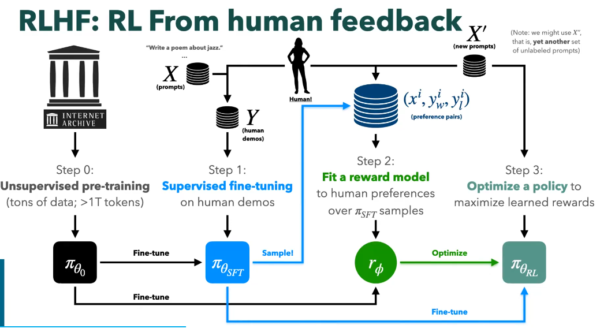
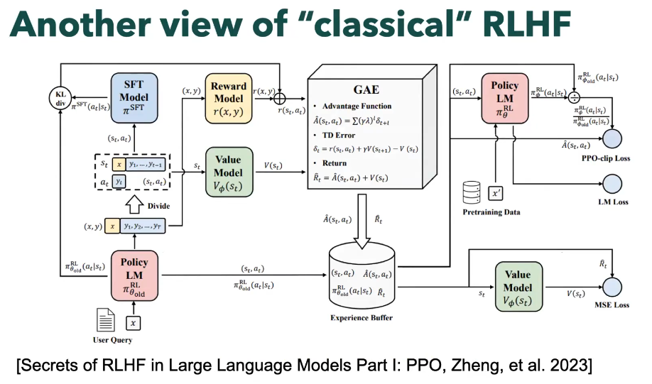
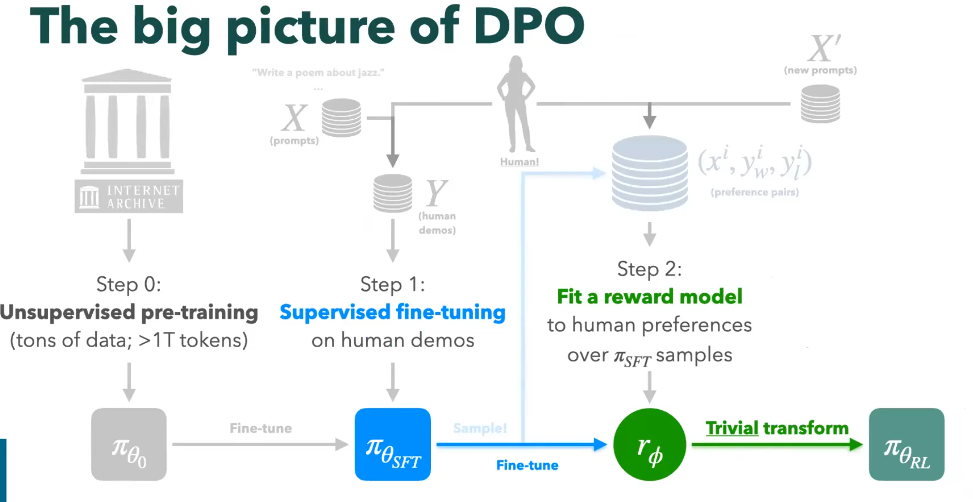

## RLHF

1. Unsupervised pre-training -> $\pi_{\theta_0}$
2. Supervised fine-tuning -> $\pi_{\theta_{SFT}}$
   1. $X_{prompt}, Y_{human\ demos}$
3. Fit a reward model -> $r_{\phi}$
   1. human point is difficult -> user pair ($y_w, y_l$)
   2. **Bradley-Terry Model**: $p(a > b)=\sigma(s(a)-s(b))$
   3. $L=-E[log(\sigma(r(x, y_w)- r(x, y_l)))]$
4. Optimize a policy -> $r_{\pi_{\theta_{RL}}}$
   1. PPO-pentaly-object: $J(\theta)\simeq L(\theta | \theta_{old}) =E_{a \sim {\pi(.|s, \theta_{old})}}[\frac{\pi(a|s,\theta)}{\pi(a|s,\theta_{old})}A]-\beta D_{KL}(\pi(a|s,\theta_{old})||\pi(a|s,\theta))$
   2. RLHF-object: below pic
      1. $\max_{\pi} E_{x \sim D, y\sim \pi(y|x)}[r(x, y)] - \beta D_{KL}(\pi(y|x)||\pi_{ref}(y|x))$

## DPO 

1. PPO有整体比较复杂 
2. 计算资源需求较高
3. 需要预先训练reward model，reward训练引入额外自由度
   1. $L_R(\phi, D) = -E_{(x, y_w, t_l)\sim D}[log( \sigma(r_\phi (x, y_w) - r_\phi (x, y_l)))]$
   2. can shift reward by arbitrary constant , which can differ across prompts

### RLHF-object

$$\max_{\pi} E_{x \sim D, y\sim \pi(y|x)}[r(x, y)] - \beta D_{KL}(\pi(y|x)||\pi_{ref}(y|x))$$

### Closed-form Optimal Policy 

$$\pi^\star(y|x)=\frac{1}{Z(x)}\pi_{ref}(y|x) exp(\frac{1}{\beta} r(x, y) )$$

- $Z(x)=\sum_y \pi_{ref}(y|x) exp(\frac{1}{\beta} r(x, y) )$
  - 参考模型对该响应的指派概率和指数化奖励的乘积

### Rearrange 

$$r(x, y) = \beta log{\frac{\pi^\star(y|x)}{\pi_{ref}(y|x)}}  + \beta log Z(x)$$

- $log{\frac{\pi^\star(y|x)}{\pi_{ref}(y|x)}}$: 大于0，如果策略返回更接近respone

### 汇总

reward model损失函数（$L_R(\phi, D) = -E_{(x, y_w, t_l)\sim D}[log( \sigma(r_\phi (x, y_w) - r_\phi (x, y_l)))]$） + 变换后的策略和奖励（$r(x, y) = \beta log{\frac{\pi^\star(y|x)}{\pi_{ref}(y|x)}}  + \beta log Z(x)$） = 最终策略函数损失DPO

$$L_{DPO}(\pi_{\theta}; \pi_{ref}) = -E_{(x, y_w, t_l)\sim D}[log( \sigma( \beta log{\frac{\pi_{\theta}(y_w|x)}{\pi_{ref}(y_w|x)}} - \beta log{\frac{\pi_{\theta}(y_l|x)}{\pi_{ref}(y_l|x)}}))]$$

### Gradient 

$-\beta E_{(x, y_w, t_l)\sim D}[\sigma (\hat{r}_{\theta}(x, y_l), \hat{r}_{\theta}(x, y_w))[ \nabla _\theta log \pi (y_w|x) - \nabla _\theta log \pi (y_l|x)  ] ]$

- $hat{r}_{\theta}(x, y) = \beta log{\frac{\pi_{\theta}(y|x)}{\pi_{ref}(y|x)}}$

|symbol | sample | explain |
|-|-|-|
|$x$|<Some long Reddit post explaining a situation> | input |
|$y_w$| TL;DR: My gf hates i have my own chef and maid. She is worried about us moving together but thinks I should make my own things| chosen |
|$y_l$| TL;DR: I'm chef and my gf dosem't like it | rejected |
|$y \sim P_{\pi _{ref}}(.\|x)$| My gf hates me. My own chef and maid bother her.She asks me to cook things.I have a chef and maid. My gf doesn't like that fact and hates me | model samples |

DPO不会学会去生成`TL;DR:`, 所以这里体现出了之前的SFT的重要性，SFT就能学会生成`TL;DR:`
关注其中，最大最小似然
$\nabla _\theta log \pi (y_w|x) - \nabla _\theta log \pi (y_l|x)$
$\sum_{t=0}^{T_w}\nabla _\theta log \pi (y^t_w|x, y_w^{<t}) - \sum_{t=0}^{T_l}\nabla _\theta log \pi (y^t_l|x, y_l^{<t})$

## deepseek-r1

1. Unsupervised pre-training
2. 冷启动 SFT: 推理数据 (高质量思维链数据) 
   1. 目的：增强模型的推理能力，让 AI 具备基本的推理能力，防止在强化学习阶段出现语言混乱或无意义的输出(解决强化学习冷启动问题)
   2. Data:
      1. 收集高质量的推理数据，包括数学推理、代码生成、长链推理等任务。
      2. 通过人工筛选和数据优化。
3. 以推理为导向的强化学习  GRPO(Group Relative Policy Optimization): 
   1. 目的：提高模型在推理任务上的准确性和能力
   2. Data:推理数据 -> 数学、编程、逻辑推理等明确有标准答案的任务
4. 拒绝采样与再监督学习 STF: 
   1. 目的：提升推理任务 + 扩展在非推理任务上的能力，使其能够有效处理这些任务
   2. Data: 推理数据(-> 拒绝采样方法，收集高质量的推理任务数据) + 非推理数据（写作、问答、翻译、自我认知等）
        - 拒绝采样对于概率分布函数难以求解的数据进行采样是有效的，现在计算机的计算能力如此发达的情况下，更是有利于蒙特卡罗采样的发展
5. 全面场景的强化学习 GRPO: 
   1. 目的：提升推理任务 + 非推理任务-对齐人类偏好, 提高在非推理任务上的 有用性 和 安全性
   2. Data: 推理数据 + 非推理数据(Reward Model)

|Steps|RLHF|RLHF-DPO|deepseek-r1|
|-|-|-|-|
|Unsupervised pre-training| Y | Y| Y|
|Supervised fine-tuning| Y-非推理数据 | Y-非推理数据 | Y-**推理数据** |
|Fit a reward model | Y | X| Y-for RL2|
| RL | Y-PPO | Y-DPO(reward+RL) | Y-GRPO(**推理数据**) |
|**STF2**| X | X| Y-推理数据+非推理数据|
|**RL2**| X | X| Y-GRPO-推理数据(no reward model)+非推理数据(reward model)|

