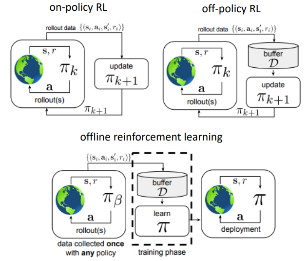
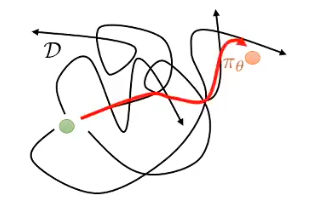
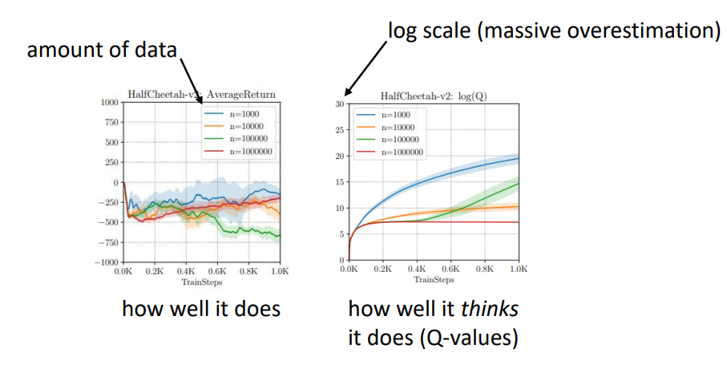
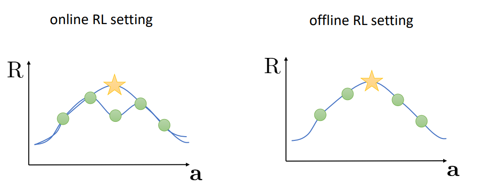

# 一、什么是OfflineRL

data-driven RL methods:
- OfflineRLRL只利用先前收集的离线数据来构造静态数据集，而不与环境进行额外的在线交互

Formally: 给定数据`D``, 学习最佳策略(*best possible policy* $\pi_\theta$)(但实际上还是会受限于数据)
- $D = \{ (s_i, a_i, s_i^\prime, r_i) \}$
- $s \sim d^{\pi_\beta}(s)$
- $a \sim \pi_\beta(a|s)$ generally not known
- $s^\prime \sim p(s^\prime|s, a)$
- $r \rightarrow r(s, a)$
- RL object: $\max_\pi \sum_{t=0}^T E_{s_t\sim d^\pi(s), a_t\sim \pi(a|s)}[\gamma^t r(s_t, a_t)]$

offline-RL希望解决什么
1. Find the "good stuff" in a dataset full of good and bad behaviors
   1. 所以如果一个数据集全都是`bad behaviors`, 最终的*best possible policy* $\pi_\theta$，依旧是那样
   2. 在一个数据集中需要包含少量的“成功”的数据
2. Generalization: good behavior in one place may suggest good behavior in another place
   1. 希望学习到一些行为的泛化能力
3. "Stitching": parts of good behaviors can be recombined
   1. 将好的行为进行有效缝合
   2. "Macro-scale" stitching (But this is just the clearest example!)  

# 二、OfflineRL的难点与解决思路

OfflineRL 会 overestimate Q 

Fundamental problem: 反事实查询(counterfactual queries)

- OnlineRL:  they can simply try this action and see what happens
- Offline RL:  must somehow account for these unseen(“out-of-distribution”) actions, 最好是以安全的方式…同时仍然利用泛化来提出比数据中最好的东西更好的行为！

Issues with generalization are not corrected
- $Q(s,a) \leftarrow y(s,a) = r(s, a) + E_{a^\prime \sim \pi_{new}}[Q(s^\prime, a^\prime)]$
- 目标函数：$\min_Q E_{(s, a)\sim\pi_\beta(s, a)}[(Q(s, a) - y(s,a))^2]$
  - 期望 $\pi_\beta(a|s) = \pi_{new}(a|s) = \argmax_\pi E_{a\sim \pi(a|s)}[Q(s, a)]$
  - 但是实际上，从下图中可以看出 $\pi_{new}(a|s)$ 可能更差
    - 在offline-RL中只能用四个点去预估R， 所以在OOD上可能会出现高估
    - 在online-RL中开始只有四个点去预估R, 交互后会产生中间的第五个点，来调整预估

avoid all OOD actions in the Q update -> IQL & CQL

# 三、 CQL 解决 OOD 问题的原理

CQL（Conservative Q-Learning）之所以能有效解决离线强化学习中的 OOD（Out-of-Distribution）问题，核心在于它通过正则化机制显式地惩罚分布外动作的 Q 值估计，从而防止策略被错误的、过高的 OOD Q 值误导。

## 1. OOD 问题的本质
在离线 RL 中，策略只能基于固定的数据集学习，无法与环境交互。这导致在数据集中未出现的状态-动作对（即OOD动作）上，Q 函数的估计可能严重偏高。这种高估会误导策略选择这些 OOD 动作，造成策略性能下降甚至崩溃。

## 2. CQL 的正则化机制
CQL 在标准的 Bellman 误差损失基础上，添加了两个正则化项：
- 最小化策略动作（包括 OOD）的 Q 值：
$$\min_Q E_{s \sim D, a \sim \mu(⋅∣s)}[Q(s,a)]$$
其中 μ 是策略或某种探索分布，用于生成 OOD 动作。

- 最大化数据集中动作的 Q 值：
$$−E_{(s,a)∼D}[Q(s,a)]$$

这两个项的组合，**使得 Q 函数在数据分布内的动作上保持高值，而在 OOD 动作上被压低**，从而防止策略被 OOD 动作吸引。

## 3. 理论保证

CQL 的正则化项可以扩大数据分布动作与 OOD 动作之间的 Q 值差距，从而确保学习到的 Q 函数是真实 Q 值的下界估计。这意味着：
- OOD 动作的 Q 值被压低，不会被策略误选；
- 数据分布内的动作 Q 值保持较高，策略更稳定。

## 4.  实证效果

在 D4RL 等基准测试中，CQL 在多个任务（如 MuJoCo、AntMaze）中显著优于 BEAR、BCQ 等基线算法，尤其是在复杂、多模态数据分布和稀疏奖励环境中。

# 总结：为什么 CQL 能有效解决 OOD？

| 机制                 | 作用                |
| ------------------ | ----------------- |
| 正则化项惩罚 OOD 动作的 Q 值 | 防止策略被高估的 OOD 动作误导 |
| 最大化数据集中动作的 Q 值     | 保持策略在数据分布内的稳定性    |
| 理论保证 Q 值为下界估计      | 提供安全策略改进的保障       |
| 实证上在复杂任务中表现优异      | 验证其在实际场景中的有效性     |

因此，CQL 通过保守地估计 Q 值，有效缓解了离线 RL 中由于 OOD 动作引起的策略坍塌问题，是当前离线强化学习中最具代表性的稳健算法之一。

which offline RL algrithm do I use

1. only train offline...
   1. CQL: +just one hyperparameter          + well understood and widely tested
   2. IQL: +more fiexible(offline + online)  -more hyperparameter
2. train offline and finetune online 
   1. Adavantage-weighted actor-critic (AWAC) +widely used and well tested 
   2. IQL: +seems to perform much better !
3. have a good way to train models in your domain
   1. COMBO 
      1. + similar properties as CQL, but benifits from models
      2. -not always easy to train a good model in your domain!
   2. TT: Trajectory Transformer
      1. +very powerful and effective models
      2. -extremely computationally expensive to train and evaluate 

standard real-world RL process 

1. instrument the task so taht we can run RL
   1. safety mechanisms
   2. autonomous collection
   3. rewards, reset, etc
2. wait a long time for online RL to run
3. change the algorithm in some small way (and repeat 2)
4. thorw it all in the garbage and start over for next task 

offline RL process
1. collect inital dataset
   1. human-provided
   2. scripted controller
   3. baseline policy
   4. all of the above
2. Train a policy offline
3. change the algoritnm in some small way  (and repeat 2)
4. collect more data, add to growing dataset (back to 2 and go downstream)
5. **keep the dataset and use it again for the next project!**

1. An offline RL workflow
   - Supervised learning workflow: train/test split
   - Offline RL workflow: ??? OPE ?
2. Statisticak guarantees
   - Biggest challenge: distributional shift/counterfactuals
3. scalable methods, large-scale applications 

# Reference

1. [berkeley CS285 lec-15](https://rail.eecs.berkeley.edu/deeprlcourse/deeprlcourse/static/slides/lec-15.pdf)
