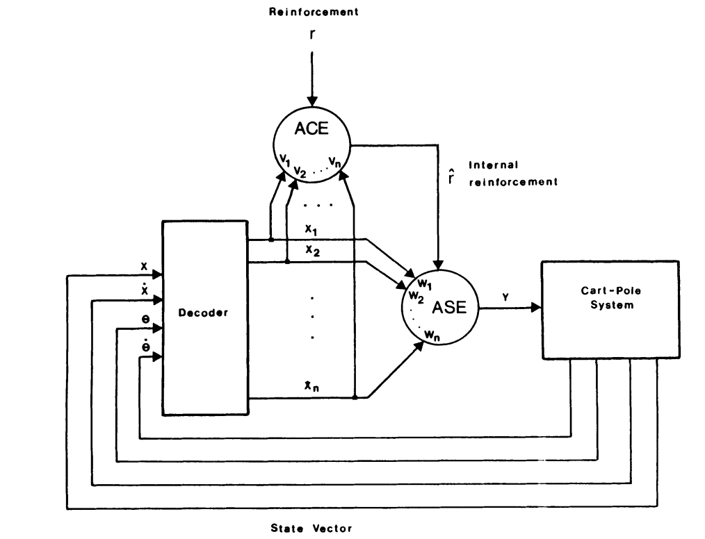
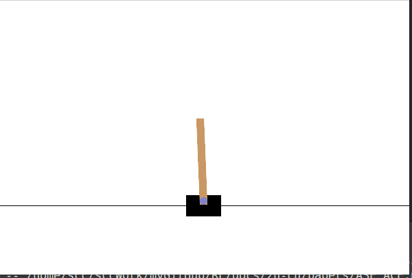

## Neuronlike adaptive elements that can solve difficult learning control problems

paper Link: [sci-hub: Neuronlike adaptive elements that can solve difficult learning control problems](https://sci-hub.se/10.1109/tsmc.1983.6313077)


### 摘要
    通过两个类似神经元的自适应元素组成的系统解决一个复杂的控制学习问题。
- 研究环境: Cart-pole (和gym的[classic_control/cart_pole](https://gymnasium.farama.org/environments/classic_control/cart_pole/) 类似)
- 算法:  ASE + ACE
  - associative search element (ASE) : 强化输入与输出之间的关联
  - adaptive critic element (ACE)：构建一个比单独的强化反馈更有信息量的评估函数 $\hat r_t$
- 主要贡献：
  - **自适应元素的能力**：ASE 和 ACE 的结合能够解决复杂的控制学习问题，即使在反馈信号质量较低的情况下
  - **对神经科学的启示**：论文提出，如果生物网络中的组件也具有类似的自适应能力，那么可能存在与本文描述的自适应元素相似的神经元
  - **对人工智能的启示**：这种自适应元素的设计为构建能够解决复杂问题的网络提供了一种新的方法


### 核心算法



#### ASE

> 用于优化搜索过程，通过强化输入输出关联来减少搜索空间，提高搜索效率;
> 
>  能够努力实现有益的事件，并避免随时可能发生的惩罚事件(ASE, on the other hand, is capable of working to achieve rewarding events and to avoid punishing events which might occur at any time)


predict: $y_t = f[\sum_i^n w^i_t x^i_t + noise_t]$ ... (1)
- $y_t \in \{-1, 1\}$
- $noise_t \sim N(0, \sigma^2)$
- f：可以是阈值函数，sigmoid函数，或恒等函数 
  - 阈值函数：$f = \begin{cases} 1, if\ x \ge 0 \ (\text{control action right})\\ -1, if\ x \lt 0 \ (\text{control action left})  \end{cases}$

update: $w^i_{t+1} = w^i_t + \alpha \hat r_t e^i_t$ ... (2)
- $\alpha$: 学习率
- $\hat r_t$: 强化值 Fig-3
- $e^i_t$: eligibility $e^i_{t+1} = \delta e^i_{t} + (1-\delta)y_t^ix_t^i$

<font color=red>The basic idea expressed by (2) is that whenever certain conditions (to be discussed later) hold for input pathway i,
then that pathway becomes eligible to have its weight modified, 
and it remains eligible for some period of time after the conditions cease to hold. </font>


If the reinforcement indicates improved performance, then the weights of the eligible pathways are changed so as to make the element more likely to do whatever it did that made those pathways eligible. 

If reinforcement indicates decreased performance, then the weights of the eligible pathways are changed to make the element more likely to
do something else

```python

class ASE:
    def __init__(self, input_dim, alpha=0.1, delta=0.2, sigma=0.01):
        """associative search element"""
        self.w = np.random.randn(input_dim, 1)
        self.lr = alpha
        self.et = 0
        self.delta = delta
        self.sigma = sigma

    def forward(self, state):
        noise = np.random.normal(0, self.sigma) # 增加随机探索
        return  self.f_func(np.dot(state, self.w) + noise)
    
    def f_func(self, a):
        if a < 0:
            return 0
        return 1
    
    def action_postfix(self, a):
        if a == 0:
            return -1
        return 1      

    def update(self, s, hat_r):
        # 1- conditions of action: becomes eligible to have its weight modified
        # e^i_{t+1} = \delta e^i_{t} + (1-\delta)y_t^ix_t^i
        e_t = self.action_postfix(self.forward(s)) * s
        # 2- it remains eligible for some period of time after the conditions cease to hold
        self.et = self.delta * self.et + (1 - self.delta) * e_t
        # w^i_{t+1} = w^i_t + \alpha r_t e^i_t
        self.w += (self.lr * hat_r * e_t).reshape(self.w.shape)

```

#### ACE

> The central idea behind the ACE algorithm is predictions are formed that predict not just reinforcement but also future predictions of reinforcement

predict: $p_t=\sum_i^n v^i_t x^i_t$

update: $v^i_{t+1} = v^i_t + \beta \hat r_t \overline{x}^i_t$
- $r_t \in \{0, -1\}$
- like partial of mse: $\frac{\partial 0.5\hat r_t^2 }{\partial v}=\frac{\partial 0.5\hat r_t^2 }{\partial p_t}\frac{\partial p_t}{\partial v}=\hat r_t x_t$
- reinforcement signal: $\hat r_t=r_t + \gamma p_t - p_{t-1}$
  - like TDError
- $\overline{x}^i_{t+1} = \lambda \overline{x}^i_t + ( 1 - \lambda) x^i_t$

> algo Prove: 
> - (1982) Simulation of anticipatory responses in classical conditioning by a neuron-like adaptive element
> - (1981) Toward a modern theory of adaptive networks: Expectation and prediction

```python

class ACE:
    """adaptive critic element"""
    def __init__(self, input_dim, beta=0.1, gamma=0.95, lmbda=0.8):
        self.v = np.random.randn(input_dim)
        self.lr = beta
        self.gamma = gamma
        self.lmbda = lmbda
        self.overline_x = np.zeros(input_dim)
    
    def forward(self, state):
        return np.dot(state, self.v) 
    
    def reward_postfix(self, r):
        return r - 1
    
    def reinforcement_signal(self, r, s, before_s):
        r = self.reward_postfix(r) # 0 -1
        return r + self.gamma * self.forward(s) - self.forward(before_s)

    def update(self, s, r, before_s):
        # r_t + \gamma p_t - p_{t-1}
        hat_r = self.reinforcement_signal(r, s, before_s)
        
        # v^i_{t+1} = v^i_t + \beta \overline{x}_i
        self.v += self.lr * hat_r * self.overline_x 

        # \overline{x}^i_{t+1} = \lambda \overline{x}^i_t + ( 1 - \lambda) x^i_t
        self.overline_x = self.lmbda * self.overline_x + (1 - self.lmbda) * s
        return hat_r
```


### Train Test
```python
# 创建环境
seed_ = 19831983
np.random.seed(seed_)
env = gym.make('CartPole-v1')
input_dim = env.observation_space.shape[0]
output_dim = env.action_space.n

 
# paper 1000
ase = ASE(input_dim, alpha=580, delta=0.9, sigma=0.01) 
ace = ACE(input_dim, beta=0.5, gamma=0.95, lmbda=0.8)

num_episodes = 1200 # 500000
reward_l = []
tq_bar = tqdm(range(num_episodes))
for episode in tq_bar:
    s, _ = env.reset(seed=20250314)   # 500
    done = False
    r_tt = 0
    while not done:
        a = ase.forward(s)  
        n_s, r, terminated, truncated, infos = env.step(a) 
        r_tt += r
        # 更新 ACE
        hat_r = ace.update(n_s, r, s)
        # 更新 ASE
        ase.update(n_s, hat_r)
        s = n_s
        done = terminated or truncated

    reward_l.append(r_tt)
    tq_bar.set_postfix({
        'rewards': r_tt,
        'last_mean': np.mean(reward_l[-10:]),
        'last_std': np.std(reward_l[-10:]),
    })

```

