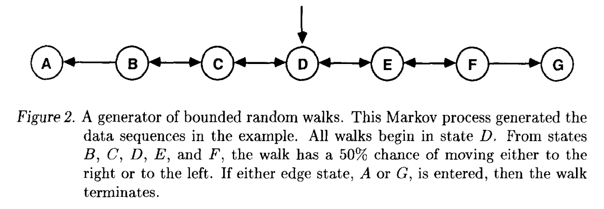
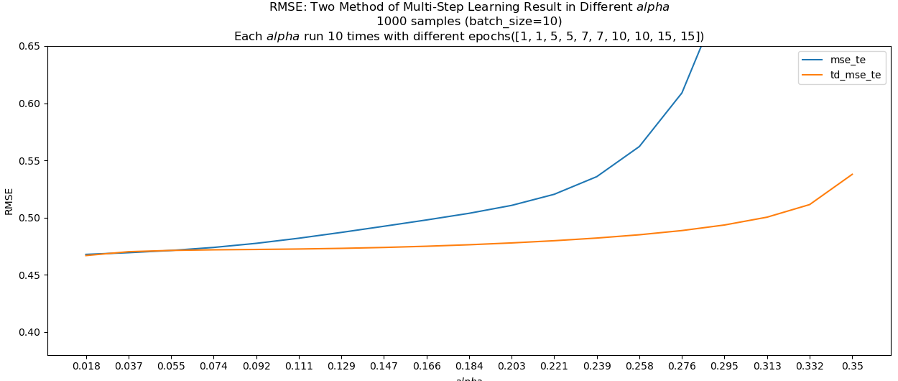
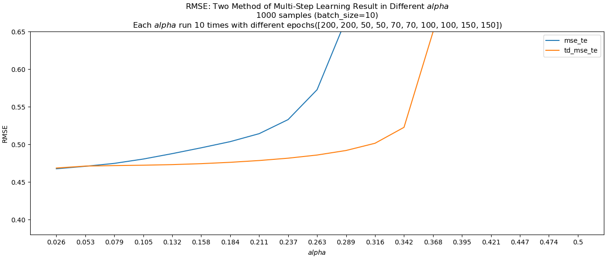

## Learning to predict by the methods of temporal differences

paper Link: [sci-hub: Learning to predict by the methods of temporal differences](https://sci-hub.se/10.1007/bf00115009)

### 1. 摘要
论文介绍了时间差分方法（TD 方法），这是一种用于预测问题的增量学习方法。TD 方法通过比较连续时间步的预测值之间的差异来调整模型，而不是传统的通过预测值与实际结果之间的差异来调整。
对于大多数现实的预测问题，TD方法比传统方法需要更少的内存和更少的峰值计算，并且可以产生更准确的预测。

### 2. 简介

传统预测学习方法依赖于预测值与实际结果之间的差异来分配“信用”（即调整权重），这种方法在多步预测问题中效率较低。TD 方法通过比较连续时间步的预测值之间的差异来更新模型。

对于 每天预测下周六是否会下雨 的问题:
- 传统方法：compare each prediction to the actual outcome whether or not it does rain on Saturday.
  - 会根据周六的实际结果增加或减少预估权重。
- TD方法: compare each day's prediction with that made on the following.
  - 如果预测周一50%可能下雨，周二有75%可能下雨，TD方法会增加与周一类似几天的预测，而不是等到周六的实际结果出来


TD方法2个优势：
1. 计算效率更高：TD 方法可以**<font color=darkred>更增量地更新预测值</font>**，减少了计算量和存储需求。
2. 更快的收敛速度：TD 方法在多步预测问题中表现更好，能够更快地收敛并产生更准确的预测。

### 3. TD和监督学习

主要关注多步预测。很多问题被定义成single-step预测问题，**<font color=darkred>实际上将其认为multi-step预测问题会更加自然</font>**，比如一些感知学习问题：视频或语音识别问题，一般都是作为简单监督学习（a training set of isolated, correctly-classified input patterns.）。但是当人类听到或看到事物时，他们会随着时间的推移收到一系列输入，并不断更新他们对所看到或听到的事物的假设。
  - 现在(2025)的很多语音识别都是`Transformer-Decoder`方式，也是考虑到了前面的输入对后一个的影响。deepseek的multi-Token Prediction本质也是一样的


#### 3.1 理论分析

一般监督回归模型参数更新方法(基于正态分布-最大似然)：
- $y \sim N(\hat{y}, \sigma ^ 2) = \frac{1}{\sigma\sqrt{2 \pi }} e^{-\frac{(y-\hat{y})^2}{2\sigma^2}}$
- $max L = \prod_1^{n} f(y|\hat{y}, \sigma^2) =\prod_{i=1}^n \frac{1}{\sigma\sqrt{2 \pi }} e^{-\frac{(y-\hat y_i)^2}{2\sigma^2}}=(2\pi)^{-n/2}\sigma^{-n} e^{-\frac{1}{2\sigma^2}\sum_{i=1}^n(y-y_i)^2}$
- $max ln(L) \sim -\sum_{i=1}^n(y-y_i)^2 \rightarrow min\ MSE=\sum_{i=1}^n(y-y_i)^2$
- 更新力度为： 
  - $\Delta w = \alpha \sum_{t=1}^m w_t;\Delta w_t = \alpha(z-P_t) \nabla _w P_t$
  - 线性回归： $\Delta w_t = \alpha(w^Tx-z) x$
  - 主要是基于真实值与预测值的偏差。在多步预测的时候，z已知之前无法确定
  - 无法进增量计算

python-example:
```python
class multiReg:
    def __init__(self, feature_dim=7, learning_rate=0.1):
        self.w = np.random.randn(feature_dim).reshape(-1, 1)
        self.learning_rate = learning_rate

    def predict(self, x):
        return np.matmul(x, self.w)
    
    def fit(self, x, y, batch_size=25, n_rounds=100):
        n = x.shape[0]
        idx = np.arange(n)
        tq_bar =  tqdm(range(n_rounds))
        for round_i in tq_bar:
            tq_bar.set_description(f'[  {round_i + 1} / {n_rounds}]')
            np.random.shuffle(idx) 
            idx_l = [min(i, n) for i in range(0, n + batch_size, batch_size)]
            for st, ed in zip(idx_l[:-1], idx_l[1:]):
                batch_x = x[st:ed, ...]
                batch_y = y[st:ed, ...]
                # x @ w
                p_t = self.predict(batch_x) 
                # (p_t - z)
                e = p_t.reshape(batch_x.shape[0], -1) - batch_y
                # \sum_{t=1}^T (p_t - z) @ x
                grad = np.matmul(batch_x.transpose(0, 2, 1), e[..., np.newaxis]).mean(axis=0)
                self.w -= self.learning_rate *  grad

```

TD方法，同样的更新策略，但是可以进行增量计算
- $z-P_t = \sum_{k=t}^m(P_{k+1}-P_{k}); \ \ \ where\ \ P_{m+1}=z$
  - $\Delta w = \alpha \sum_{t=1}^m\Delta w_t=\alpha \sum_{t=1}^m \sum_{k=t}^m(P_{k+1}-P_{k})\nabla _w P_t=\sum_{t=1}^m \alpha(P_{t+1}-P_{t})\sum_{k=1}^t \nabla _w P_k$
  - $\Delta w_t = \alpha(P_{t+1}-P_{t})\sum_{k=1}^t \nabla _w P_k$
- 加入$\lambda \in [0, 1]$
  - $\Delta w_t = \alpha(P_{t+1}-P_{t})\sum_{k=1}^t \lambda^{t-k} \nabla _w P_k$
  - 越接近预估时间t权重越大
  - $e_{t+1}=\sum_{k=1}^{t+1}\lambda ^{t+1-k} \nabla _w P_k=\nabla _w P_{t+1} + \lambda\sum_{k=1}^{t}\lambda ^{t-k} \nabla _w P_k=\nabla _w P_{t+1} + \lambda e_{t}$
    - $\lambda = 0 \rightarrow \alpha(P_{t+1}-P_{t})\nabla _w P_{t}$

python-example:
```python

class multiTDReg:
    def __init__(self, feature_dim=7, learning_rate=0.1, time_step=9, lmbda=0.9, incre_update=True):
        self.w = np.random.randn(feature_dim).reshape(-1, 1)
        self.learning_rate = learning_rate
        self.lmbda = lmbda
        self.time_step = time_step
        self.incre_update = incre_update

    def predict(self, x):
        return np.matmul(x, self.w)

    def get_nabla(self, batch_x):
        lmbda = self.lmbda
        e_t_list = [0]
        for t in range(self.time_step):
            e_t_1 = batch_x[:, t, :] + e_t_list[-1] * lmbda
            e_t_list.append(e_t_1)
        return np.stack(e_t_list[1:], axis=1)
    
    def fit(self, x, y, batch_size=25, n_rounds=100):
        n = x.shape[0]
        idx = np.arange(n)
        tq_bar =  tqdm(range(n_rounds))
        for round_i in tq_bar:
            tq_bar.set_description(f'[  {round_i + 1} / {n_rounds}]')
            np.random.shuffle(idx) 
            idx_l = [min(i, n) for i in range(0, n + batch_size, batch_size)]
            for st, ed in zip(idx_l[:-1], idx_l[1:]):
                batch_x = x[st:ed, ...]
                batch_y = y[st:ed, ...]
                p_t = self.predict(batch_x) 
                p_t_c = np.concatenate([p_t, batch_y[..., np.newaxis]], axis=1)
                e =  p_t_c[:, :-1, :] - p_t_c[:, 1:, :] #  -(p_{t+1} -p_t)  # b, time_step, 1
                # e \sum_{k=1}^t lmbda^{t-k} \nabla_w P_k 
                nabla = self.get_nabla(batch_x) # b, time_step, 7
                # print(f'{nabla.shape=} {e.shape=}')
                if not self.incre_update:
                    grad = np.matmul(nabla.transpose(0, 2, 1), e).mean(axis=0)
                    self.w -= self.learning_rate *  grad
                    continue

                # incrementally update:
                for t in range(self.time_step):
                    grad_t = nabla[:, t, :] * e[:, t, :]
                    self.w -= self.learning_rate *  grad_t.mean(axis=0).reshape(-1, 1)

```

#### 3.2 案例

> 每当数据序列由动态系统（by a system that has a state which evolves and is partially revealed over time.）生成时， TD方法会发挥更大的作用

Random-walk Env example : [github: 1988_randomWalk_td.py ](./1988_randomWalk_td.py)
$P(s=G|s=x) \rightarrow z=E[V(S=x)]$



env python example:
```python

class SimpleRandomWalk(gym.Env):
    def __init__(self):
        super(SimpleRandomWalk, self).__init__()
        self.states = ['A', 'B', 'C', 'D', 'E', 'F', 'G']
        self.action_space = gym.spaces.Discrete(2, start=0)
        self.observation_space = gym.spaces.Discrete(len(self.states))
        self.start_state = 'D'
        self.current_state = self.start_state
        self.rewards = {'A': 0, 'G': 1}
        
    def step(self, action):
        index = self.states.index(self.current_state)
        if action == 0:  # 左移
            if index > 0:
                self.current_state = self.states[index - 1]
        elif action == 1:  # 右移
            if index < len(self.states) - 1:
                self.current_state = self.states[index + 1]
        
        reward = self.rewards.get(self.current_state, 0)
        done = self.current_state in ['A', 'G']
        return self._state_to_index(self.current_state), reward, done, False, {}
    
    def reset(self):
        self.current_state = self.start_state
        return self._state_to_index(self.current_state), {}

    def render(self, mode='human'):
        print(f"Current state: {self.current_state}")

    def _state_to_index(self, state):
        return self.states.index(state)
```

Learning result : TD-Reg is mush more easy to learn 
- train set (seq nums, seq length):  `train_seq_pairs = [
    (10, 4), (90, 6), (150, 8), (200, 10), 
    (150, 12), (100, 14), (100, 16), (100, 18), (100, 20),
]`




### 4. Theory of temporal-difference methods


总结
Richard S. Sutton 的这篇论文为时间差分方法奠定了理论基础，并展示了其在多步预测问题中的优势。
TD 方法不仅在理论上具有收敛性和最优性，而且在实际应用中也表现出了更高的效率和更快的收敛速


