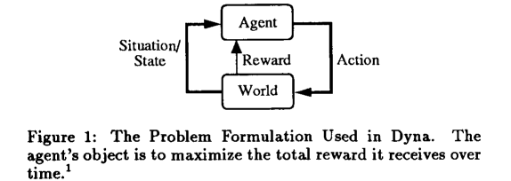

## Dyna, an integrated architecture for learning, planning, and reacting

paper Link: [Dyna, an integrated architecture for learning, planning, and reacting](https://dl.acm.org/doi/10.1145/122344.122377)
- [pdf](https://dl.acm.org/doi/pdf/10.1145/122344.122377)
- Richard S. Sutton于1991年发表, 提出了一种结合了学习、规划和反应的集成架构

### 1. 简介

主要介绍Dyna框架的优缺点。
Dyna框架旨在将模型学习（model-based learning）与无模型学习（model-free learning）相结合，以提高强化学习算法的效率和效果。

### 2. Dyna框架简介

> Dyna架构是专门为agent不完全准确地了解其行为对世界的影响以及这些影响可能是不确定的情况而设计的。
> 并假设agent的任务可以建模成奖励最大化问题（reward maximization）

Dyna框架试图整合：
- 对最优反应性政策（optimal reactive policy）的试错学习，从实际情况到行动的映射；
- 以行动模型（action model）的形式学习领域知识，这是一个黑匣子，它将情况和行动作为输入，并输出对下一个情况的预测；
- 规划：在给定领域知识（action model）的情况下，找到最优的反应性策略
- 反应式执行：在感知情况和应对情况之间没有计划干预。

Dyna一般步骤：
1. 在每个时间步骤，智能体选择一个动作并执行
2. 观察得到的奖励和下一个状态。
3. 将强化学习应用于此体验（experience）
4. 根据实际经验更新action model
5. **规划（Planning）**: 重复K次：
   1. 选择一个模拟的世界状态和行动；
   2. 使用行动模型预测结果奖励和新状态；
   3. 将强化学习应用于这一模拟经验。

### 3. Components of Dyna

Dyna包括以下几个关键部分：
1. **模型（Action Model）**：模型结构和模型迭代学习算法
2. 一种选择假设状态和动作的算法
3. **强化学习方法**：包括从示例中学习算法和生成行为多样性的方法。

Dyna对动作模型（Action Model）没有强烈的假设，它可以使用目前存在或尚未开发的各种方法。

### 4 Potential Problems with Dyna

1. 对监督学习的依赖
   1. 状态空间远大于表格格式数据空间 （当前-2025, 深度学习可以解决这个问题）
      1. 泛化知识和知识表达等
   2. **作者并不认为将一个集成架构建立在从示例中有效学习的能力之上是不合适的。**

2. 分层规划（Hierarchical Planning）
   1. Planning must be done at several levels and the results combined in some way.

3. 模糊和隐藏状态
   1. Dyna 假设agent在每个时间步，都可以观察到环境的相关状态
      1. 例如，机器人可能无法从其周围环境中确定它在两个类似的房间中的哪一个，或者门是否锁着，或者门另一侧的房间里是否有人。在这些情况下，机器人无法明确地确定世界的状态，因为大部分状态对他来说都是隐藏的
   2. 一些解决办法: 尽量增加一些探索，状态记忆等
      1. uncertainty about the true state on the world
      2. Intrinsic Curiosity Module(ICM) [ Curiosity-driven Exploration by Self-supervised Prediction (ICML 2017)](https://pathak22.github.io/noreward-rl/)
      3. 内在动机和奖励塑造的统一框架[BAMDP Shaping: a Unified Framework for Intrinsic Motivation and Reward Shaping (ICLR 2025)](https://arxiv.org/abs/2409.05358)

4. 确保行为的多样性
   1. 动作空间的不足
      1. [Efficient Exploration via State Marginal Matching (ICLR 2019)](https://sites.google.com/view/state-marginal-matching)
         1. 均匀探索，熵最大
   2. 不同策略的探索
      1. [Diversity is All You Need: Learning Skills without a Reward Function (2018)](https://arxiv.org/abs/1802.06070)
      2. [Variational Intrinsic Control (2016)](https://arxiv.org/abs/1611.07507)

5. 任务能力
   1. Dyna is based on the reward maximization problem which recognizes only one goal, the maximization of total reward over time.
   2. 目标的设计需要结合当前的状态
      1. 例如，考虑一个机器人因捡垃圾而获得奖励，但它必须偶尔给电池充电。当电池电量低时，最佳行为将是寻找充电器，而当电池电量充足时，最佳操作将是寻找更多垃圾。如果电池的电量是状态描述的一部分，那么这两个明显的目标很容易成为单一政策的一部分。
   3. 对奖励进行一定的调整

6. 整合先验知识
   1. Q函数也隐含了部分的先验知识
   2. 这个在[BAMDP Shaping]的伪造奖励中也考虑了 
      1. BAMDP：好比"这座城市 + 你对它的认识"合在一起，变成了一个大"状态"。城市是客观存在的，但你的"不确定性"与"历史经历"也会影响下一步去哪儿吃。
      2. VOI（信息价值）：在还不知道哪些街区藏着美食时，去探索新的、未知的地方，也许能收获惊喜。就算当下不一定赚到最多的"美食奖励"，但未来几天可能会因此受益巨大。
      3. VOO（机会价值）：代表的是"对已知好餐厅的利用价值"。如果你已经知道某家店很好，可能当前就应该去吃那个稳妥的大餐，而不是冒险去找新店。
      4. BAMPF：论文告诉我们，如果想给自己一些"额外动力"来尝试新餐厅，却又不想因为这个动力而无限制地四处乱逛（导致"只顾到处搜罗，却忘记真正享受"），可以给每次行动添加一类"潜在奖励"。如果这种潜在奖励在数学上符合特定形式，就不会破坏最终真正的"吃得好"目标；这就是BAMPF的作用。

### 结论
Dyna算法展示了结合模型学习和无模型学习的潜力，为开发更高效、更灵活的强化学习系统提供了新的思路。随着强化学习领域的不断发展，Dyna框架的原则可能会在未来算法和应用的开发中发挥重要作用。