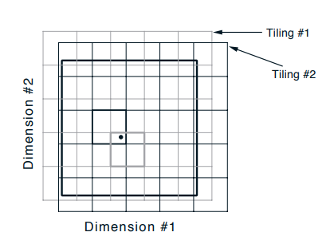
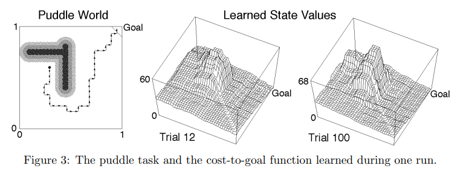
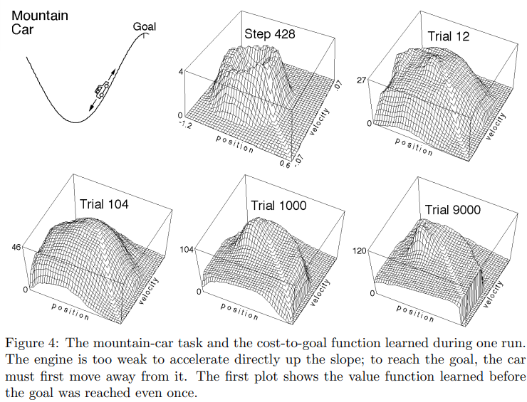
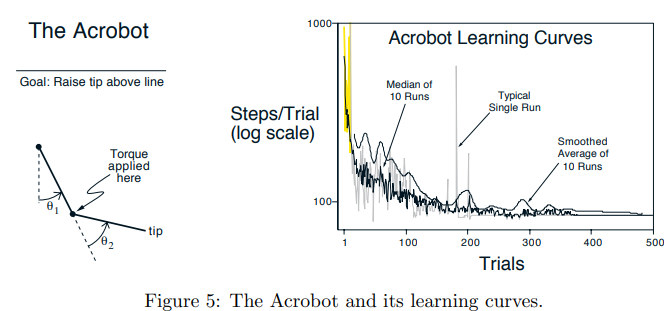
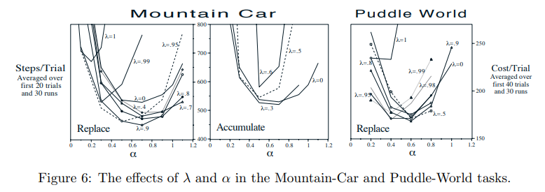
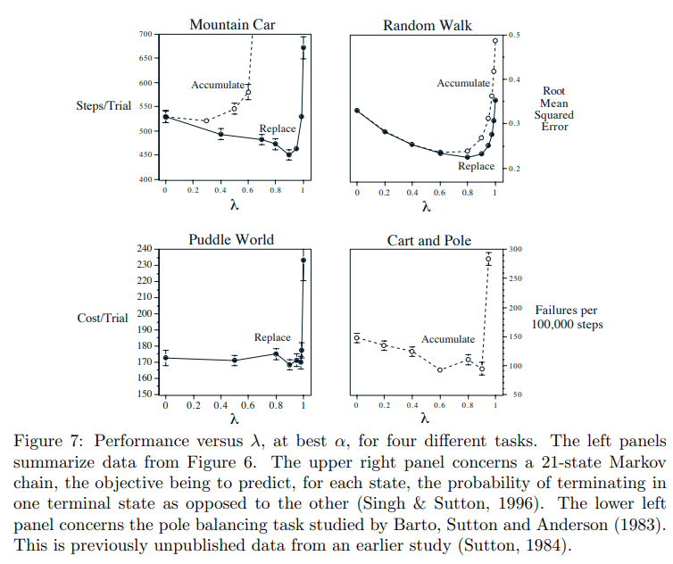

## Generalization in reinforcement learning: Successful examples using sparse coarse coding

paper Link: [Generalization in reinforcement learning: Successful examples using sparse coarse coding](http://www.incompleteideas.net/papers/sutton-96.pdf)
- NIPS 1998

> 背景：
>   1. 在paper:1991-92 Reinforcement learning is direct adaptive optimal control 发表后， 将 RL 与控制理论结合——将强化学习（RL）视为一种直接自适应最优控制方法
>   2. 强化学习中的泛化（generalization）一直是关键挑战，尤其是在高维状态空间中。
>   3. 传统方法如表格型 Q-learning 无法扩展到连续或高维状态空间。
>   4. 需要一种能有效泛化、同时保持简单性和可解释性的函数逼近方法。
> 
> 可能目的：进一步推广间接自适应方法——RL
> 解决问题：连续空间的泛化
> 如何解决：通过“稀疏粗糙编码”（sparse coarse coding）展示了强化学习中泛化成功的例子

### 摘要

在大规模强化学习问题中，系统必须借助带参数的函数逼近器（如神经网络）才能在相似状态-动作对之间完成泛化。然而，针对这类方法的理论收敛精度结果尚不充分，实验表现也良莠不齐。
尤其在上一年度的会议中，Boyan 与 Moore 报告了一系列负面实验结果：他们尝试将动态规划与函数逼近结合，用于处理若干具有连续状态空间的简单控制任务，却未能取得理想效果。

在本文中，我们给出了他们在所有尝试任务上的**正面结果**，并额外在一个规模更大的任务上验证了有效性。最关键的区别在于：
- 我们采用稀疏粗糙编码（`sparse-coarse-coded`）的函数逼近器（CMACs），而他们主要使用全局函数逼近器；
- 此外，我们进行在线学习，而他们采用离线学习。

Boyan、Moore 等人曾指出，若改用真实回报（“rollouts”）——如经典蒙特卡洛方法，或 TD(λ) 取 λ = 1 时——即可解决上述问题。然而，在我们的实验中，这种做法反而显著降低了性能。

我们得出结论：强化学习可以与函数逼近器稳健地结合；目前并无充分理由回避 λ < 1 的一般情形。

关键定义 
- $Q^\pi(s,a)$：从状态 s 出发，采取动作 a，此后遵循策略 $\pi$ 所能获得的期望回报。
  
一句话总结
- 这篇短论文通过简单但有效的“稀疏粗糙编码”展示了强化学习在连续控制任务中的成功泛化，证明了无需复杂模型也能实现高效学习。

### 1. 强化学习与函数逼近

强化学习是一类基于“从经验、仿真或搜索中估计价值函数”的最优控制方法（Barto, Bradtke & Singh, 1995; Sutton, 1988; Watkins, 1989）。动态规划、时序差分（TD）学习等许多方法在更新估计值时，**会部分依赖其他估计值**。这种做法令人担忧：实践中估计值永远不会完全准确；而在大规模问题上，又必须使用神经网络这类带参数的函数逼近器。由于估计值不完美，且又作为其他估计值的目标，最终可能导致估计结果极差，甚至发散。事实上，一些方法在理论上已被证明可能不稳定（Baird, 1995; Gordon, 1995; Tsitsiklis & Van Roy, 1994），实践中也确实出现了发散（Boyan & Moore, 1995）。
另一方面，有些方法在理论上已被证明收敛（Sutton, 1988; Dayan, 1992），在实践中也非常有效（Lin, 1991; Tesauro, 1992; Zhang & Dietterich, 1995; Crites & Barto, 1996）。那么，究竟<b>哪些方法或任务的关键要素能保证良好性能？本文的实验旨在进一步缩小这一问题的答案范围</b>。

我们采用的强化学习算法是 Sarsa 的若干变体（Rummery & Niranjan, 1994; Singh & Sutton, 1996）。该算法与 $TD(\lambda)$（Sutton, 1988）相同，只是将其应用于`state-action pairs`而非单纯状态`state`，并用这些估计值来选择动作。智能体估计动作价值函数 $Q^\pi(s,a)$，定义为：从状态 s 出发，采取动作 a，此后遵循策略 $\pi$ 所能获得的期望回报。

这些估计针对当前策略 π 的所有状态与动作。策略的选择依赖于当前估计，使得估计值与策略相互改进，最终逼近最优策略与最优动作价值。

在我们的实验中，动作采用 ε-greedy 策略选择：
- 大部分时刻，选择当前估计值 $\hat{Q}(s,a)$ 最大的动作（随机打破平局）；
- 以较小概率 ε 随机均匀地选择动作（动作集始终离散且有限）。

Sarsa 有两种资格迹（eligibility trace）实现：累加迹（accumulate traces）与替换迹（replace traces）（Singh & Sutton, 1996）。算法细节见图 1。

------------------------------------
基本流程如下：
1. 初始化： $w_a(f) = \frac{Q_o}{c}; e_a(f)=0, \forall a \in A, \forall f \in CMAC-tiles$
2. 开始试验：
   1. $s=random-state()$
   2. $F=feature(s)$
   3. $a = \epsilon - greedy -policy(F)$
3. Eligibility Traces:  $a_b(f) = \lambda e_b(f), \forall b, \forall f$
   1. Accumulate algorithm: $e_a(f) = e_a(f) + 1, \forall f \in F$
   2. Replace algorithm: $e_a(f)=1, e_b(f)=0, \forall f \in F, \forall b \neq a$
4. 环境step: `n_s, r, done, info = env.step(a)`, $s^\prime= s\_n$
5. 选择下一个动作：
   1. $F^\prime = feature(s^\prime)$ 除非 $done=True$, 否则 $F^\prime = \varnothing$
   2. $a^\prime = \epsilon - greedy -policy(F^\prime)$
6. Learn: $w_b(f) = w_b(f) + \frac{\alpha}{c} [r + \sum_{f\in F^\prime} w_{a^\prime} - \sum_{f \in F} w_a ]e_b(f), \forall b, \forall f$
7. 循环设置：$a=a^\prime, s=s^\prime, F=F^\prime$, 如果done, 从2开始，否则从3开始
------------------------------------

为了将 Sarsa 应用于连续状态空间任务，我们将其与一种稀疏、粗糙编码的函数逼近器——CMAC（Albus, 1980; Miller, Gordon & Kraft, 1990; Watkins, 1989; Lin & Kim, 1991; Dean et al., 1992; Tham, 1994）——相结合。CMAC 通过多个相互重叠的“瓦片”（tilings）覆盖状态空间，生成一组特征，再由线性映射完成最终逼近，所有学习都在这个线性层进行（见图 2）。

有点卷积的味道
CMACs 像 稀疏哈希版的局部卷积，CNN 是 连续可学习的卷积；**两者都把输入的 局部区域映射到输出**，但前者“快、轻、易解释”，后者“深、准、可端到端优化”。

| 维度       | CMACs                    | 卷积（CNN）                    |
| -------- | ------------------------ | -------------------------- |
| **核心思想** | **离散查表**（每个输入→若干地址→权重累加） | **连续卷积**（共享权重滑动窗口→加权和+非线性） |
| **感受野**  | 固定、局部、可重叠的 **“tile”** 区域 | 由卷积核大小和 stride 决定，**可扩张**  |
| **参数**   | 稀疏、人工设定（哈希表大小）           | 稠密、端到端学习                   |
| **可微性**  | ❌ 不可微（或线性插值）             | ✅ 全可微，支持反向传播               |
| **泛化**   | 高维灾难明显                   | **高维仍有效**（卷积核共享）           |
| **数据需求** | 少量样本即可工作                 | 大量标注 + 算力                  |
| **经典场景** | 实时控制、RL 值函数逼近            | 图像/语音/序列感知任务               |

整体效果类似于`network withe fixed radial basis function`，但计算上更高效（在其他方面，RBF 网络及类似方法也应有同样效果）。
值得注意的是，瓦片不必是简单网格。为缓解维度灾难，常用技巧是：
1. 在部分瓦片中忽略某些维度（即使用超平面切片而非完整格子）；
2. “哈希”（hashing）——将大量瓦片一致地随机折叠到少量存储单元，通常可把内存需求降低几个数量级而性能损失很小。
   1. 因为在整个状态空间中，只有小部分区域需要高分辨率。哈希让我们摆脱内存随维度指数增长的困境，仅需与实际任务需求相匹配的存储量。

### 2. 控制问题上的良好收敛

我们应用SARSA + CMAC 在3个连续状态控制问题上： `gridworld`, `puddle world`,  `mountain car`。
我们使用无模型，在线学习，并支持在完整试验中遇到的任何状态。我们的方法在上述3个环境中表现良好。

进行了多次训练试验，都从随机选择的state开始直到达到目标。每个时间步 获得-1分，`puddle world`有额外的负分，掉入`puddle region`获得-1分。
下列图例展示了每个 state 预估的`cost-to-goal`$\max_a \hat{Q}(s, a)$
- `puddle world` CMACs， 5 tilings, 每个5*5 和Figure2 一样
- `mountain car` CMACs, 10 tilings, 每个9*9

我们同在更大和更困难的任务——acrobot，上进行实验
`acrobot`: two-link under-actuated robot (Figure5) 完全类似于体操运动员在高杠上荡秋千

three actions: positive torque, negative torque, and no torque, and reward is −1 on all steps

### 3. $\lambda$的效果

强化学习的一个关键问题是，是更好地基于实际结果学习，如蒙特卡洛方法和$\lambda = 1$ 的 $TD(\lambda )$，还是基于中期估计学习，如 $ \lambda< 1$ 的 $TD(\lambda )$。
理论上，当使用函数逼近器时，前者具有渐近优势（Dayan，1992；Bertsekas，1995），但从经验上讲，后者被认为可以实现更好的学习率（Sutton，1988）。然而，迄今为止，这个问题还没有使用函数逼近器进行实证检验。图6显示了这种测试的结果。
 

Figure 7 中对数据进行了总结。每个实验上，模型的表现性能都是关于$\lambda$的倒U型曲线， 从0-1 先提升后下降。

