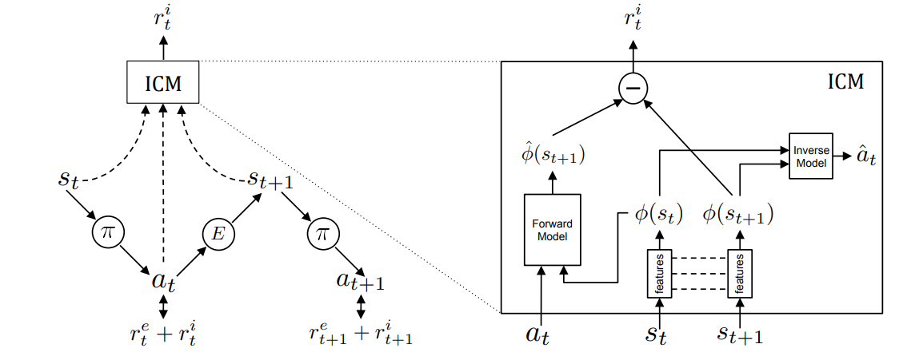
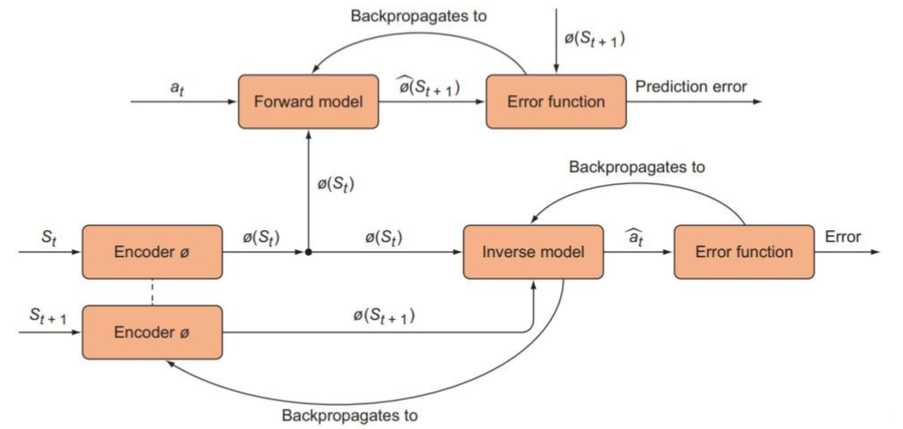

## ICM: Curiosity-driven Exploration by Self-supervised Prediction

paper Link: [ICM: Curiosity-driven Exploration by Self-supervised Prediction](https://pathak22.github.io/noreward-rl/)
GITHUB Link:
- [官方: noreward-rl](https://github.com/pathak22/noreward-rl)
- [ICM-PPO-implementation](https://github.com/Stepan-Makarenko/ICM-PPO-implementation/tree/master)
其他相关链接: 
- [知乎：【RL稀疏奖励系列】ICM 算法详解](https://zhuanlan.zhihu.com/p/656752427)
- [知乎：ICM DQN与好奇心](https://zhuanlan.zhihu.com/p/161948260)


### 主要贡献
1. 对好奇心进行定义与建模
   1. 好奇心定义：next state的prediction error作为该state novelty
      1. 如果智能体真的“懂”一个state，那么给出这个state和所做的action，它应该能很准确的predict出next state是什么。也就是“What I can not predict well, is novel”
2. 提出了Intrinsic Curiosity Module（ICM）来估计一个状态的novelty大小，并给予相应的**内在奖励（intrinsic reward）**
3. 研究了3种泛化环境，验证了好奇心在实际环境中的作用
   1) 稀疏的**外在奖励**, 好奇心使得与环境少量的互动，就那么好以实现目标;  
   2) 不添加**外在奖励**的探索，好奇心促使主体更有效地探索；
   3) 泛化到看不见的场景（例如同一游戏的新级别），在这些场景中，从早期经验中获得的知识可以帮助agnet比重新开始更快地探索新的地方。


### Intrinsic Curiosity Module (ICM) 框架



ICM三大件：
1. Encoder($\theta_E$): 
   1. 将current state转换成feature $\phi(s_t)$
   2. 将next    state转换成feature $\phi(s_{t+1})$
2. Forward Model($\theta_F$): 给定 $\phi(s_t)$ 和 action $a_t$, 来估计next state feature $\hat{\phi}(s_{t+1})$
   1. 用 $\min_{\theta_F} L(\hat{\phi}(s_{t+1}), \phi(s_{t+1}))$ 
   2. $r^i_t = \frac{\eta}{2} ||\hat{\phi}(s_{t+1}) - \phi(s_{t+1})||^2_2$
3. Inverse Model($\theta_I$): 给定 $\phi(s_t)$ 和 $\phi(s_{t+1})$, 来估计action $\hat{a}_t$
   1. 用 $\min_{\theta_I, \theta_E} L(a_t, \hat{a}_t) $ 
   2. 让Encoder输出的表征限制于智能体、改变的空间里

三大件的作用:
1. Encoder显然就是将state编码
2. Forward Model就是基于state-Encoder和action给出next state feature， 用真实next state feature和预估的值的差异作为好奇心内在奖励
   1. 对于见到少的组合给出的预估会不准，即好奇心reward会高
3. Inverse Model让Encoder输出的表征限制于智能体、改变的空间里
   1. 因为Encoder+Forward Model会引入一个Noisy-TV Problem（雪花屏问题）：
      1. 当画面都是噪音的时候，观察者无法对下一个state做出预测
      2. 即预估和真实next state feature始终差异较大，内在奖励就非常大，会导致观察者很上瘾，一直盯着noisy TV看：比如开枪时火花的随机渲染，智能体可能就会一直停在原地开火，欣赏迸发出的火花
   2. 所以Inverse Model根据两个相邻的state来推断智能体所选的action $\hat{a}_t$。然后利用inverse prediction error( $L(a_t, \hat{a}_t)$ )来训练Encoder。
      1. 最终 Encoder就不在意两个不同的噪音的差别，也就不会提供novelty奖励了


反向传播迭代图示


1. Forward Model的Prediction error只用来训练forward model，而不用于训练Encoder
   1. 即 $\hat{\phi}(s_{t+1})= f_{F}(\phi(s_t), a_t; \theta_F);\min_{\theta_F} L(\hat{\phi}(s_{t+1}), \phi(s_{t+1}))$
   2. 对 $\phi(s_{t}), \phi(s_{t+1})$ detach
2. Inverse Model的Inverse prediction error既用来训练Inverse model，也用来Encoder
   1. 即 $\min_{\theta_I, \theta_E} L(a_t, \hat{a}_t)$ 
   2. $\hat{a}_t = f_{I}( \phi(s_t), \phi(s_{t+1}); \theta_I) = f_{I}( \phi(s_t), f_{E}(s_{t+1}; \theta_E)); \theta_I)$
   3. 对 $\phi(s_{t})$ detach

#### python code

ICM code
```python
from  torch import nn 
import torch 
import torch.nn.functional as F


class cnnICM(nn.Module):
    def __init__(
        self, 
        channel_dim,
        state_dim, 
        action_dim
    ):
        super(cnnICM, self).__init__()
        self.state_dim = state_dim
        self.channel_dim = channel_dim
        self.action_dim = action_dim
        self.cnn_encoder_feature = nn.Sequential(
            nn.Conv2d(channel_dim, 32, kernel_size=8, stride=4),
            nn.ReLU(),
            nn.Conv2d(32, 64, kernel_size=4, stride=2),
            nn.ReLU(),
            nn.Conv2d(64, 64, kernel_size=3, stride=1),
            nn.ReLU(),
            nn.Flatten()
        )
        cnn_out_dim = self._get_cnn_out_dim()
        self.cnn_encoder_header = nn.Sequential(
            nn.Linear(cnn_out_dim, 512),
            nn.ReLU()
        )
        # 离散动作
        self.action_emb = nn.Embedding(self.action_dim, self.action_dim)
        self.forward_model = nn.Sequential(
            nn.Linear(512 + action_dim, 256),
            nn.ReLU(),
            nn.Linear(256, 512),
        )
        self.inverse_model = nn.Sequential(
               nn.Linear(512 + 512, 256),
               nn.ReLU(),
               nn.Linear(256, action_dim),
               nn.Softmax()
        )
    
    @torch.no_grad
    def _get_cnn_out_dim(self):
        pic = torch.randn((1, self.channel_dim, self.state_dim, self.state_dim))
        return self.cnn_encoder_feature(pic).shape[1]  
    
    def encode_pred(self, state):
        return self.cnn_encoder_header(self.cnn_encoder_feature(state))
    
    def forward_pred(self, phi_s, action):
        return self.forward_model(torch.concat([phi_s, self.action_emb(action)], dim=1))

    def inverse_pred(self, phi_s, phi_s_next):
        return self.inverse_model(torch.concat([phi_s, phi_s_next], dim=1))

    def forward(self, state, n_state, action, mask):
        # 离散动作
        action = action.type(torch.LongTensor).reshape(-1).to(state.device)
        # encode
        phi_s = self.encode_pred(state)
        phi_s_next = self.encode_pred(n_state)

        # forward  不用于训练Encoder
        hat_phi_s_next = self.forward_pred(phi_s.detach(), action)
        # intrinisc reward & forward_loss  
        r_i = 0.5 * nn.MSELoss(reduction='none')(hat_phi_s_next, phi_s_next.detach())
        r_i = r_i.mean(dim=1) * mask 
        forward_loss = r_i.mean()
        
        # inverse 同时用于训练Encoder
        hat_a = self.inverse_pred(phi_s.detach(), phi_s_next)
        # inverse loss 
        inv_loss = (nn.CrossEntropyLoss(reduction='none')(hat_a, action) * mask).mean()
        return r_i, inv_loss, forward_loss
```


