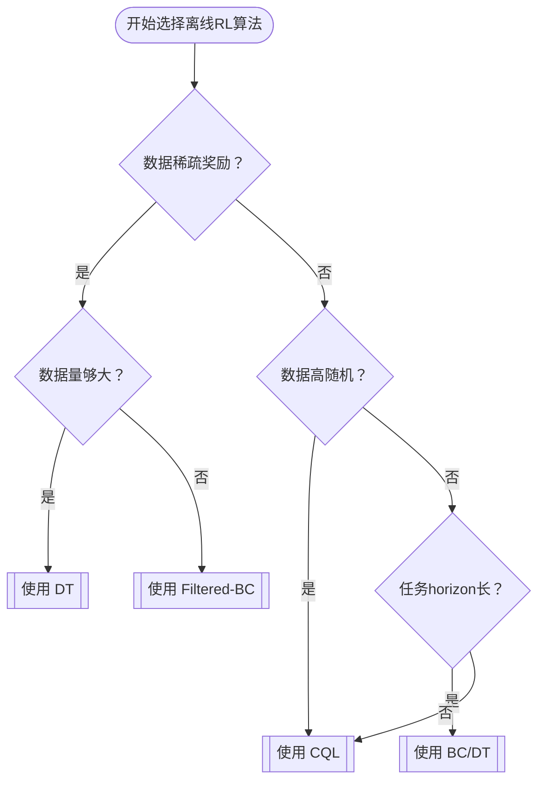

# WHEN SHOULD WE PREFER DECISION TRANSFORMERS FOR OFFLINE REINFORCEMENT LEARNING

> 帮助你判断在什么条件下应该 优先选择 DT、在什么条件下应该 弃用或替换 DT
> 在稀疏奖励、低质量或长 horizon、人类演示条件下，优先考虑 Decision Transformer； 
> 在数据量极少、高随机或密集奖励场景下，CQL 或 Filtered-BC 往往更划算

paper Link: [ICLR 2024: WHEN SHOULD WE PREFER DECISION TRANSFORMERS FOR OFFLINE REINFORCEMENT LEARNING](https://arxiv.org/pdf/2305.14550)
- [2025: Should We Ever Prefer Decision Transformer?](https://arxiv.org/abs/2507.10174)
Github link: [prajjwal1/rl_paradigm](https://github.com/prajjwal1/rl_paradigm)

## 一、主要贡献

1. DT 相对于CQL 需要更多的训练数据学习competitive policies，但更稳健
2. 在稀疏奖励(`sparse-reward`) 和 低质量数据上，DT相对于CQL和BC是更好的选择
3. DT和BC在下列2中情况表现更加：任务范围增加或数据来自人类演示
4. CQL在高随机性和低数据质量相结合的情况下表现出色 （如 D4RL/minari 的 `xx/simple-v0` 数据）
5. 更大的DT模型需要更少的训练，扩大数据量可以提高ATARI的得分。
   - 在 ATARI 游戏中，当我们将用于训练DT的数据量扩大5倍后，平均游戏得分提高了2.5倍。

回答几个主要问题：
1. Agent如何受到次优数据存在的影响？
  - paper中的三种研究方法
    1. 改变Agent训练的数据量: 从高质量和低质量数据中学习时研究样本效率
       - 基于轨迹的returnReward排序，进行轨迹数据组合： BEST X% WORST X%
    2. 数据集中轨迹长度增加引起的次优性的影响
       - 在较长的轨迹中，奖励状态通常离早期状态更远，这可能会影响训练动态。
    3. 向数据添加噪声的影响（random actions）
       - 这种设置可以被视为模拟了一种常见的实际情况，即离线数据集伴随着大量的探索。 
2. 当任务复杂性增加时，Agent表现如何？
   - 为了理解这一点，我们研究了状态空间维度和任务视界对代理性能的影响
3. 在随机环境中，Agent表现如何？
   - 改变随机性和数据质量的程度时评估了Agent的性能
4. 如何在实践中有效地使用DT？
   - 研究结果中DT的整体实力，我们为DT的架构（附录A）和超参数提供了指导，并对ATARI中模型大小和数据量的缩放进行了详细分析

## 二、DT 的设计假设与优势

| 维度       | DT 的做法                                                                     | 带来的优势                             |
| -------- | -------------------------------------------------------------------------- | --------------------------------- |
| **建模框架** | 把 RL 问题变成**序列建模**（state → action → reward → …），用 GPT 式 Transformer 自回归预测动作 | 不需要 Bellman 迭代，天然擅长**长程依赖**       |
| **学习目标** | **Return-Conditioned BC**：给定目标回报 Return-to-go 与历史，直接预测动作                        | 对**稀疏奖励**不敏感，只要 Return-to-go 能区分好坏轨迹即可 |
| **数据结构** | 支持任意长度轨迹，**无需 MDP 假设**                                                     | 对**非马尔可夫数据**（如人类演示）鲁棒             |

## 三、基本结论(ESTABLISHING BASELINE RESULTS)

### 什么时候 DT 值得优先用

| 场景特征                      | 结论                     | 原因简述                                      |
| ------------------------- | ---------------------- | ----------------------------------------- |
| **奖励稀疏**                  | ✅ **DT 显著优于 CQL & BC** | CQL 的 TD 传播在稀疏奖励下难以学习；DT 只需用 R-to-go 过滤轨迹 |
| **数据质量低**（次优/噪声大）         | ✅ **DT 更鲁棒**           | 保守 Q-Learning 会过度悲观；DT 通过序列建模降低外推误差       |
| **任务 horizon 长**（>1000 步） | ✅ **DT & BC 优于 CQL**   | CQL 的 Bellman 迭代在长序列中误差累积大                |
| **数据来源为人类演示**             | ✅ **DT 与 BC 占优**       | 人演示往往非马尔可夫、轨迹间分布差异大，DT 无需对齐 MDP           |
| **数据量充足**                 | ✅ **DT 可随数据扩展**        | 5× 数据 → Atari 上 2.5× 性能提升，呈现正比例放大         |

### 什么时候 DT 并不合适

| 场景特征              | 结论                         | 原因 & 替代方案                                                                |
| ----------------- | -------------------------- | ------------------------------------------------------------------------ |
| **数据量极少**         | ❌ **CQL 更好**               | DT 需要更大样本才能匹配 CQL 的性能                                                    |
| **环境高度随机**（高噪声转移） | ❌ **CQL 显著更好**             | 随机性破坏序列一致性，DT 难以建模                                                       |
| **稀疏奖励且数据可过滤**    | ❌ **Filtered-BC（FBC）可能更好** | Dong et al. (2025) 指出：在相同稀疏奖励机器人任务上，**简单过滤轨迹后再 BC** 比 DT 表现更好、训练更快、参数量更小 |
| **密集奖励 + 低随机性**   | ❌ **CQL 通常更优**             | 既有文献与 D4RL 原始任务均显示 CQL 领先                                                |

## 四、次优数据数据的影响

### 4.1 从高到低增加数据量

1) bset数据集上CQL, 样本效率更高。 混合策略下表现会不佳
   -  going down between 20% and 80%, adding lower-return data could sometimes harm CQL
   -  增加的数据后最优策略和行为策略之间的差异越来越大
2) DT需要更多的训练数据, DT更加稳健
   - 由于DT 依赖回报 Return-to-go，额外的次优数据对回报 Return-to-go的方差影响较小，更为稳健； 
3) 在低质量数据上，DT 仅微微好于 CQL
4) DT和CQL比BC更可取，特别是在存在次优数据的情况下。

### 4.2 轨迹长度增加引起的次优性的影响

1) 轨迹长度的增加，Agent也会受到类似的影响，但当数据由人类生成时，BC是首选。

### 4.3 向数据添加噪声的影响

1) BC可能会受到噪声数据的影响最大，而DT和CQL则更稳健。然而，在这种设置下，DT的性能比CQL更可靠。

## 五、当任务复杂性增加时，Agent表现如何

> 导致任务复杂性的两个主要因素是状态空间的维度和任务MDP的视界

当状态空间的维数增加时，所有Agent都会经历类似的恶化。当任务期限增加时，DT仍然是一个稳健的选择，但当已知数据质量高时，BC可能更可取。(fig3 右)

## 六、在随机环境中，Agent表现如何

虽然在连续动作空间中对高质量数据进行训练时，DT的下降幅度与CQL相当，但随着数据质量的下降或随机性的增加，CQL预计会相对更稳健。

## 七、如何在实践中有效地使用DT

在为复杂环境扩展DT时，优先考虑在模型大小之前**扩展数据**。同时扩展两者可能会进一步提高性能。

### 决策流程图

### 实践 Checklist（工程落地）

| 步骤         | 建议                                                                                         |
| ---------- | ------------------------------------------------------------------------------------------ |
| **Step 1** | 检查奖励密度：若 reward<0.01 占比 >90%，优先考虑 DT                                                       |
| **Step 2** | 估计数据量：轨迹数 <1 k 时先尝试 FBC，≥2 k 再考虑 DT                                                        |
| **Step 3** | 评估随机性：环境转移噪声 σ>0.1 时，放弃 DT 换 CQL                                                           |
| **Step 4** | 若 horizon>1 k 步，DT 训练时用 **context length ≥ 3×horizon** 并加 **gradient checkpointing** 防 OOM |
| **Step 5** | 训练 DT 时把 **return-to-go 离散化**（如 0/1 稀疏标签）可进一步加速收敛                                          |
