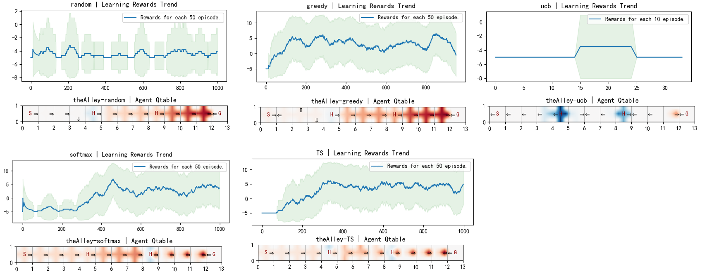
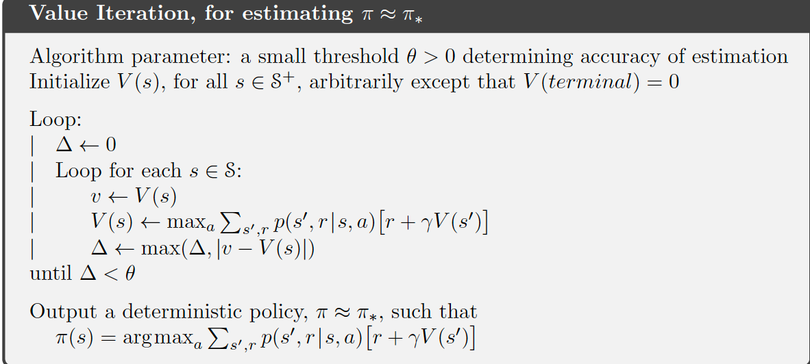

## 1. 环境描述

代码提供了一个基于`FrozenLake`的简易RL环境`simple_grid.py`。

如下，该环境描述了一个这样的故事，你半夜喝醉了准备从朋友家回去，路过一个胡同口(Alley)。

```python
"theAlley": [
        "S...H...H...G"
    ]
```

当然也有可能经过一个公园，具体地图可以自行定义，如下：

```python
"walkInThePark": [
        "S.......",
        ".....H..",
        "........",
        "......H.",
        "........",
        "...H...G"
    ]
```

其中`S`表示出发位置，`G`表示目的地，`.`表示平坦的道路，每次你决策的动作是二维地图上的上下左右，但由于你喝醉了，所以你有80%的概率会走到自己想要的方向，20%的概率会走到相反的方向。另外路上可能会有一些水洼泥坑，用`H`表示，经过这个水洼，你可能会有一定的概率(环境设定是20%，请不要修改)摔倒，摔倒之后本局回家游戏就此结束，你需要回溯时间到初始位置`S`上从头再来，如此反复直到你回家。

## 2. 问题

* 你觉得`theAlley`和`walkInThePark`哪个地图更难学一点？为什么？
* 使用值迭代方法完成`theAlley`
* 使用Q learning算法完成`theAlley`，参数：$episodes=1000，\varepsilon=0.05,\gamma=0.9,\alpha=0.1$，epsilon不需要衰减，看看能不能学出一个最优策略？可以用值迭代的算出的Q表对比。
* 环境给了一个摔倒的惩罚系数`BROKEN_LEG_PENALTY`，默认是-10，改成-5，看看能不能学出一个最优策略？
* 更改探索策略，换成softmax，ucb，汤普森采样试试看能不能学出一个最优策略
学习策略如下：


<b><font color=darkred>BROKEN_LEG_PENALTY = -5</font></b>
|  探索策略   | play5次平均游戏结束步长  | play5次平均游戏奖励 |
|  ----  | ----  | ----  |
| random | 42.4 | -5.0 |
| greedy | 9.8 | 1.0 |
| softmax | 38.0 | 4.0 |
| TS | 29.2 | 10.0 |
| ucb | 501.0 | 0.0 |

## 3. 提示

值迭代伪代码参考如下图，这里可以设置$\theta=0.005$



环境中目前设置done=True的时候才会成功，可以设置每回合最大步长=500，如果done说明学出来了一个最优策略，可以计算1000个回合的成功次数来表示能否学出一个最优策略的情况

探索策略可以参考[多臂老虎机](https://hrl.boyuai.com/chapter/1/%E5%A4%9A%E8%87%82%E8%80%81%E8%99%8E%E6%9C%BA)，和[softmax](http://incompleteideas.net/book/ebook/node17.html)

有不明白的地方随时交流！