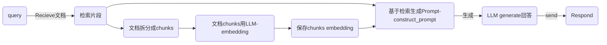
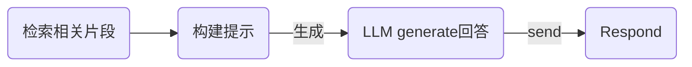

# 一、RAG主要流程



注：
- generate和embedding可以不同模型
  - LLM-embedding: 推荐使用 智源的BGE  `BAAI/bge-en-icl 	$0.0100/Mtoken`
    -  In-context Learning (ICL) : 通过提供少量示例（few-shot examples）来显著提升模型处理新任务的能力
    -  也可以用阿里云的 `text-embedding-v3`
  - LLM generate：可以直接用 `deepseek-chat`
- 保存chunks embedding
  - 可以用简单的dict
  - 可以用向量数据库 `chromadb` 等


# 二、本地保存的全流程实现

## 2.1 文本保存成Embedding chunks


### 2.1.1 文档读取&拆分成chunk——以text文档为例

> pdf文档解析可以看这个文档： https://www.aneasystone.com/archives/2025/03/pdf-parser-libraries.html

1. `load_documents(dir_path: str) -> List[str]`: 读取文件下所有的txt文件
2. `split_into_clean_chunks(docs: List[str], chunk_size: int = 30) -> List[str]`: 将读取的文件内容，拆分为大小为chunk_size的chunk列表

```python
def load_documents(dir_path: str) -> List[str]:
    docs = []
    for f in os.listdir(dir_path):
        if f.endswith('.txt'):
            with open(os.path.join(dir_path, f), 'r', encoding='utf-8') as f_o:
                docs.append(f_o.read())
    return docs


def preprocess_text(text: str) -> str:
    text = text.lower()
    # Remove special characters, keeping only alphanumeric characters and spaces
    text = ''.join(char for char in text if char.isalnum() or char.isspace())
    return text


def split_into_clean_chunks(docs: List[str], chunk_size: int = 30) -> List[str]:
    chunks = []  
    for doc in docs:  
        words = doc.split()  
        for i in range(0, len(words), chunk_size):
            chunk = " ".join(words[i:i + chunk_size])   
            chunks.append(preprocess_text(chunk))
    return chunks 


def prepare_text_test():
    cur_p = os.path.dirname(__file__)
    dir_p = os.path.join(cur_p, "data")
    documents = load_documents(dir_p)
    preprocessed_chunks = split_into_clean_chunks(documents)
    for i in range(2):
        print(f"Chunk {i+1}: {preprocessed_chunks[i][:50]} ... ")
        print("-" * 50)  
```

### 2.1.2 embedding & save

1. 分批生成Embedding： `generate_embeddings(chunks: List[str], batch_size: int = 10) -> np.ndarray`  
   1. 每batch_size大小chunks， 调用一次api `BAAI/bge-en-icl`
   2. `generate_embeddings_batch`调用
2. 保存成简单的Dict： `add_to_vector_store(embeddings: np.ndarray, chunks: List[str])`  
   1. 保存成：`{0:{"embedding": "np.arrray", "chunk": "string"}}`


```python
def generate_embeddings_batch(chunks_batch: List[str], model: str = "BAAI/bge-en-icl") -> List[List[float]]:
    """
    # BAAI/bge-en-icl 	$0.0100/Mtoken  
    """
    response = emb_client.embeddings.create(
        model=model,   
        input=chunks_batch,
        encoding_format='float'
    )
    embeddings = [item.embedding for item in response.data]
    return embeddings


def generate_embeddings(chunks: List[str], batch_size: int = 10) -> np.ndarray:
    all_embeddings = []
    for i in tqdm(range(0, len(chunks), batch_size)):
        batch = chunks[i:i + batch_size]
        embeddings = generate_embeddings_batch(batch)
        all_embeddings.extend(embeddings)
    return np.array(all_embeddings)


vector_store: dict[int, dict[str, object]] = {}
def add_to_vector_store(embeddings: np.ndarray, chunks: List[str]) -> None:
    for embedding, chunk in zip(embeddings, chunks):
        vector_store[len(vector_store)] = {"embedding": embedding, "chunk": chunk}

```

# 三、简单RAG流程




## 3.1 检索相关片段

1. query转成embedding: `generate_embeddings([query_text])[0]`
2. 基于query和保存的向量文档`vector_store`，搜索最相关的TopN个文档碎片
   1. `similarity_search(query_embedding: np.ndarray, top_k: int = 5)`


```python
def cosine_similarity(vec1: np.ndarray, vec2: np.ndarray) -> float:
    dot_product = np.dot(vec1, vec2)
    return dot_product / (np.linalg.norm(vec1) * np.linalg.norm(vec2))


def similarity_search(query_embedding: np.ndarray, top_k: int = 5) -> List[str]:
    similarities = []
    for key, value in vector_store.items():
        similarity = cosine_similarity(query_embedding, value["embedding"])
        similarities.append((key, similarity))

    similarities = sorted(similarities, key=lambda x: x[1], reverse=True)
    # 倒序排序取Top N
    return [vector_store[key]["chunk"] for key, _ in similarities[:top_k]]


def retrieve_relevant_chunks(query_text: str, top_k: int = 5) -> List[str]:
    query_embedding = generate_embeddings([query_text])[0]
    relevant_chunks = similarity_search(query_embedding, top_k=top_k)
    return relevant_chunks

```

## 3.2 构建提示

1. System: 指出根据提供信息回答问题
2. Context: 放入检索出来的文档片
3. Question: 提问的文本

```python
def construct_prompt(query: str, context_chunks: List[str]) -> str:
    """
    通过将查询与检索到的上下文片段结合，构建提示。
    参数：
        query (str): 要构建提示的查询文本。
        context_chunks (List[str]): 要包含在提示中的相关上下文片段列表。

    返回：
        str: 用于作为 LLM 输入的构建好的提示。
    """
    # chinese_prompt_template = """
    # System:
    # 你是一个问答机器人。你的任务是根据下述给定的已知信息回答用户问题。
    # 如果已知信息不包含用户问题的答案，或者已知信息不足以回答用户的问题，请直接回复"我无法回答您的问题"。

    # 已知信息:
    # {context} # 检索出来的原始文档

    # 用户问题:
    # {query} # 用户的提问

    # 回答:
    # """
    context = "\n".join(context_chunks)
    system_message = (
        "You are a helpful assistant. Only use the provided context to answer the question. "
        "If the context doesn't contain the information needed, say 'I don't have enough information to answer this question.'"
    )
    prompt = f"System: {system_message}\n\nContext:\n{context}\n\nQuestion:\n{query}\n\nAnswer:"
    return prompt

```

## 3.3 生成答案


```python
def generate_response(
    prompt: str,
    model: str = "deepseek-chat",
    client_in = None,
    max_tokens: int = 512,
    temperature: float = 1,
    top_p: float = 0.9,
    top_k: int = 50
) -> str:
    """
    根据构建的prompt从OpenAI-模型生成回答

    Args:
        prompt (str): construct_prompt 生成的提示词
        model (str): LLM default "deepseek-chat" "google/gemma-2-2b-it 国内无法正常使用".
        max_tokens (int): 生成回答的最多tokens数  Default is 512.
        temperature (float): Sampling temperature for response diversity. Default is 0.5.
        top_p (float): Probability mass for nucleus sampling. Default is 0.9.
        top_k (int): Number of highest probability tokens to consider. Default is 50.

    Returns:
        str: The generated response from the chat model.
    """
    client = client_in if client_in is not None else client
    response = client.chat.completions.create(
        model=model,   
        max_tokens=max_tokens,   
        temperature=temperature,   
        top_p=top_p,   
        extra_body={   
            "top_k": top_k  
        },
        messages=[   
            {
                "role": "user", 
                "content": [  
                    {
                        "type": "text",  # Type of content (text in this case)
                        "text": prompt  # The actual prompt text
                    }
                ]
            }
        ]
    )
    # Return the content of the first choice in the response
    return response.choices[0].message.content


def basic_rag_pipeline(query: str, model: str="deepseek-chat", api_client=None) -> str:
    """
    实现基础检索增强生成(RAG) pipeline
    检索相关片段 -> 构建提示 -> 并生成回答
    Args:
        query (str): 输入查询，用于生成回答。
    Returns:
        str: 基于查询和检索到的上下文，由 LLM 生成的回答。
    """
    relevant_chunks = retrieve_relevant_chunks(query)
    prompt = construct_prompt(query, relevant_chunks)
    response = generate_response(prompt, model=model, client_in=api_client)
    return response
```

# 四、测试

```python

def RAG_test():
    cur_p = os.path.dirname(__file__)
    dir_p = os.path.join(cur_p, "data")
    documents = load_documents(dir_p)
    preprocessed_chunks = split_into_clean_chunks(documents)
    emb_f = os.path.join(cur_p, "data", "embeddings.json")
    embeddings = load_embedding(emb_f)
    add_to_vector_store(embeddings, preprocessed_chunks)

    test_f = os.path.join(cur_p, "data", 'val.json')
    with open(test_f, 'r') as file:
        validation_data = json.load(file)

    sample_query = validation_data['basic_factual_questions'][0]['question']  
    expected_answer = validation_data['basic_factual_questions'][0]['answer']  

    print(f"Sample Query: {sample_query}\n")
    print(f"Expected Answer: {expected_answer}\n")

    print("🔍 Running the Retrieval-Augmented Generation (RAG) pipeline...")
    print(f"📥 Query: {sample_query}\n")

    # Run the RAG pipeline and get the response
    #  $0.02/$0.04 in/out Mtoken  google/gemma-3-4b-it
    # response = basic_rag_pipeline(sample_query, model='google/gemma-3-4b-it', api_client=emb_client)
    response = basic_rag_pipeline(sample_query, model='deepseek-chat', api_client=client)
    # Print the response with better formatting
    print("🤖 AI Response:")
    print("-" * 50)
    print(response.strip())
    print("-" * 50)

    # Print the ground truth answer for comparison
    print("✅ Ground Truth Answer:")
    print("-" * 50)
    print(expected_answer)
    print("-" * 50)
    response_embedding = generate_embeddings([response])[0]
    ground_truth_embedding = generate_embeddings([expected_answer])[0]
    similarity = cosine_similarity(response_embedding, ground_truth_embedding)
    
    print(f"✅ similarity: {similarity:.5f}")
```

输出如下:
```
Sample Query: What is the mathematical representation of a qubit in superposition?
Expected Answer: |ψ⟩ = α|0⟩ + β|1⟩, where α and β are complex numbers satisfying |α|² + |β|² = 1, representing the probability amplitudes for measuring the qubit in state |0⟩ or |1⟩ respectively.

🔍 Running the Retrieval-Augmented Generation (RAG) pipeline...
📥 Query: What is the mathematical representation of a qubit in superposition?


🤖 AI Response:
--------------------------------------------------
The mathematical representation of a qubit in superposition is given by:  
**ψ = α|0⟩ + β|1⟩**,  
where α and β are complex numbers satisfying |α|² + |β|² = 1. These represent the probability amplitudes for measuring the qubit in state |0⟩ or |1⟩, respectively.  

(Answer derived directly from the provided context.)
--------------------------------------------------
✅ Ground Truth Answer:
--------------------------------------------------
|ψ⟩ = α|0⟩ + β|1⟩, where α and β are complex numbers satisfying |α|² + |β|² = 1, representing the probability amplitudes for measuring the qubit in state |0⟩ or |1⟩ respectively.
--------------------------------------------------
✅ similarity: 0.92927
```

# 五、关于api 

1. deepseek: 
   1. `client = OpenAI(api_key=api_key, base_url="https://api.deepseek.com")`
   2. 官网：[deepseek](https://api-docs.deepseek.com/zh-cn/quick_start)
   3. 模型：`deepseek-chat`: 2元/8元  in/out Mtoken | 0.5元   输入缓存命中
2. deepinfra
   1. `emb_client = OpenAI(api_key=df_api_key, base_url="https://api.deepinfra.com/v1/openai")`
   2. 官网：[deepinfra](https://deepinfra.com)
   3. 模型：`BAAI/bge-en-icl`: $0.0100/Mtoken ;  `google/gemma-3-4b-it`: $0.02/$0.04 in/out Mtoken
3. 阿里云百炼
   1. `client = OpenAI(api_key=os.getenv("DASHSCOPE_API_KEY"), base_url="https://dashscope.aliyuncs.com/compatible-mode/v1")`
   2. 官网：[阿里云百炼](https://bailian.console.aliyun.com/)
   3. 模型：`qwen-max`, `qwen-plus`, `qwen-turbo`, `qwen-long` [通义千问模型列表](https://help.aliyun.com/zh/model-studio/models)


# 六、保存到向量数据库的RAG

1. 和简单实现的差异
   1. 分批生成Embedding： `generate_embeddings -> simpleVectorDB.batch_add_documents()`  
      1. 还是调用`generate_embeddings_batch`调用
      2. batch_add_documents 中直接用 collection.add 保存到了向量数据库中
         1. 不用再执行简单实现中的`add_to_vector_store`
   2. 搜索最相关的TopN个文档碎片

```python

import chromadb
from chromadb.config import Settings
from functools import partial


class simpleVectorDB:
    def __init__(self, collection_name, embedding_fn=generate_embeddings_batch):
        self.collection_name = collection_name
        self.chroma_client = chromadb.Client(Settings(allow_reset=True))
        self.collection = self.chroma_client.get_or_create_collection(name=collection_name)
        self.embedding_fn = embedding_fn
        self.add_counts = 0

    def add_documents(self, documents):
        '''向 collection 中添加文档与向量'''
        # print(f'self.add_counts={self.add_counts}', documents[:2])
        self.collection.add(
            embeddings=self.embedding_fn(documents),
            documents=documents,
            ids=[f"id{self.add_counts}_{i}" for i in range(len(documents))]
        )
        self.add_counts += 1

    def reset(self):
        self.chroma_client.reset()
        self.collection = self.chroma_client.get_or_create_collection(name=self.collection_name)
        self.add_counts = 0

    def search(self, query: str, top_n: int=5):
        '''检索向量数据库'''
        results = self.collection.query(
            query_embeddings=self.embedding_fn([query]),
            n_results=top_n
        )
        return results['documents'][0]

    def batch_add_documents(self, chunks: List[str], batch_size: int = 10):
        all_embeddings = []
        for i in tqdm(range(0, len(chunks), batch_size)):
            self.add_documents(chunks[i:i + batch_size])


def vdb_search_test():
    cur_p = os.path.dirname(__file__)
    dir_p = os.path.join(cur_p, "data")
    documents = load_documents(dir_p)
    preprocessed_chunks = split_into_clean_chunks(documents)
    v_db = simpleVectorDB(
        'ragVectorDB-tt1', 
        partial(generate_embeddings_batch, model='text-embedding-v3', emb_client=ali_client)
    )
    v_db.reset()
    v_db.batch_add_documents(preprocessed_chunks)
    query_text = "What is Quantum Computing?"
    relevant_chunks = v_db.search(query_text)
    for idx, chunk in enumerate(relevant_chunks):
        print(f"Chunk {idx + 1}: {chunk[:50]} ... ")
        print("-" * 50)  # Print a separator line
```

## 6.1 完整pipeline示例


```python

class VDB_RAG_Bot:
    def __init__(
        self, 
        collection_name: str='ragVectorDB', 
        client: OpenAI = ali_client,
        embedding_fn=partial(generate_embeddings_batch, model='text-embedding-v3', emb_client=ali_client)
    ):
        self.v_db = simpleVectorDB(
            'ragVectorDB', 
            partial(generate_embeddings_batch, model='text-embedding-v3', emb_client=ali_client)
        )
        self.client = client
    
    def db_prepare(self, doc_dir: str):
        documents = load_documents(doc_dir)
        preprocessed_chunks = split_into_clean_chunks(documents)
        self.v_db.batch_add_documents(preprocessed_chunks)
    
    def chat(self, 
            query: str,
            model: str = "qwen-long",
            max_tokens: int = 512,
            temperature: float = 1,
            top_p: float = 0.9,
            top_k: int = 50
    ):
        """
        Args:
            query (str): 提问
            model (str): LLM default "qwen-long".
            max_tokens (int): 生成回答的最多tokens数  Default is 512.
            temperature (float): Sampling temperature for response diversity. Default is 0.5.
            top_p (float): Probability mass for nucleus sampling. Default is 0.9.
            top_k (int): Number of highest probability tokens to consider. Default is 50.
        """
        relevant_chunks = self.v_db.search(query)
        prompt = construct_prompt(query, relevant_chunks)
        response = generate_response(
            prompt, 
            model=model, 
            client_in=self.client,
            max_tokens=max_tokens,
            temperature=temperature,
            top_p=top_p,
            top_k=top_k
        )
        return response


def VDB_RAG_test():
    cur_p = os.path.dirname(__file__)
    dir_p = os.path.join(cur_p, "data")
    ali_client = OpenAI(api_key=ali_api_key, base_url="https://dashscope.aliyuncs.com/compatible-mode/v1")
    chat_box = VDB_RAG_Bot(
        collection_name='ragVectorDB', 
        client=ali_client,
        embedding_fn=partial(generate_embeddings_batch, model='text-embedding-v3', emb_client=ali_client)
    )
    chat_box.db_prepare(dir_p)

    test_f = os.path.join(cur_p, "data", 'val.json')
    with open(test_f, 'r') as file:
        validation_data = json.load(file)

    sample_query = validation_data['basic_factual_questions'][0]['question']  
    expected_answer = validation_data['basic_factual_questions'][0]['answer']  

    print(f"Sample Query: {sample_query}\n")
    print(f"Expected Answer: {expected_answer}\n")

    print("🔍 Running the Retrieval-Augmented Generation (RAG) pipeline...")
    print(f"📥 Query: {sample_query}\n")
    
    response = chat_box.chat(sample_query)
    print("🤖 AI Response:")
    print("-" * 50)
    print(response.strip())
    print("-" * 50)

    # Print the ground truth answer for comparison
    print("✅ Ground Truth Answer:")
    print("-" * 50)
    print(expected_answer)
    print("-" * 50)
    response_embedding = generate_embeddings_batch([response])[0]
    ground_truth_embedding = generate_embeddings_batch([expected_answer])[0]
    similarity = cosine_similarity(response_embedding, ground_truth_embedding)
    
    print(f"✅ similarity: {similarity:.5f}")

```
输出如下：
```
Sample Query: What is the mathematical representation of a qubit in superposition?
Expected Answer: |ψ⟩ = α|0⟩ + β|1⟩, where α and β are complex numbers satisfying |α|² + |β|² = 1, representing the probability amplitudes for measuring the qubit in state |0⟩ or |1⟩ respectively.

🔍 Running the Retrieval-Augmented Generation (RAG) pipeline...
📥 Query: What is the mathematical representation of a qubit in superposition?

model='qwen-long'
🤖 AI Response:
--------------------------------------------------
A qubit in superposition is mathematically represented as:

\[ \alpha|0\rangle + \beta|1\rangle \]

where \( \alpha \) and \( \beta \) are complex numbers called probability amplitudes, and \( |0\rangle \) and \( |1\rangle \) are the basis states of the qubit. The probabilities of measuring the qubit in state \( |0\rangle \) or \( |1\rangle \) are given by \( |\alpha|^2 \) and \( |\beta|^2 \), respectively, with the condition that \( |\alpha|^2 + |\beta|^2 = 1 \).
--------------------------------------------------
✅ Ground Truth Answer:
--------------------------------------------------
|ψ⟩ = α|0⟩ + β|1⟩, where α and β are complex numbers satisfying |α|² + |β|² = 1, representing the probability amplitudes for measuring the qubit in state |0⟩ or |1⟩ respectively.
--------------------------------------------------
✅ similarity: 0.91612
```